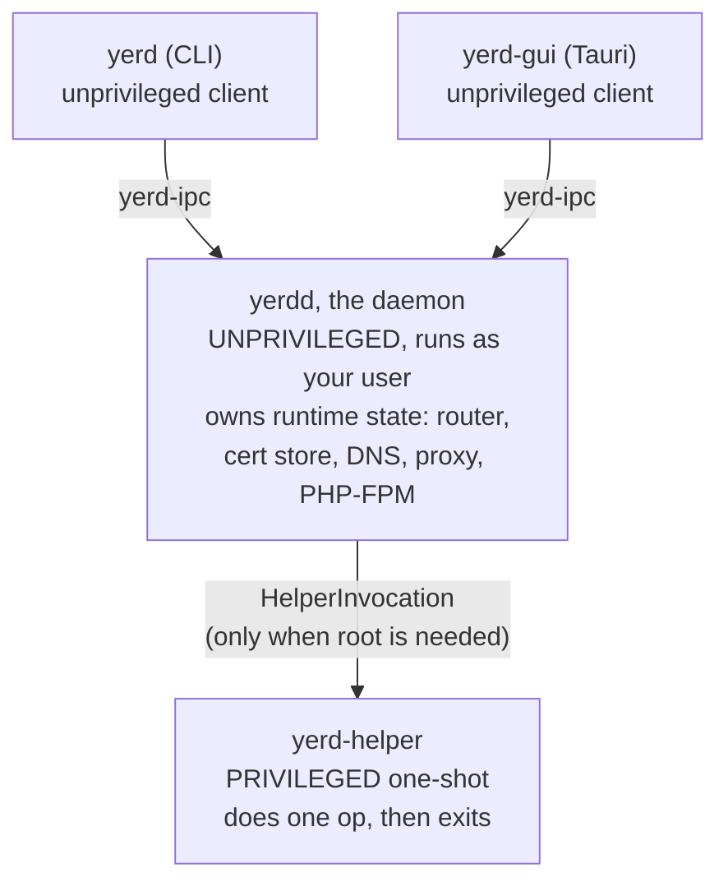
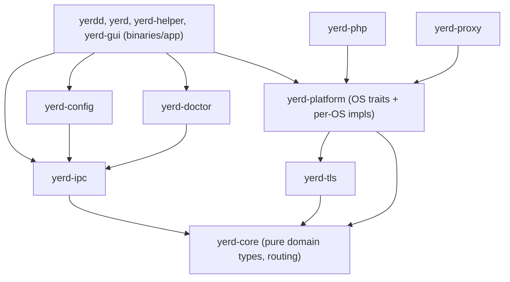

# Architecture

This page is the orientation map for contributors. It explains how the Yerd
workspace is organised, the one rule that everything else follows from, and the
boundaries you must respect when you add code. If you read one developer page
before opening the source, read this one.

For the matching per-component detail, see the [Crates Overview](./crates) and
the per-crate pages it links to, the [IPC Protocol](./ipc-protocol) reference,
and the [Cross-Platform Model](./cross-platform).

## The single organising rule

> **Pure logic lives in library crates. I/O and OS calls are pushed to the
> edges behind traits.**

Everything in the codebase is a consequence of this rule:

1. **Pure crates and pure modules do no I/O.** No filesystem, no network, no
   process spawning, no clock reads, no environment reads. They are
   unit-testable with in-memory fixtures and zero setup. `yerd-core` is the
   exemplar - it depends on no other `yerd-*` crate and is kept rigorously pure.
2. **Side effects go behind traits.** Anything that touches the OS is expressed
   as a trait - `TrustStore`, `ResolverInstaller`, `PortBinder`,
   `PortRedirector`, `Paths`, and the per-crate spawner/probe traits. Business
   logic depends on the trait; tests inject a fake; the real implementation
   lives in `yerd-platform` (or a crate's own `os`/`io` module) selected by
   `#[cfg(target_os = ...)]`.
3. **Binaries are thin.** `bin/yerdd`, `bin/yerd`, `bin/yerd-helper`, and the
   Tauri `src-tauri` layer wire crates together and own transports. They contain
   orchestration, not behaviour. Interesting logic belongs in a crate with
   tests.
4. **The IPC protocol is a stable contract.** Add fields and variants
   additively; never silently rename or reorder a variant or field; bump the
   protocol version on any breaking change.
5. **One source of truth.** The daemon (`yerdd`) owns runtime state. The CLI and
   the GUI are both `yerd-ipc` *clients* - neither reimplements daemon logic.

::: tip Why this matters
A side effect routed around a trait, or domain logic that creeps into a binary,
defeats the test strategy and the cross-platform strategy at once. If a task
seems to require breaking one of these boundaries, surface the conflict rather
than working around it.
:::

## Workspace layout

Yerd is a single Cargo workspace (`resolver = "2"`) plus a Tauri v2 + Vue 3
desktop app. The members are declared in the root
[`Cargo.toml`](https://github.com/forjedio/yerd/blob/main/Cargo.toml):

```
yerd/
├── crates/              library crates - all behaviour lives here
│   ├── yerd-core        pure domain types + host→site routing (bottom of the graph)
│   ├── yerd-ipc         request/response protocol + length-prefixed framing
│   ├── yerd-config      on-disk config: parse / migrate / serialize
│   ├── yerd-tls         pure-Rust local CA + per-site leaf certs (rustls/rcgen)
│   ├── yerd-platform    OS abstraction layer: the side-effect traits + per-OS impls
│   ├── yerd-dns         embedded *.test resolver (hickory)
│   ├── yerd-php         PHP-FPM pool supervision + release handling
│   ├── yerd-proxy       hand-rolled hyper + tokio-rustls reverse proxy
│   ├── yerd-supervise   generic process-supervision substrate (FPM + services)
│   ├── yerd-services    DB/cache engines (Redis/Valkey · MySQL · MariaDB · Postgres)
│   ├── yerd-mail        embedded SMTP sink (catch-all mailbox)
│   └── yerd-doctor      diagnostics + repair planning
├── bin/                 thin binaries - orchestration + transports only
│   ├── yerdd            the unprivileged per-user daemon (source of truth)
│   ├── yerd             the CLI (a yerd-ipc client)
│   └── yerd-helper      the privileged one-shot (the security boundary)
├── apps/
│   └── yerd-gui         Tauri v2 + Vue 3 desktop app (another yerd-ipc client)
└── xtask/               build automation (cargo xtask bump / version-check)
```

Shared dependency versions are pinned once in `[workspace.dependencies]` and
referenced with `dep.workspace = true`. Several are pinned with `=` for MSRV or
wire-stability reasons - read the comment next to a pin before bumping it. The
workspace MSRV is `1.77`; the GUI builds with a newer toolchain (Tauri v2 needs
edition2024, rustc ≥ 1.85).

See [Build Automation (xtask)](./xtask) for what `xtask` packages, and the
[Desktop App Internals](./gui) for the GUI side.

## The two-process model

In normal operation Yerd runs as an **unprivileged daemon** with **thin
clients**, and reaches for a separate **one-shot privileged helper** only for
the handful of operations that genuinely require root.



The clients reach the daemon over `yerd-ipc`: length-prefixed JSON over a
per-user socket or named pipe.

- **`yerdd`** runs as the user, unprivileged, and is the single source of truth
  for runtime state. It loads `yerd-config`, builds a `SiteRouter`, starts the
  DNS responder, reverse proxy, and PHP-FPM pools, owns the cert store, and
  serves the `yerd-ipc` server transport. It is thin orchestration - behaviour
  lives in the crates it wires together.
- **`yerd` (CLI)** and **`yerd-gui`** are both `yerd-ipc` clients. They connect
  to the daemon's per-user socket, send a typed `Request`, and render the
  `Response`. Neither holds authoritative state, so the CLI and the GUI can
  never disagree. (The GUI's `src-tauri` Cargo manifest depends on
  `yerd-ipc` with the `transport` feature and on `yerd-core` for domain types -
  nothing daemon-internal.)
- **`yerd-helper`** is the only privileged surface and therefore the security
  boundary. It takes strict typed arguments, never shells out, never accepts
  network input, performs exactly one operation, then exits. The daemon and GUI
  processes never run as root; when an operation needs root, code goes through
  `yerd-platform`, which returns a typed `HelperInvocation`, and a privileged
  caller (the daemon, or `yerd elevate` under `sudo`) owns the actual
  `Command::new(...)` that spawns the helper.

::: warning Privilege boundary
`yerd-platform`'s OS implementations never spawn the helper themselves - they
return `PlatformError::NeedsHelper` and hand back a typed `HelperInvocation`.
The privileged caller owns the spawn. The GUI process must never run as root.
See [Elevation & Privileges](../guide/elevation) and the
[yerd-helper](./binaries/yerd-helper) page.
:::

## One source of truth

The daemon owns state; clients are stateless views. This is rule 5 above, and it
is load-bearing: any feature that would let a client decide runtime truth (cache
authoritative state, mutate config without the daemon, reimplement routing) is a
boundary violation. Mutations flow as `yerd-ipc` requests to the daemon, which
applies them and broadcasts the new state. PHP updates are deliberately
**notify-only** - the daemon's periodic checker and `list` only *report* newer
patches; an install happens solely on an explicit update request.

## Daemon-hosted developer subsystems

Beyond serving sites, the daemon hosts two self-contained developer-tooling
subsystems. Both follow the rules above - the daemon owns the state, the GUI is a
stateless `yerd-ipc` view - and both keep their pure logic in a crate.

- **Mail capture.** A built-in SMTP sink (`crates/yerd-mail`) that the daemon
  binds on a loopback port when capture is enabled. Anything it receives is
  stored as a raw `.eml` on disk; there is **no relaying** - captured mail never
  leaves the box. The store is opened unconditionally (so already-captured mail
  stays listable even with capture off), and the SMTP listen is the only part
  gated on the enabled flag. Captured mail is surfaced over IPC (`ListMails` /
  `GetMail` / …) and rendered in the GUI's Mails viewer. As with the rest of the
  workspace, the crate splits a pure layer (the SMTP command state machine, MIME
  decoding, retention) from the I/O edge (the tokio TCP server and the disk
  store).

- **Laravel Dumps telemetry.** A live feed of per-request telemetry - `dump()`,
  Eloquent queries, jobs, views, cache, logs, outgoing HTTP - from running PHP
  apps. The data path is **native PHP extension → loopback TCP → ring buffer →
  IPC → GUI**: a native Zend extension emits newline-delimited JSON frames to a
  loopback dump server the daemon runs, which buffers them in a bounded
  in-memory ring and pages them to the GUI (`ListDumps` / `DumpsStatus`). The
  shared wire model lives in `crates/yerd-ipc` (`dump.rs`); the daemon treats
  each frame's `payload` as **opaque** JSON so the extension's per-category
  schema can evolve without daemon changes.

  The native extension is an **external dependency**: the `.so` is built and
  published by the separate [`forjedio/yerd-php-ext`](https://github.com/forjedio/yerd-php-ext)
  repository, and the daemon downloads + SHA-256-verifies the artifact matching
  each installed PHP version's host triple (against the release `manifest.json`),
  placing it beside - not inside - the PHP installs so a PHP patch update never
  removes it. The daemon then wires it into each FPM pool via
  `-d extension`; the extension self-disables (via a daemon-written state
  file) when dumps are off. Fetch/verify is best-effort - a failure leaves the
  site running with no dumps. See the [yerdd](./binaries/yerdd) page for the
  `dump_server` / `ext_install` modules.

## Dependency direction (downhill, no cycles)

Internal dependencies flow strictly downhill. `yerd-core` sits at the bottom and
depends on no other `yerd-*` crate; libraries never depend on binaries; the CLI
and GUI depend on `yerd-ipc` (with its `transport` feature), not on the daemon's
internals.



Arrows point from a crate to what it depends on, so everything below points up
toward `yerd-core`.

Reading the graph:

- `yerd-core` ◄── everything.
- `yerd-core` ◄── `yerd-ipc` ◄── `yerd-config`, `yerd-doctor`, the binaries, and
  the GUI.
- `yerd-tls` ◄── `yerd-platform` ◄── `yerd-php`, `yerd-proxy`, the binaries.
  `yerd-platform` also depends on `yerd-core` directly, for the pure
  web-root detector it feeds (`ProjectSignals` in, framework decision out).

Crates carry dependency-graph tests (for example `yerdd`'s
`tests/no_runtime_deps.rs` and `yerd-helper`'s `tests/no_runtime_deps.rs`) that
fail if a forbidden crate - or an OpenSSL/native-tls variant - leaks into the
runtime graph. TLS is **rustls + rcgen only, never OpenSSL**.

## The physical `pure/` vs `io/` split

Many crates split the organising rule into actual modules: a **pure** layer that
is sync and runtime-free, and an **I/O** layer that is the side-effecting edge.
This is not merely stylistic - it is what keeps the bulk of the logic unit
testable in-memory.

| Crate | Pure layer | I/O / OS edge |
|---|---|---|
| `yerd-core` | the whole crate (`host`, `router`, `site`, `php`, `tld`, `php_settings`, `detect`) | - (no I/O at all) |
| `yerd-ipc` | default build: `frame`, `message`, `request`, `response` | `transport` module, gated behind the `transport` feature (the only part allowed `tokio`) |
| `yerd-platform` | `pure` module (decision logic, parsing, port planning) | `os` module (`#[cfg(target_os)]` impls), `helper`, `trust_store`, `resolver`, `port_binder`, `port_redirect`, `metrics`, `detect` (project-signal gathering) |
| `yerd-php` | `pure/` (`fpm_conf`, `supervisor`, `env_scrub`) | `io/` (`atomic_write`, `fastcgi_probe`), `traits.rs`, `real.rs` |
| `yerd-proxy` | `pure/` | `server.rs`, `tls.rs`, `forward/`, `traits.rs` |
| `yerd-config` | `parse`, `migrate`, `serialize`, `schema` | `io.rs` |
| `yerd-tls` | the whole crate - no I/O, no clock reads, no env reads (callers pass `Validity` timestamps) | - |
| `yerd-dns` | `answer.rs`, `responder.rs` | `server.rs` |

For example, `yerd-tls` documents its own purity contract at the crate root:

```rust
//! `yerd-tls` generates a self-signed CA, loads it back from PEM, computes its
//! SHA-256 fingerprint, and issues per-site leaf certs signed by it. It does
//! **no I/O**, **no clock reads**, and **no env reads** - callers pass
//! timestamps via [`Validity`]; persistence and trust-store install live in
//! `yerd-config` and `yerd-platform` respectively.
```

And `yerd-platform` exposes its OS traits at the crate root, with one thin impl
per OS:

```rust
//! The core traits live here - [`Paths`], [`TrustStore`], [`ResolverInstaller`],
//! [`PortBinder`], and [`PortRedirector`] - each with a single thin
//! implementation per OS selected by `#[cfg(target_os = ...)]`. macOS and Linux
//! ship in Phase 1;
//! Windows compiles against the [`os::unsupported`] stub that returns
//! [`PlatformError::Unsupported`] for every method.
```

::: info Cross-platform discipline
Per-OS code is selected with `#[cfg(target_os = ...)]`; exactly one of
`linux` / `macos` / `unsupported` is active per build. OS-specific *decisions*
(parsing `profiles.ini`, planning ports, matching PEM) live in pure helpers so
they stay unit-testable without the OS effect. When you change one OS path, make
the equivalent change - or a deliberate, commented no-op - in the others, or CI
on the other platform will break. Details on the
[Cross-Platform Model](./cross-platform) page.
:::

## Error handling

- **Libraries use `thiserror`** to define typed, structured error enums. Every
  library crate has an `error` module (`CoreError`, `IpcError`/`IpcErrorKind`,
  `TlsError`, `PlatformError`, …) exposing precise, matchable variants. Reasons
  are split into dedicated enums (for example
  `PlatformError::ResolverErrorReason`) so callers can branch on cause.
- **`anyhow` is allowed only at a binary's top level** - never in a library's
  runtime dependency graph. Library APIs return their typed errors; the binary
  wiring is free to collapse them with context at the very top.

## Async only at the I/O edge

Pure crates and pure modules are synchronous and runtime-free. Only the I/O
layers touch `tokio` and `async-trait`. Concretely, the crates that pull in
`tokio` are `yerd-dns`, `yerd-proxy`, `yerd-php`, and `yerd-ipc` (only via its
`transport` feature), plus the daemon and CLI binaries. `yerd-core`,
`yerd-tls`, `yerd-config`, `yerd-doctor`, and `yerd-platform`'s pure layer have
no async. The default `yerd-ipc` build is pure: the frame codec and message
types compile with no `tokio` at all, so a pure client can use them; the async
connect/read/write helper lives behind the `transport` feature.

```toml
# crates/yerd-ipc/Cargo.toml
[features]
default   = []
transport = ["dep:tokio"]
```

## The IPC stable-contract rule

`yerd-ipc` is a published contract between the daemon and its clients, so it
gets special discipline. The wire format is a length-prefixed JSON frame: a
4-byte big-endian `u32` length followed by that many bytes of UTF-8 JSON.
`Request` and `Response` are internally tagged on a `snake_case` `type` field.

Contract rules:

- Add variants and fields **additively**. Never rename or reorder a variant or
  field silently - `tests/wire_stability.rs` pins the exact JSON tags and shapes
  and will (and should) fail. Treat such a failure as a contract alarm, not a
  test to "fix".
- Expand the error code set rather than overloading a generic variant.
- Raise `PROTOCOL_VERSION` on any breaking change, and add a `Hello`/`Welcome`
  handshake before the first incompatible change. Until then, a client speaking
  a newer protocol against an older daemon surfaces as a decode error when an
  unknown `type` tag arrives.

```rust
/// The current IPC protocol version. Bump on any breaking change;
/// add a handshake before doing so.
pub const PROTOCOL_VERSION: u32 = 1;
```

The framing edges are pinned in `tests/frame_codec.rs` (partial reads, multiple
frames per buffer, oversized-length rejection, empty frames) and round-trips in
`tests/roundtrip.rs`. The privileged argv contract has its own analogue:
`yerd-helper`'s clap parse is cross-checked against
`yerd_platform::HelperInvocation::from_argv` in debug builds, firing `WireDrift`
if a clap upgrade silently changes argv normalisation.

Full message catalogue and framing details are on the
[IPC Protocol](./ipc-protocol) page.

## Hard rules, at a glance

These are enforced by lints (`[workspace.lints]`) or by tests, and apply
workspace-wide:

| Rule | Enforcement |
|---|---|
| No `unsafe` | `unsafe_code = "forbid"`, plus `#![forbid(unsafe_code)]` on crate roots |
| No `unwrap` / `expect` / `panic!` / `todo!` / `dbg!` / indexing-slicing outside tests | clippy `deny` lints (allowed explicitly at the top of test files) |
| `thiserror` in libraries; `anyhow` only at binary top level | convention; no `anyhow` in any library runtime graph |
| TLS is rustls + rcgen, never OpenSSL / native-tls | dependency-graph tests in several crates |
| Async only at the I/O edge | pure crates/modules carry no `tokio` |
| `yerd-helper` is the only privileged surface | typed argv, no shelling out, no network input, one op then exit |
| Document public items | `missing_docs = "warn"`, pedantic clippy on |

The definition of done for a change: pure logic has table-driven unit tests;
every side-effecting path is behind a trait and tested with a fake; wiring has an
integration test in the crate's `tests/`; and
`cargo fmt --all --check`, `cargo clippy --workspace --all-targets -- -D warnings`,
and `cargo test --workspace` all pass on **both** Linux and macOS. See
[Contributing](./contributing) and [Building from Source](./building).

## Where to go next

- [Crates Overview](./crates) - every crate, its responsibility, and its tests.
- [IPC Protocol](./ipc-protocol) - the full request/response catalogue and wire
  format.
- [Cross-Platform Model](./cross-platform) - the `#[cfg(target_os)]` strategy and
  per-OS adapters.
- Binaries: [yerdd (daemon)](./binaries/yerdd),
  [yerd (CLI)](./binaries/yerd), [yerd-helper (privileged)](./binaries/yerd-helper).
- [Desktop App Internals](./gui) and [Build Automation (xtask)](./xtask).
