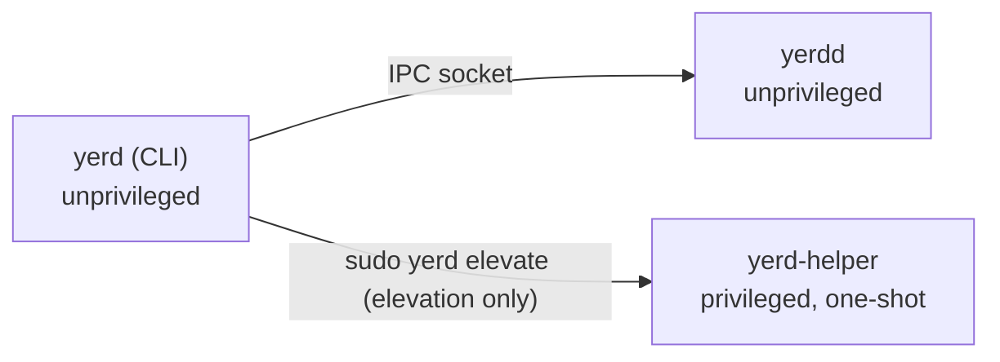

# yerd-helper (privileged)

`yerd-helper` is the **only** privileged component in Yerd and therefore the project's single security boundary. The daemon ([`yerdd`](./yerdd)) and the CLI ([`yerd`](./yerd)) run entirely as your user; the small set of operations that genuinely require root - trusting the local CA, redirecting `.test` DNS, granting the daemon permission to bind low ports - are handed to this binary, which validates everything, performs exactly one operation, and exits.

For the user-facing model of when and how elevation happens, see [Elevation & Privileges](../../guide/elevation). This page is the contributor-level reference: the module map, the hard rules, the argv wire contract, the per-operation implementations, and the invariants enforced by tests.

::: info One-line summary
`yerd-helper` is a stateless, no-network, no-shell, one-shot. It takes a typed operation over a frozen argv contract, re-validates it from scratch (it does not trust the daemon), does the work, and returns a `sysexits.h` exit code the daemon interprets.
:::

## Where it sits



The daemon never spawns `yerd-helper` for itself under ambient privilege. Elevation is driven by `yerd elevate` (`yerd elevate [trust|resolver|ports]`), which is the moment a user supplies `sudo` / an admin prompt. The helper inherits that elevated context, does one job, and exits. There is no resident privileged process.

Source: [`bin/yerd-helper`](https://github.com/forjedio/yerd/tree/main/bin/yerd-helper).

## The hard rules

These are not aspirational - they are enforced by code structure, lints, and tests.

1. **Strict typed args; never shell out.** Every external command goes through `ops::run_command`, which builds a `std::process::Command` with arguments pushed one at a time. There is no `sh -c`, no string interpolation, no glob expansion. The child's environment is wiped with `env_clear()` and given a single pinned `PATH`.
2. **Never take network input.** The helper reads only its argv and a few well-known files on disk (the PEM the daemon wrote, `/etc/resolv.conf`, `/etc/pf.conf`, anchor directories). It opens no sockets and performs no DNS.
3. **One operation, then exit.** No event loop, no daemonization, no persisted state. `main` parses one invocation, dispatches it once, and returns an `ExitCode`.
4. **Minimal, auditable dependencies.** The runtime crate graph is tiny: `clap`, `thiserror`, `hex`, `pem`, plus the workspace's own `yerd-core` and `yerd-platform`. A test (`tests/no_runtime_deps.rs`) walks `cargo metadata` and **fails the build** if `tokio`, `reqwest`, `openssl`, `openssl-sys`, or `native-tls` ever appear in the normal-dependency graph.
5. **Effective-UID check, debug-only bypass.** Before any side effect the helper confirms its effective UID is 0. The only way to skip the check is a hidden `--skip-priv-check` flag that **does not exist in release builds** (it is compiled out by `cfg(debug_assertions)`).
6. **Defence in depth.** The helper does not trust the daemon. Every typed value is re-parsed and re-validated here, even though the daemon already validated it.

`#![forbid(unsafe_code)]` is set at the crate root, so even the UID lookup avoids raw FFI to `geteuid`.

## Module map

| File | Responsibility |
|---|---|
| `src/main.rs` | Entry point: parse → drop privileges' cwd → UID check → dispatch → exit code |
| `src/cli.rs` | clap-derived CLI; maps subcommands to `HelperInvocation`; debug-build wire-drift cross-check |
| `src/privilege.rs` | `is_privileged()` - effective-UID == 0 check, per-OS |
| `src/validate.rs` | Defence-in-depth validators (absolute path, file exists, basename, TLD, PEM↔fingerprint) |
| `src/exec.rs` | `dispatch(HelperInvocation)` → the right `ops::*` function |
| `src/ops/mod.rs` | `run_command` (pinned-`PATH` subprocess) and `atomic_write` |
| `src/ops/ca.rs` | `install-ca` / `uninstall-ca` (Linux trust anchors, macOS System keychain) |
| `src/ops/resolver.rs` | `install-resolver` / `uninstall-resolver` (systemd-resolved drop-in, `/etc/resolver/<tld>`) |
| `src/ops/setcap.rs` | `setcap` (Linux only) |
| `src/ops/port_redirect.rs` | `install-port-redirect` / `uninstall-port-redirect` (macOS pf, only) |
| `src/error.rs` | `HelperError`, `ValidationReason`, `CommandReason`, and the exhaustive `exit_code` mapping |

## main: the control flow

`main.rs` is intentionally short. On an unsupported OS (anything but Linux/macOS in Phase 1) it prints a message and exits `78` (`EX_CONFIG`). On a supported OS:

```rust
fn run() -> ExitCode {
    let parsed = match cli::parse(std::env::args_os()) {
        Ok(p) => p,
        Err(e) => {
            eprintln!("yerd-helper: {e}");
            return ExitCode::from(error::exit_code(&e));
        }
    };

    // Defang any relative-path argv before doing any per-op work.
    let _ = std::env::set_current_dir("/");

    if !parsed.skip_priv_check && !privilege::is_privileged() {
        let e = error::HelperError::NotPrivileged;
        eprintln!("yerd-helper: {e}");
        return ExitCode::from(error::exit_code(&e));
    }

    if let Err(e) = exec::dispatch(parsed.invocation) {
        eprintln!("yerd-helper: {e}");
        return ExitCode::from(error::exit_code(&e));
    }
    ExitCode::SUCCESS
}
```

Two details worth calling out:

- The `set_current_dir("/")` before any per-op work neutralises any relative-path surprises in the inherited working directory.
- `main` is the **only** place that converts a `HelperError` into an exit code. Everything else returns `Result<(), HelperError>`.

## Effective-UID check (`privilege.rs`)

```rust
#[must_use]
pub fn is_privileged() -> bool {
    effective_uid() == Some(0)
}
```

The implementation is per-OS and deliberately avoids `unsafe`:

- **Linux** parses `/proc/self/status` for the `Uid:` line (`real effective saved fsuid`) and reads the effective field. If `/proc` is missing (chroot, minimal container), it conservatively returns `None` → `is_privileged()` is `false`. Failing closed with `NotPrivileged` is safer than assuming root.
- **macOS** shells out to `/usr/bin/id -u` **by absolute path with `env_clear()`**, so a poisoned `PATH` from the elevation mechanism cannot redirect the lookup.

### The debug-only bypass

The bypass flag exists only so integration tests can exercise the dispatch path without actually being root:

```rust
#[cfg(debug_assertions)]
#[arg(long, global = true, hide = true)]
pub skip_priv_check: bool,
```

In release builds the field is not compiled at all, and `skip_priv_check_value()` is a `const false`. A shipped binary therefore cannot be told to skip the UID check - passing `--skip-priv-check` to a release build is simply an unknown flag (rejected as `EX_USAGE`).

::: warning
`--skip-priv-check` is debug-only and hidden. It never reaches a release artifact. If you are reading this in a packaged build, the flag does not exist.
:::

## The argv wire contract

The daemon and helper communicate by argv, not by a serialization format. The shape is **frozen** and owned by `yerd_platform::HelperInvocation`:

- The daemon builds an invocation and calls `HelperInvocation::to_argv()` to render argv.
- The helper consumes argv. Its primary parser is the clap layer in `cli.rs`; `HelperInvocation::from_argv` is the lower-level reference parser that the contract is defined against.

`HelperInvocation` (in [`crates/yerd-platform/src/helper.rs`](https://github.com/forjedio/yerd/tree/main/crates/yerd-platform/src/helper.rs)) has one variant per operation:

```rust
#[non_exhaustive]
pub enum HelperInvocation {
    InstallCa { ca_pem_path: PathBuf, fp: CaFingerprint },
    UninstallCa { fp: CaFingerprint },
    InstallResolver { tld: String, addr: SocketAddr },
    UninstallResolver { tld: String },
    Setcap { daemon_binary: PathBuf },
    InstallPortRedirect { http_from: u16, http_to: u16, https_from: u16, https_to: u16 },
    UninstallPortRedirect,
}
```

`to_argv` always emits the operation tag first (one of the `&str` constants in `yerd_platform::error::ops`), then alternating `--flag` / value pairs. Fingerprints render as 64 lowercase hex chars; socket addresses use their `Display` form; paths pass through as native `OsString`; TLDs verbatim.

### CLI surface

The clap layer mirrors the enum one-for-one:

| Subcommand | Flags | OS |
|---|---|---|
| `install-ca` | `--pem <PATH>` `--fingerprint <HEX>` | Linux, macOS |
| `uninstall-ca` | `--fingerprint <HEX>` | Linux, macOS |
| `install-resolver` | `--tld <NAME>` `--addr <SOCKETADDR>` | Linux, macOS |
| `uninstall-resolver` | `--tld <NAME>` | Linux, macOS |
| `setcap` | `--binary <PATH>` | Linux only (macOS → `Unsupported`) |
| `install-port-redirect` | `--http-from` `--http-to` `--https-from` `--https-to` (all `<PORT>`) | macOS only |
| `uninstall-port-redirect` | (none) | macOS only |

The parser is configured `arg_required_else_help = true` and `disable_help_subcommand = true`. Unknown subcommands and unknown flags are rejected by clap and surface as `HelperError::ArgvUsage` (exit `64`).

### Debug-build wire-drift cross-check

clap and `from_argv` are two independent parsers of the same argv. If a clap upgrade ever normalised argv differently from the hand-written `from_argv`, the two could silently diverge - a wire-contract drift bug. `cli::parse` guards against this in **debug builds only**:

```rust
#[cfg(debug_assertions)]
{
    if argv.len() > 1 {
        let tail: Vec<OsString> = argv.iter().skip(1).cloned().collect();
        // Strip the global debug-only flag before handing to from_argv.
        let filtered: Vec<OsString> = tail
            .into_iter()
            .filter(|a| a != "--skip-priv-check")
            .collect();
        if let Ok(parsed) = HelperInvocation::from_argv(&filtered) {
            if invocation_tag(&parsed) != invocation_tag(&invocation) {
                return Err(HelperError::WireDrift {
                    clap: invocation_tag(&invocation),
                    from_argv: invocation_tag(&parsed),
                });
            }
        }
    }
}
```

If the two parsers disagree on the operation tag, dev/CI builds fire `HelperError::WireDrift` (exit `70`, `EX_SOFTWARE`). The check is `cfg(debug_assertions)`-gated so that a benign clap upgrade can never brick a shipped release binary - at worst CI catches the drift first.

The integration test `tests/argv_contract.rs` is the twin of this in-source check: for every variant it asserts `from_argv(inv.to_argv())` round-trips back to the same operation tag and re-serialises to the identical argv.

## Validation (`validate.rs`)

The helper re-validates from scratch. Highlights:

```rust
pub fn require_existing_file(path: &Path) -> Result<(), HelperError> {
    if !path.is_absolute() { /* PathNotAbsolute */ }
    let meta = fs::symlink_metadata(path) /* PathMissing */;
    if !meta.file_type().is_file() { /* PathNotFile */ }
    Ok(())
}
```

- **Paths must be absolute and exist**, and must be a regular file. The helper **deliberately does not canonicalise** - canonicalising a path an attacker may control between the `canonicalize` and the `open` introduces a TOCTOU window. It uses `symlink_metadata` and operates on the path as given.
- **`setcap` basename must be `yerdd`** (`require_basename_yerdd`). This bounds the blast radius: even if the daemon were tricked into requesting `setcap` on an arbitrary binary, the helper refuses anything not named `yerdd`.
- **TLD re-parsed through `yerd_core::Tld`** (`require_valid_tld`), so traversal-style inputs like `../etc/passwd` are rejected by the helper's own validation, not just the daemon's.
- **PEM ↔ fingerprint binding** (`require_pem_matches_fingerprint`): the helper reads the PEM, requires **exactly one** `CERTIFICATE` block, computes its SHA-256, and compares it against the argv-supplied fingerprint. A mismatch is `HelperError::FingerprintMismatch`. This closes the "swap a different PEM into the runtime dir" attack: the helper provably installs the certificate whose fingerprint the daemon chose, and on Linux it re-emits the PEM from the validated DER rather than copying any bytes the daemon may have prepended outside the certificate block.

## Subprocess hygiene (`ops/mod.rs`)

Two shared primitives back every operation.

`run_command` pins the environment for every external tool:

```rust
const PINNED_PATH: &str = "/usr/sbin:/usr/bin:/sbin:/bin";

let mut cmd = Command::new(program);
cmd.env_clear().env("PATH", PINNED_PATH);
for a in args { cmd.arg(a); }
```

Failure modes are typed: a `NotFound` spawn error becomes `CommandReason::NotFound`, other spawn errors `Spawn`, a non-zero exit `NonZero(code)`, and a signal kill `Signal`.

`atomic_write` writes to a `.tmp` sibling in the same directory, `fsync`s it, then `rename(2)`s into place - no partial-write or replace race. The mode is set **at creation time** via `OpenOptionsExt::mode` (no create-then-chmod window): `0o600` for anchor PEMs, `0o644` for world-readable resolver files and drop-ins.

## Operations

Each op lives in one file with its per-OS branches behind `#[cfg(target_os = ...)]`, so it can be audited end-to-end in one place. All ops are **idempotent**: re-running an install is a no-op or benign, and uninstalling something already absent returns success.

### install-ca / uninstall-ca

**Linux.** Picks the first present anchor directory in precedence order - `/usr/local/share/ca-certificates` (Debian/Ubuntu/Alpine), `/etc/pki/ca-trust/source/anchors` (RHEL/Fedora), `/etc/ca-certificates/trust-source/anchors` (Arch) - writes `yerd-<first-16-hex-of-fp>.crt`, then runs the matching refresh command (`update-ca-certificates`, `update-ca-trust extract`, or `trust extract-compat`). Uninstall reads the anchor dir, matches by fingerprint, removes the file, and refreshes. An unrecognised layout returns `ValidationReason::NoAnchorDir`.

**macOS.** Runs `security add-trusted-cert -d -r trustRoot -k /Library/Keychains/System.keychain <pem>` (mkcert's approach). `add-trusted-cert` exits non-zero when the cert is already present (`errSecDuplicateItem`); the helper tolerates that **only** after confirming via `security find-certificate -Z -a` that the cert really is in the System keychain. Uninstall probes the keychain first (idempotent) then `security delete-certificate -Z <FP> …`.

### install-resolver / uninstall-resolver

**Linux.** Only systemd-resolved is supported in Phase 1. The helper reads `/etc/resolv.conf` and checks for the `/run/systemd/resolve` runtime dir; if resolved is not in charge it returns `Unsupported` rather than risk editing an `/etc/resolv.conf` that NetworkManager / resolvconf / cloud-init may rewrite. Otherwise it writes `/etc/systemd/resolved.conf.d/yerd-<tld>.conf` and runs `systemctl reload-or-restart systemd-resolved`. `uninstall-resolver` removes the drop-in and reloads (no backup mechanism on Linux).

**macOS.** Writes `/etc/resolver/<tld>`. If a foreign file already exists there (Valet/Herd/an older Yerd) and does not already point at our responder, it is backed up best-effort into the system backups dir as `<tld>-<unixsecs>.conf` before being overwritten; a backup failure is logged and swallowed, never fatal. No reload is needed - macOS picks up the new file on the next query.

`uninstall-resolver` on macOS is a **restore**, not a bare delete: it puts the newest backup back over `/etc/resolver/<tld>` (then clears all of that tld's backups), falling back to a plain removal when there's nothing to restore. Because the helper runs as root and the backups dir is world-traversable (`0755`), restore is **guarded** — the dir and chosen file must be root-owned, the file a non-symlink regular file with no group/other write bit, and its bytes must pass `resolver_file::restorable` (parse as a real resolver file). The destination is replaced atomically; on a write failure the live file and backups are left intact. This closes a local DNS-hijack vector (a planted future-stamped backup) and never restores empty/garbage content.

### setcap (Linux only)

```rust
validate::require_existing_file(binary)?;
validate::require_basename_yerdd(binary)?;
run_command("setcap", "setcap", ["cap_net_bind_service=+ep", binary_str.as_ref()])
```

Grants `yerdd` the ability to bind ports 80/443 without being root. On macOS this op returns `HelperError::Unsupported { operation: SETCAP }` (macOS uses the pf port redirect instead).

### install-port-redirect / uninstall-port-redirect (macOS only)

macOS has no `setcap`, so the rootless daemon cannot bind 80/443 directly. Instead the helper installs a pf `rdr` redirect (rule text composed by `yerd_platform::pure::pf_anchor`) plus a `LaunchDaemon` to re-apply it at boot. The flow is carefully ordered for safety:

1. Reject any zero port (`ValidationReason::PortInvalid`).
2. Write the inert anchor-rules file.
3. Edit the canonical `/etc/pf.conf` to reference the anchor (preserving its contents and Apple's default anchors), keeping the original for rollback.
4. `pfctl -f /etc/pf.conf` both validates and loads; if it rejects the edited config the helper **rolls the pf.conf edit back** before returning the error, so a broken config is never persisted. `pfctl -e` ("already enabled" is success) is best-effort.
5. Only after a clean load does it install the boot-persistence `LaunchDaemon` (`chown root:wheel`, then `launchctl bootout` for idempotency, then `bootstrap`).

Uninstall reverses this in the safe order: tear down the `LaunchDaemon`, remove the hook lines from `/etc/pf.conf` and reload (leaving pf's enabled state as-is), then delete the anchor and plist files - so pf.conf never references a missing anchor.

## Errors and exit codes

`HelperError` is the single error type; `error::exit_code` maps it to a `sysexits.h` code. The match is **exhaustive** - adding a variant without extending the mapping is a compile error, not a silent default.

| Code | Constant | Meaning |
|---|---|---|
| `0` | - | success |
| `64` | `EX_USAGE` | malformed argv (clap parse failure, unknown subcommand/flag) |
| `65` | `EX_DATAERR` | bad typed data: `ArgvData`, `Validation`, `FingerprintMismatch` |
| `69` | `EX_UNAVAILABLE` | required external tool not on the pinned `PATH` (`Command`/`NotFound`) |
| `70` | `EX_SOFTWARE` | `WireDrift` - debug-build wire-contract drift bug |
| `74` | `EX_IOERR` | `Io` against a known path |
| `75` | `EX_TEMPFAIL` | external command spawn failure / non-zero exit / signal |
| `77` | `EX_NOPERM` | `NotPrivileged` - daemon should retry under elevation |
| `78` | `EX_CONFIG` | `Unsupported` - op not implemented on this OS |

The daemon keys off these codes - for example, `77` tells it elevation is required, while `78` tells it the operation simply isn't available on the current platform.

## Invariants enforced by tests

- **`tests/argv_contract.rs`** - every `HelperInvocation` variant round-trips: `to_argv` → `from_argv` → same op tag → identical re-serialised argv.
- **`tests/no_runtime_deps.rs`** - walks the normal-dependency graph from `cargo metadata --locked --filter-platform <host>` and fails if `tokio`, `reqwest`, `openssl`, `openssl-sys`, or `native-tls` is reachable.
- **Unit tests in `validate.rs`** - relative/missing/non-file paths rejected; basename guard; TLD traversal rejected; PEM fingerprint happy-path, mismatch, multi-cert and zero-cert rejection.
- **Unit tests in `error.rs`** - every `HelperError` variant maps to its expected exit code.
- **In-source debug cross-check** - `cli.rs` fires `WireDrift` if clap and `from_argv` disagree (debug builds only).

## Platform scope and roadmap

Windows is not supported in Phase 1: the `main` stub exits `78`. Real Windows behaviour is planned for Phase 2 alongside `yerd-platform`'s Windows implementations. Also planned: a macOS Authorization Services entitlements wrapper, and broader Linux distro coverage (unknown anchor-dir layouts currently return `Unsupported`). There is intentionally no `tracing` subscriber - `eprintln!` to stderr is enough for a process that lives for milliseconds.

## See also

- [Elevation & Privileges](../../guide/elevation) - the user-facing model
- [yerdd (daemon)](./yerdd) - the unprivileged process that issues invocations
- [yerd (CLI)](./yerd) - drives `yerd elevate` / `yerd unelevate`
- [yerd-platform](../crates/yerd-platform) - owns `HelperInvocation`, the argv contract, and the pure composers
- [Cross-Platform Model](../cross-platform) - how per-OS branches are organised
- [HTTPS & Certificates](../../guide/https) and [DNS & .test Domains](../../guide/dns) - what the privileged ops ultimately enable
