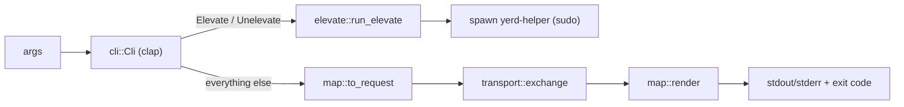

# yerd (CLI)

`yerd` is the command-line client. It is deliberately thin: it parses
arguments, maps each command to exactly one [`yerd-ipc`](../crates/yerd-ipc)
`Request`, exchanges that request with the [`yerdd`](./yerdd) daemon over a
local socket, and renders the `Response` as either a human-readable block or
`--json`. Almost no domain logic lives here - the daemon owns state and all
privileged work happens in [`yerd-helper`](./yerd-helper).

The one exception is `yerd elevate` / `yerd unelevate`, which do not map to a
single IPC round-trip: they orchestrate the privileged helper locally (under
`sudo`). That path lives in `elevate.rs` and is described in detail
[below](#elevate-the-privileged-orchestrator).

::: info Crate facts
Source: [`bin/yerd`](https://github.com/forjedio/yerd/tree/main/bin/yerd) ·
binary `yerd` (`src/main.rs`), library `yerd` (`src/lib.rs`). Depends on
[`yerd-core`](../crates/yerd-core), [`yerd-ipc`](../crates/yerd-ipc) (with the
`transport` feature) and [`yerd-platform`](../crates/yerd-platform). The user-
facing command catalogue lives in the [CLI Reference](../../reference/cli/).
:::

::: tip Designed fresh, not ported
The v2 command surface was designed from scratch around the daemon/IPC model -
it is **not** a port of the Yerd v1 commands. If you are migrating, see the
[Upgrade Guide](../../guide/upgrading-from-v1).
:::

## Module map

The binary is a one-line wrapper; everything testable lives in the library so
the `tests/cli_e2e.rs` integration test can drive the same code paths.

| File | Role |
| --- | --- |
| `src/main.rs` | Parse args, build a current-thread tokio runtime, call `yerd::run`. |
| `src/lib.rs` | `run()` - the orchestration: branch `elevate`, map, exchange, render, set the exit code. |
| `src/cli.rs` | The clap-derived `Cli` / `Command` surface (no I/O). |
| `src/map.rs` | Pure `to_request` (command → `Request`) and `render` (`Response` → text + exit code). |
| `src/transport.rs` | Resolve the socket path and perform one framed request/response exchange. |
| `src/elevate.rs` | `yerd elevate` / `unelevate`: local privileged orchestration of `yerd-helper`. |
| `src/cover_shim.rs` | Multi-call dispatch: when `argv[0]` is a `phpcover`/`php<ver>cover` alias, exec PHP with pcov enabled (Unix-only). Runs before clap. |
| `src/composer_shim.rs` | Multi-call dispatch: when `argv[0]` is `composer`, exec the default PHP against `{data}/tools/composer/composer.phar` (Unix-only). Runs before clap. See [Dev-tool installers](../dev-tools). |
| `src/wp_shim.rs` | Multi-call dispatch: when `argv[0]` is `wp`, exec WP-CLI - site-aware if cwd is inside a registered site (pins that site's PHP, scopes via `--path=`) (Unix-only). Runs before clap. |
| `src/shim.rs` | Shared PHP-resolution helpers for the cover, composer, and `wp` multi-call shims (default-version resolution, highest-installed fallback). |
| `src/path_cmd.rs` | `yerd path install`/`uninstall`/`print`: edit the user's shell startup file to add `{data}/bin` to `PATH` (local, no IPC; Unix-only). |
| `src/error.rs` | `ClientError` - the client's error type. |



## The command surface (`cli.rs`)

`Cli` is the top-level clap parser. The only global flag is `--json`; every
subcommand is one variant of `Command`.

```rust
#[derive(clap::Parser, Debug)]
#[command(name = "yerd", version, about = "Yerd CLI - talks to the yerdd daemon")]
pub struct Cli {
    /// Emit machine-readable JSON instead of human-readable text.
    #[arg(long, global = true)]
    pub json: bool,
    #[command(subcommand)]
    pub command: Command,
}
```

Several commands take a *target* subcommand rather than a positional argument,
which keeps room for non-PHP components later (e.g. `install php 8.5`,
`restart daemon`). The current shape:

| Command | Args / target | Notes |
| --- | --- | --- |
| `ping` | - | Liveness check. |
| `sites` | - | List parked + linked sites. |
| `park <path>` | directory | Each child directory becomes a `.test` site. |
| `link <name> <path>` | name + directory | One named site. |
| `unlink <name>` | name | Remove a linked site. |
| `unpark <path>` | directory | Remove a parked root (see canonicalisation below). |
| `use <first> [version]` | one or two args | One arg = global default PHP; two = a site's version. |
| `set php <setting> <value>` | `SetTarget::Php` | Global PHP ini default. |
| `unset php <setting>` | `UnsetTarget::Php` | Reset to PHP's built-in. |
| `install php <version>` | `InstallTarget::Php` | Download a prebuilt static build. |
| `restart php [version]` / `restart daemon` | `RestartTarget` | Pool(s), or the daemon itself. |
| `uninstall php <version>` | `UninstallTarget::Php` | Remove files; blocked if in use. |
| `list php [--check] [--available]` / `list parked` | `ListTarget` | See flag precedence below. |
| `update php [version]` | `UpdateTarget::Php` | Upgrade to latest; omit version = all. |
| `status` | - | Live daemon/proxy/DNS/ports/CA/PHP snapshot. |
| `doctor [fix]` | optional `DoctorAction::Fix` | Diagnose; `fix` attempts safe repairs. |
| `secure <name>` / `unsecure <name>` | name | Toggle HTTPS for a site. |
| `root <name> [path] [--auto]` | name + optional path | Set/reset a site's served web root → `SetWebRoot`. |
| `domain <action>` | `DomainAction`: `list [site]` / `add <site> <domain>` / `remove <site> <domain>` / `primary <site> <domain>` / `reset <site>` | Manage a site's routable domains, subdomains, and wildcards. All but `list` map to a domain `Request`; `list` is rendered locally (it needs the TLD to synthesize default `{name}.{tld}` domains). |
| `elevate [target]` / `unelevate [target]` | optional `ElevateTarget` | Privileged setup - handled locally. |

The `ElevateTarget` enum enumerates the three privileges: `Trust` (system CA
store), `Resolver` (`*.<tld>` DNS routing) and `Ports` (bind 80/443). Omitting
the target means "all three".

## Cover shims: `yerd` as a multi-call binary (`cover_shim.rs`)

`yerd` doubles as the pcov **code-coverage** launcher. In `{data}/bin` the daemon
maintains a set of *cover* symlinks - `phpcover` (the default PHP version) and
`php<major>.<minor>cover` (e.g. `php8.4cover`) - each pointing back at the `yerd`
binary itself. Running one of those names makes `yerd` behave as a thin PHP
wrapper that turns coverage on, while the clean `php` / `php<ver>` shims stay
untouched so ordinary PHP carries **no coverage overhead**.

This is dispatched in `main.rs` **before clap ever parses**:

```rust
#[cfg(unix)]
if let Some(code) = yerd::cover_shim::dispatch() {
    return code;
}
```

`dispatch` inspects `argv[0]`'s basename:

- `parse_cover_name` matches `phpcover` (→ default) and `php<major>.<minor>cover`
  (→ that explicit version) **exactly**. Any other name - `php`, a clean
  `php8.4`, `phpunit`, malformed forms like `php8.cover` - returns `None`, so the
  call falls straight through to the normal `Cli::parse()` CLI. `yerd <subcommand>`
  is never intercepted.
- On a match it resolves `(php_binary, "major.minor")`. For an explicit version
  that is `{data}/php/php-<ver>/bin/php` (erroring if the version isn't
  installed). For the default it reads the `php` shim's link target (falling back
  to the highest installed minor whose CLI binary exists).
- It then locates that version's `{data}/php-ext/php-<ver>/pcov.so` (the daemon
  bundles it; see [yerdd · cover-shim reconciliation](./yerdd#cover-shim-reconciliation-and-pcov)),
  reads Yerd's CLI ini (`{data}/php-cli.ini`, treating a missing file as empty),
  appends pcov's `extension`/`pcov.enabled` directives
  (`yerd_core::php_settings::render_cover_ini`), and atomically writes the
  result to `{data}/php-ext/php-<ver>/cover.ini`. This read-render-write happens
  on **every** invocation - `cover.ini` is never cached or diffed against the
  last run, so it can't drift out of sync with `php-cli.ini` (whose contents
  change whenever a PHP setting is edited). It then `exec`s PHP with `PHPRC`
  set to that path, followed by the caller's own args. `exec` replaces the
  process, so on success it never returns; a missing binary, missing
  `pcov.so`, or a write failure prints a `yerd:` diagnostic and returns
  `ExitCode::FAILURE`.

`PHPRC` rather than `-d` flags is deliberate: `-d` only affects the exec'd
process itself, but `PHPRC` is an environment variable, so it's inherited by
any PHP process that process spawns in turn (e.g. `php artisan test`'s child
PHPUnit/Pest/paratest run, launched via `PHP_BINARY` by a Symfony `Process`
that inherits the parent's environment) - which is what actually needs pcov
loaded to produce a coverage report. Setting `PHPRC` on the `Command` overrides
that one key and leaves the rest of the environment inherited (no
`env_clear()` is called), so if the caller's shell already has its own `PHPRC`
(for example from the `yerd path install` rc-block, which points the plain
`php` shim at `{data}/php-cli.ini`), the cover shim's value wins for the
exec'd process - intentional, not a conflict to resolve.

The same logic also backs the `yerd coverage <args…>` **subcommand**, which
reaches it from the other direction. Rather than being keyed on `argv[0]`,
`lib.rs::run` intercepts `Command::Coverage` locally (like `elevate`/`path`,
before the daemon round-trip) and calls `cover_shim::run_coverage`, which is just
`run(&CoverSpec::Default, args)` with the clap-captured passthrough args. So the
subcommand and the `phpcover` shim share one implementation and one code path;
the only difference is where the forwarded args come from (`argv[0]` dispatch
forwards `env::args_os().skip(1)`, the subcommand forwards its `Vec<OsString>`).

::: info Unix-only
The `dispatch()` call is `#[cfg(unix)]` and the cover symlinks are only ever
created on Unix - on other platforms `yerd` is always just the CLI. PHP itself
reads `PHP_BINARY` from `/proc/self/exe`, so although the process was launched
via the cover alias, `argv[0]` (left at the real `php` path) and `PHP_BINARY`
both report the genuine interpreter, not the shim name.
:::

`composer` works the same way (`composer_shim.rs`): when `argv[0]` is `composer`,
`yerd` resolves the default PHP (sharing the helpers in `shim.rs`) and `exec`s it
against `{data}/tools/composer/composer.phar`. Its `dispatch()` runs in `main.rs`
just before the cover dispatch. See [Dev-tool installers](../dev-tools) for how
the daemon installs the phar and creates the `composer` symlink.

`wp` is a third multi-call shim (`wp_shim.rs`), for **WP-CLI**. Unlike the cover
and composer shims it is *site-aware*: when the current directory is inside a
registered site, it asks the daemon for the live site list (`Request::ListSites`,
bounded to 300ms so a slow or unreachable daemon never stalls an ordinary `wp`
invocation) and, on a match, runs WP-CLI under *that site's* pinned PHP version,
scoped to its served root via `--path=` - so `wp option get siteurl` and friends
behave the way the site is actually served, with no `--path` flag or `cd`-ing
into `public/` needed. Outside any registered site, or if the daemon is
unreachable, slow, or finds no match, it falls back to the default managed PHP
with no working-directory change, identical to the cover and composer shims. If
cwd *is* inside a site but that site's pinned PHP version isn't installed, it
fails loudly rather than silently running under an unrelated version.

WP-CLI re-invokes its own entry point for some subcommands
(`WP_CLI::launch_self()`, used by `rewrite structure` among others) via a raw
shell string built from `argv[0]` - on macOS that path always runs through
`~/Library/Application Support/...`, which always contains a space and would
silently split the re-invoked shell command. The shim works around this by
exec'ing WP-CLI's boot script under its bare file name with `cwd` set to the
script's own directory rather than the site, keeping "which WordPress install"
and "process cwd" decoupled via `--path=` - see
[`bin/yerdd/src/create_site/wordpress.rs`](https://github.com/forjedio/yerd/blob/main/bin/yerdd/src/create_site/wordpress.rs)
for the daemon-side scaffolding path that hits the same bug and works around it
the same way.

## Pure mapping and rendering (`map.rs`)

`map.rs` is the heart of the client and is entirely I/O-free, which is what
makes it exhaustively unit-testable. It has two directions.

### `to_request` - command → `Request`

```rust
pub fn to_request(cmd: &Command) -> Result<Request, ClientError>
```

Each `Command` arm produces exactly one `yerd_ipc::Request`. Crucially, this is
also where **client-side validation** happens, so a bad site name or PHP
version is a clean usage error *before* any socket connect:

- `validate_name` constructs a throwaway `Site::linked(name, "/", …)` purely to
  run the same name rules the daemon would.
- `parse_php` parses the version through `PhpVersion::FromStr`.
- `validate_php_setting` checks the setting against
  `yerd_core::php_settings::is_supported` and validates the value with
  `validate_value`.

A handful of mappings encode real design decisions worth knowing:

- **`use`** is overloaded by arity. One argument (`yerd use 8.5`) maps to
  `Request::SetDefaultPhp`; two (`yerd use blog 8.5`) maps to `Request::SetPhp`.
- **`unset php <setting>`** maps to `Request::SetPhpSettings` with an *empty
  string* value - empty value is the wire convention for "remove / reset".
- **`root <name> [path] [--auto]`** maps to `Request::SetWebRoot { name, path }`,
  where `--auto` (or omitting the path) sends `path: None` to reset the site to
  auto-detection. The name is validated client-side like `secure`/`link`.
- **`domain`** maps each sub-action through `domain_request`: `add`/`remove`/`primary`/`reset` become `AddDomain`/`RemoveDomain`/`SetPrimaryDomain`/`ResetDomains`, each validating the site name and (for the first three) the domain shape client-side (`validate_domain`) before any socket connect. `domain list` is *not* mapped to a request - it is rendered locally by `render_domains`/`site_domains`, which needs the TLD (from a `DaemonInfo` round-trip) to synthesize a default site's `{name}.{tld}` domains.
- **`list php`** flag precedence: `--available` wins over `--check`. With
  neither, it sends `Request::ListPhp` (cached); `--check` polls the
  distribution (`CheckPhpUpdates`); `--available` lists installable versions.
- **`unpark`** passes the path through as a string here (pure); the actual
  canonicalisation happens at the I/O boundary in `run` (see below).
- **`elevate` / `unelevate`** are deliberately *not* mapped to a single
  request. Their arms return `ClientError::Usage(...)` to keep the `match`
  total; `run` branches to `elevate::run_elevate` before ever calling
  `to_request`.

### `render` - `Response` → text + exit code

```rust
pub fn render(resp: &Response, json: bool) -> Rendered

pub struct Rendered { pub stdout: String, pub stderr: String, pub code: u8 }
```

`render` formats a `Response` into stdout/stderr and a process exit code. Two
properties are intentional and tested:

1. **The exit code is computed once, before branching on `--json`,** so the
   JSON and human paths always agree. `doctor_exit_code` returns `1` for a
   `Response::Error`, `1` for any `Severity::Fail` doctor finding (in
   `Diagnoses` or a `DoctorFix` report's `manual` list), else `0`.
2. **`Response` is `#[non_exhaustive]`.** An unknown variant from a newer daemon
   falls through to a benign `"unexpected response from daemon"` on stderr
   rather than panicking.

The formatters render tab-separated tables (`sites`), annotated version lists
(marking the default and any available updates), and a multi-line `status`
block. `status` carries small but real semantics - for example `fmt_port`
distinguishes a plain rootless fallback (`80 → 8080 (fallback)`) from a macOS
`pf` redirect that makes the privileged port reachable (`80 → 8080
(redirected)`), and empty `daemon_version` (an older daemon, `#[serde(default)]`)
renders as `unknown` rather than blank.

## Transport (`transport.rs`)

The client and daemon must agree on the socket path *without* a config
exchange. They do so by deriving it identically from
`yerd_platform::Paths::resolve()`:

```rust
#[cfg(unix)]
pub async fn exchange(req: &Request) -> Result<Response, ClientError> {
    let dirs = ActivePaths::new().resolve()?;
    exchange_at(&dirs.runtime.join("yerd.sock"), req).await
}
```

`exchange_at` is factored out so integration tests can target a tempdir socket.
It connects with `interprocess` (`GenericFilePath`), then frames one request and
reads one response using `yerd-ipc`'s `write_message` / `read_message` /
`FrameDecoder` with `DEFAULT_MAX_FRAME`. A closed connection with no reply
becomes `ClientError::DaemonUnreachable`.

::: warning Windows is not yet a client
`exchange` on non-Unix targets returns `DaemonUnreachable` immediately: the
daemon's Windows pipe name is currently PID-based and not derivable by a client.
This is tracked as a Phase-2 follow-up - treat Windows CLI support as roadmap.
:::

## Orchestration and exit codes (`lib.rs`)

`run` ties the pieces together. It does **not** auto-start the daemon - if the
socket is unreachable it reports an error (or, for `doctor`, a synthetic FAIL).
The flow:

1. Branch `Elevate` / `Unelevate` to `elevate::run_elevate` and return.
2. `map::to_request`; on `Err` print `yerd: <e>` and exit `2`.
3. `canonicalize_unpark` rewrites an `Unpark` request's path to its canonical
   form at the I/O boundary, so a relative/symlinked path the user typed matches
   the canonical string the daemon stored when the directory was parked. (The
   daemon matches `unpark` *exactly* and deliberately does not canonicalise, so
   an already-deleted directory is still removable by its stored path.)
4. `transport::exchange`, then `map::render`, then print and exit with the
   rendered code.

Two extra behaviours live here:

- After a successful global `yerd use <ver>` (human output only),
  `print_php_path_hint` prints where the managed `php` shim lives and warns if a
  different `php` shadows it earlier on `PATH`.
- For `doctor` specifically, a down daemon is itself a FAIL: `run` synthesises a
  `DiagnosisCode::DaemonDown` `Diagnoses` response and renders it through the
  normal path, so `--json` and the exit code behave like any other doctor run
  (exit `1`) instead of the generic "unreachable" code.

### Exit codes

| Code | Meaning |
| --- | --- |
| `0` | Success. |
| `1` | Daemon error response, or a doctor `Fail` finding. |
| `2` | Client-side usage error (bad name/version/setting - before connecting). |
| `69` | Daemon unreachable (`EX_UNAVAILABLE`). |
| `70` | Could not build the tokio runtime (`main.rs`). |
| `74` | Other transport/IO failure (`EX_IOERR`). |
| `77` | `elevate` not run as root (`EX_NOPERM`). |
| `78` | `elevate` on a non-Unix host / unsupported target (`EX_CONFIG`). |

The `ClientError` enum (`error.rs`) is `#[non_exhaustive]` and covers `Usage`,
`DaemonUnreachable`, `Ipc` (from `yerd_ipc::IpcError`), `Platform` and
`Fingerprint`.

## `elevate`: the privileged orchestrator

`yerd elevate` is run via `sudo` and is the one command that does not map to a
single IPC request. Its design follows a strict trust model (see
[Elevation & Privileges](../../guide/elevation)):

- It runs as root **only to orchestrate.** It fetches read-only facts
  (`Request::DaemonInfo` → `Response::Info`: DNS address, TLD, CA path +
  fingerprint, bound HTTP/HTTPS ports) from the *invoking user's* daemon, then
  spawns the audited `yerd-helper` once per target. The daemon itself is never
  restarted as root.
- Under `sudo` the process env points at root, so the user's socket is
  reconstructed from `SUDO_UID` (uid-based, home-independent):
  `/run/user/<uid>/yerd/yerd.sock` then `/tmp/yerd-<uid>/yerd.sock`.
- The `yerdd` and `yerd-helper` binaries are derived from `yerd`'s own trusted
  `current_exe` siblings - never from the daemon - so a forged daemon cannot
  point root's `setcap` at an arbitrary binary.
- Before trusting the CA pem, the path (the only one taken from the daemon) is
  owner-checked against the invoking uid and rejected if group/world-writable.
- The helper is spawned with `env_clear()` and re-validates every argument
  independently.

`plan_invocation` is a pure function mapping `(ElevateTarget, undo)` to a
`yerd_platform::HelperInvocation`, and it is cfg-gated per OS:

| Target | macOS | Linux |
| --- | --- | --- |
| `trust` | `InstallCa` / `UninstallCa` | same |
| `resolver` | `InstallResolver` / `UninstallResolver` | same |
| `ports` | `InstallPortRedirect` / `UninstallPortRedirect` (a `pf` redirect 80→http, 443→https; reversible) | `Setcap` (grants `cap_net_bind_service` to `yerdd`); **no clean reverse**, so `unelevate ports` prints `setcap -r` guidance |

Helper exit codes are classified: `0` is success, `78` (`EX_CONFIG`) is treated
as a *skip* ("unsupported on this host", e.g. resolver without
`systemd-resolved`), and anything else is a failure that flips the run's exit
code to `1`.

## Tests and invariants

The crate is tested at two levels.

**Unit tests in `map.rs`** assert the pure invariants directly:

- `maps_each_command_to_its_request` - one assertion per command arm, including
  the `use` arity split, `--available` winning over `--check`, and `restart php`
  (specific) vs. `restart php` with no version (`RestartAllPhp`).
- `rejects_bad_version_and_name_before_connect` - bad names, versions and PHP
  settings produce `ClientError::Usage` with no I/O.
- Rendering tests pin the human output and, importantly,
  `renders_doctor_and_sets_exit_code_on_fail` /
  `json_rendering_is_valid_and_codes_match` verify the JSON and human paths
  produce the **same** exit code.

**`tests/cli_e2e.rs`** boots a real daemon on a tempdir (only the IPC task; no
proxy/DNS, since no shipped command touches them) and drives every command
through `map::to_request` + `transport::exchange_at`. It exercises `park` →
`sites`, `link`/`unlink`, per-site `use`, the `secure`/`unsecure` toggle,
`status`, `doctor` (asserting the `NoPhpInstalled` FAIL renders as exit `1`),
`list parked`, and the canonical-path `unpark` round-trip (including idempotent
re-`unpark`). This is the test that justifies the lib/bin split in `lib.rs`:
binary-only crates expose no Rust API to integration tests, so the modules are
published as a library.

## See also

- [CLI Reference](../../reference/cli/) - full command catalogue and examples.
- [yerdd (daemon)](./yerdd) - the server the CLI talks to.
- [yerd-helper (privileged)](./yerd-helper) - what `elevate` spawns.
- [IPC Protocol](../ipc-protocol) - the framing and `Request`/`Response` types.
- [Elevation & Privileges](../../guide/elevation) - the user-facing trust model.
