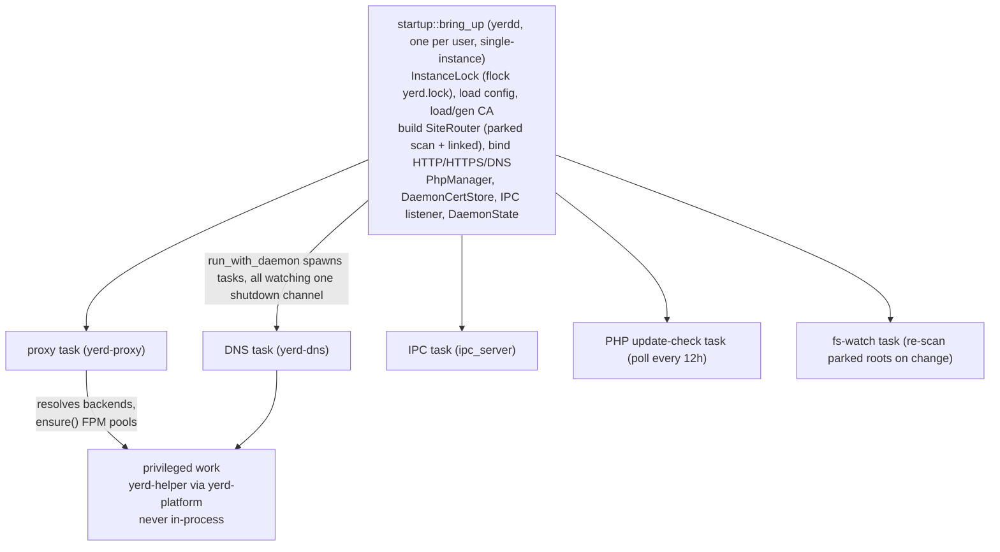

# yerdd (daemon)

`yerdd` is Yerd's **unprivileged, long-running daemon**. It is the process that actually serves HTTP/HTTPS, answers DNS for the local TLD, supervises PHP-FPM pools and database/cache services, owns the local certificate authority, and exposes the IPC socket that the [`yerd` CLI](./yerd) and the [desktop app](../gui) drive.

The crate is deliberately **thin orchestration**: nearly all real logic lives in the libraries (`yerd-core`, `yerd-config`, `yerd-tls`, `yerd-dns`, `yerd-proxy`, `yerd-supervise`, `yerd-php`, `yerd-services`, `yerd-doctor`, `yerd-platform`, `yerd-ipc`). `yerdd` wires them together - it loads config, builds the router, binds sockets, spawns the subsystem tasks (proxy, DNS, PHP-FPM pools, database/cache services), dispatches IPC requests, and handles process lifecycle. For anything that requires elevated privileges (trust-store install, resolver config, privileged-port redirect) it does **not** elevate itself; it shells out to [`yerd-helper`](./yerd-helper) through the [`yerd-platform`](../crates/yerd-platform) layer.

For the user-facing operational view of the daemon, see [The Daemon](../../guide/daemon). For the request/response contract this binary serves, see the [IPC Protocol](../ipc-protocol).

::: info Source
[`bin/yerdd`](https://github.com/forjedio/yerd/tree/main/bin/yerdd) on GitHub. The crate is published as both a binary (`src/main.rs`) and a library (`src/lib.rs`) - the lib shim exists only so the integration tests under `tests/` can reach internal entry points like `bring_up_with_dirs` and `run_with_daemon`.
:::

## Process model at a glance



## CLI surface

The daemon has a single subcommand, `serve`, which also runs when no subcommand is given (`src/args.rs`):

```rust
#[derive(clap::Subcommand, Debug)]
pub enum Command {
    /// Run the daemon in the foreground.
    Serve(ServeArgs),
}

#[derive(clap::Args, Debug, Default)]
pub struct ServeArgs {
    /// Increase log verbosity. `-v` → debug, `-vv` → trace.
    #[arg(short, long, action = clap::ArgAction::Count)]
    pub verbose: u8,
    /// Override the config file location.
    #[arg(short, long)]
    pub config: Option<PathBuf>,
}
```

| Flag | Effect |
| --- | --- |
| _(no subcommand)_ | Equivalent to `serve` with defaults. |
| `serve` | Run the daemon in the foreground. |
| `-v` / `-vv` | Raise the log level to `DEBUG` / `TRACE` (see [tracing](#tracing-init)). |
| `-c, --config <PATH>` | Override the config file path. Defaults to `<config-dir>/yerd.toml`. |

`yerdd` runs in the **foreground** - process supervision (launchd/systemd, or the desktop app's spawn) is the caller's responsibility. It does not daemonize itself.

## Entry point and exit codes

`main.rs` parses args, installs tracing, builds a multi-threaded tokio runtime, and blocks on `run(args)`. The result is an `Outcome`:

```rust
pub enum Outcome {
    Exit,    // normal shutdown - process should exit
    Restart, // re-exec the binary in place (same PID)
}
```

`Outcome::Restart` is produced by a `RestartDaemon` IPC request. `main` drops the runtime first (joining worker threads so no residual fd survives), then `restart_in_place()` re-execs the binary with the original argv via `CommandExt::exec` on Unix. On non-Unix the daemon refuses `RestartDaemon`, so `Restart` is unreachable there.

Errors are translated to **sysexits-style** exit codes by `error::exit_code` (`src/error.rs`):

| Code | Meaning | `DaemonError` variants |
| --- | --- | --- |
| `0` | Clean shutdown | - |
| `70` | `EX_SOFTWARE` (fallback) | DNS, Proxy, PHP, IPC, runtime-build failures |
| `71` | `EX_OSERR` | `Platform`, `Tls` |
| `74` | `EX_IOERR` | `Io` |
| `75` | `EX_TEMPFAIL` | `AlreadyRunning` (another instance holds the lock) |
| `78` | `EX_CONFIG` | `Config`, `Core` |

`DaemonError` is `#[non_exhaustive]` and uses `thiserror` with `#[from]` conversions for every library error type, so any subsystem failure funnels into one daemon error and one exit code.

## Module map

The daemon's modules (`src/lib.rs` re-exports each as `pub mod`):

| Module | Responsibility |
| --- | --- |
| `args` | clap-derived CLI surface (`serve`, `-v`, `--config`). |
| `startup` | Bring-up pipeline: dirs, config, CA, router, socket binds, `DaemonState`. |
| `state` | `DaemonState` - the shared config + router + lifecycle channel. |
| `ipc_server` | IPC accept loop and per-request dispatch. |
| `cert_store` | `DaemonCertStore` - per-SNI leaf issuance/cache for the proxy. |
| `backend_resolver` | `DaemonBackendResolver` - routes a `Site` to a live FPM pool. |
| `detect_cache` | `DetectCache` - memoises web-root detection per project, keyed on a freshness stamp. |
| `fs_watch` | Debounced filesystem watcher that re-scans parked roots as projects appear/change. |
| `mutate` | Pure, I/O-free config-mutation logic (`Park`/`Link`/`SetPhp`/…). |
| `php_install` | Download + unpack prebuilt PHP builds; `reqwest` downloader. |
| `php_updates` | Update poller + cache (notify-only). |
| `dump_server` | Loopback TCP server reading newline-delimited JSON dump frames from the native `yerd-dump` extension into a bounded ring buffer; serves the ring to the GUI over IPC (`ListDumps`/`DumpsStatus`/…). |
| `ext_install` | Downloads + SHA-256-verifies native PHP extension `.so`s per installed PHP version (from the `forjedio/yerd-php-ext` releases) into `{data}/php-ext/php-<ver>/`. An `ExtSpec` abstraction drives one fetch loop for **both** `yerd-dump` (`DUMP_SPEC`, gated on dumps) and `pcov` (`PCOV_SPEC`, ungated) - two manifests, one release. |
| `tools` | Dev-tool installers (Composer, Node, Bun): download + SHA-256-verify self-contained binaries into `{data}/tools/<id>/` and reconcile their `{data}/bin` shims. See [Dev-tool installers](../dev-tools). |
| `secure_fs` | Filesystem hardening (`0o700` dirs, `0o600` secrets). |
| `signals` | Unified shutdown future (SIGTERM + Ctrl-C). |
| `single_instance` | `InstanceLock` - exclusive `flock` so only one daemon runs. |
| `tracing_init` | Idempotent tracing-subscriber install. |
| `error` | `DaemonError` + sysexits exit-code mapping. |

## Startup (`startup.rs`)

`bring_up(args)` resolves the per-user [`PlatformDirs`](../crates/yerd-platform) via `ActivePaths::new().resolve()`, computes the config path (`--config` override, else `<config>/yerd.toml`), loads the config, and delegates to `bring_up_with_dirs`. The latter is the shared pipeline used by both production and the lifecycle tests (which inject a `tempfile`-rooted `PlatformDirs`), and it runs in this order:

1. **Single-instance lock** - `InstanceLock::acquire(&dirs)` (see below).
2. **PHP discovery** - `yerd_php::discover_bundled(&dirs)` finds installed builds under the data dir, producing a `BTreeMap<PhpVersion, PathBuf>`. An empty map is a warning, not an error.
3. **CA load-or-generate** - `load_or_generate_ca`. If `ca.cert.pem` + `ca.key.pem` exist they are re-loaded and their modes re-asserted (`0o644` cert, `0o600` key); otherwise a fresh `CertAuthority` ("Yerd Local CA", ~10-year validity) is generated and persisted. The CA path and SHA-256 fingerprint are captured **before** the CA is moved into the cert store, because `yerd elevate trust` needs both.
4. **Router build** - `build_router(&config, &dirs, &detect_cache)`: `scan_sites` walks every parked root for child directories, then appends explicitly linked sites. The result becomes a `SharedRouter` (`Arc<RwLock<SiteRouter>>`). A shared `DetectCache` (`Arc`) is created just before this and threaded into the build so the mutation path and the filesystem watcher reuse cached web-root detection.
5. **Port binding** - `ActivePortBinder::bind_pair((http, https), (8080, 8443))`. If `80`/`443` need elevation, the daemon falls back to `8080`/`8443` and logs a warning. The std listeners are converted to non-blocking tokio listeners. The bound HTTPS port also seeds `DaemonState::redirect_https_port` - see [the run loop](#the-run-loop-lib-rs) for how that value can later change live, without a restart.
6. **PhpManager** - constructed with `TokioProcessSpawner`, `SystemClock`, `FastCgiProbe`, the dirs, a port binder, the **daemon PID** as `instance_id` (disambiguates concurrent daemons), and the discovered binaries. Global ini settings from `config.php.settings` are seeded so the first pool start renders the user's values.
7. **IPC listener** - `build_ipc_listener` (Unix socket `runtime/yerd.sock` on Unix, named pipe `yerd-<pid>` on Windows).
8. **DNS bind** - `yerd_dns::Bound::bind(127.0.0.1:<dns_port>)`. A **fixed** port is required so an installed resolver config (`DNS=127.0.0.1:<port>`) survives restarts; `dns_port = 0` requests an ephemeral port (dev/tests only), read back via `Bound::local_addr`.
9. **Mail-capture store + listener** (the Email Capture feature). A `yerd_mail::Store` is opened over `{data}/mail` **unconditionally** - so already-captured mail stays listable even when capture is off - and is a hard error if it can't open. The SMTP listener is then bound via `yerd_mail::bind(mail_port)` **only when `config.mail.enabled`**; a bind failure (e.g. the port is busy) is logged and degrades to not-listening (`mail_listener = None`) rather than aborting the daemon. The resulting `mail_listening` flag is recorded on `DaemonState` and surfaced by `Status`.
10. **Dump-extension wiring.** Before the manager is shared, `php_manager.set_dump_ext(..)` is called so any pool with a matching `yerd-dump.so` under `{data}/php-ext/php-<ver>/` starts with `-d extension=<so>` plus the extension's `yerd_dump.state_path` ini define. The `.so` itself is fetched on demand (see [the run loop](#the-run-loop-lib-rs) / `ext_install`); the extension self-disables via its state file when dumps are off.
11. **DaemonState assembly** - everything the running tasks share (next section), including the `DumpStore` (the ring + rebind signal) and the mail store/runtime flag. After assembly, the extension's runtime `state.json` is seeded from the persisted `[dumps]` config (best-effort) so a fresh boot reflects the durable settings.

### Site discovery: `scan_sites` / `build_routing`

`scan_sites` reads each `cfg.parked.paths` root and turns each non-hidden child **directory** into a parked `Site` keyed by its lowercased name. Linked sites win on a name collision (the parked child is skipped). Persisted per-site overrides (`cfg.overrides`, keyed by the site's `document_root` stringified with `to_string_lossy`) are re-applied here - PHP version, `secure` flag, and `web_root` - **without promoting the site to linked**. A missing parked root is a warning, not an error.

**Web-root detection.** For each parked site, if the override pins a `web_root` it is used; otherwise the daemon detects one via the shared `DetectCache` - `yerd_platform::gather_project_signals` (I/O) feeds `yerd_core::detect` (pure). A site whose detection is **unresolved** (an empty folder with no framework evidence yet) serves the project root provisionally and its path is collected as a *watch target*. So `scan_sites` returns `(Vec<Site>, Vec<PathBuf>)`, and `build_routing(cfg, dirs, cache) -> (SiteRouter, Vec<PathBuf>)` exposes both; `build_router` is the thin wrapper that keeps only the router. Linked sites carry their `web_subpath` in the persisted `Site`, so they aren't re-detected on a scan (re-detection is on demand via `SetWebRoot { path: None }`).

::: tip Override-key invariant
`startup::scan_sites` and the `SetWebRoot`/`mutate` handlers both derive the overrides map key from the same `DirEntry::path()` via `to_string_lossy`, so the strings are byte-identical. Neither side canonicalises independently - that is what keeps a parked site's override matching across a re-scan.
:::

The unit tests in `startup.rs` pin this behaviour: parked-dir walking, missing-root tolerance, linked-wins-on-collision, PHP/secure override application, dormant orphan overrides, a linked collision leaving a parked override dormant, web-root detection collecting the unresolved roots, and a `web_root` override pinning the path without watching it.

### The detection cache (`detect_cache.rs`)

`DetectCache` memoises `Detection` per project root, keyed on a **freshness stamp** = `max(project-root dir mtime, composer.json mtime)`. Adding/removing a top-level entry (e.g. cloning in `public/`) bumps the dir mtime; editing `composer.json` in place bumps the file mtime - so the stamp invalidates exactly when the web root could change. Without it, every unrelated mutation (`yerd use`, `yerd secure`) would re-read every parked project's `composer.json` under the config lock. It uses a `std::sync::Mutex` (the critical section is a brief map lookup, no `.await`) and recovers from a poisoned lock rather than panicking.

### Filesystem watcher (`fs_watch.rs`)

Detection at scan time only fires at startup and on mutations, so a project cloned into a parked folder *afterwards* would serve from the wrong directory until something else triggered a re-scan. The watcher closes that gap. It uses `notify` + `notify-debouncer-mini` and watches **non-recursively**, so the descriptor count scales with the number of sites (not project size) and `vendor/`/`node_modules/` churn never reaches a parent watch. The live watch set is:

- **every parked root** - always, to notice child sites appearing/disappearing; plus
- **only the project roots of *unresolved* parked sites** (no framework detected yet, no manual override) - to catch a project being cloned in.

A site is dropped from the watch set once it resolves or is manually overridden - "don't watch what we already know" (the documented trade-off: deleting a resolved site's web root *in place* isn't noticed until the next scan from another trigger). On a debounced batch of events - or a ping on `state.watch_dirty` (sent after every mutation commits, so a freshly parked root is watched without waiting for an fs event) - the task rebuilds the router from the *current* config under the config lock (same `config → router-write` order as the mutation path, so it never races a mutation) and **never writes config**, so it cannot feed back into its own fs events. It is the fifth subsystem task (see [the run loop](#the-run-loop-lib-rs)).

## Shared state (`state.rs`)

`DaemonState` is the single `Arc`-shared struct the IPC dispatch and proxy read at runtime. The non-obvious fields:

| Field | Purpose |
| --- | --- |
| `config: Mutex<Config>` | Authoritative config, mirrored in memory; the mutex serializes concurrent mutations. |
| `router: SharedRouter` | Live routing table (`Arc<RwLock<SiteRouter>>`), replaced wholesale on a successful mutation; the proxy reads it. |
| `dirs`, `config_path` | For re-scanning parked roots and persisting on mutation. |
| `dns_addr`, `ca_path`, `ca_fingerprint` | Reported by `DaemonInfo` / `Status` (the resolver and trust installers consume them). |
| `php_updates: RwLock<HashMap<PhpVersion, String>>` | Update cache: installed minor → newest known patch. Served (no network) on `ListPhp`. |
| `php_manager: Arc<Mutex<DaemonPhpManager>>` | The FPM supervisor, shared with the proxy backend resolver and update task. |
| `http`, `https: PortStatus` | Requested-vs-bound ports (drives the rootless-fallback diagnostics). |
| `redirect_https_port: Arc<AtomicU16>` | Port the HTTP→HTTPS redirect currently advertises. Seeded from `https.bound`; when `https.fell_back`, the redirect-probe task (see [the run loop](#the-run-loop-lib-rs)) flips it to `https.requested` once a privileged-port redirect (macOS `pf`, `yerd elevate ports`) is live, and back when it isn't - so `yerd-proxy`'s `HttpsBinding::public_port` can change without restarting the proxy. |
| `started_at: Instant` | `Status` uptime. |
| `shutdown_tx: watch::Sender<bool>` | The one broadcast channel every task watches; `RestartDaemon` trips it directly. |
| `restart_requested: AtomicBool` | Set before tripping shutdown so `main` re-execs instead of exiting. |
| `detect_cache: Arc<DetectCache>` | Shared web-root detection cache (mutation path + watcher). |
| `watch_dirty: Notify` | Pinged after a mutation commits so the watcher reconciles its watch set without waiting for an fs event. |
| `shim_reconcile: Mutex<()>` | Serializes `php_install::reconcile_shims` runs. IPC dispatch is `tokio::spawn`-per-connection, so two clients could rebuild the `{data}/bin` cover/clean shims at once; this guard keeps the (sync) scan→prune from interleaving. |

::: warning Lock order
The mutation path is the only place that holds two locks, and always in the order **config-mutex → router-write**. The proxy and `ListSites` take only a router *read* guard and never touch the config mutex, so there is no cross-lock cycle. The status assembler (`build_status_report`) takes each guard, drains it into owned data, and drops it before the next - never two at once, never a guard held across an `.await` that touches another lock.
:::

## The run loop (`lib.rs`)

`run(args)` calls `bring_up`, then `run_with_daemon`, which:

1. Clones `state.shutdown_tx` and subscribes a receiver.
2. Spawns `signals::wait_for_shutdown` on the sender.
3. Calls `run_until_shutdown`, which spawns the long-lived subsystem tasks - each watching a clone of the shutdown channel:
   - **DNS** (`yerd_dns::Bound::serve`),
   - **proxy** (`yerd_proxy::ProxyServer::serve` with the `DaemonBackendResolver` and an `HttpsBinding` carrying the cert store),
   - **IPC** (`ipc_server::run`),
   - the **dump-telemetry server** (`dump_server::run`) - a loopback TCP listener receiving newline-delimited JSON frames from the native PHP `yerd-dump` extension into a ring buffer; it rebinds on a port change and a bind failure is non-fatal (logged, retried on the next rebind),
   - a **PHP update checker** (poll once, then every 12h; notify-only),
   - the **filesystem watcher** (`fs_watch::run`, see above),
   - conditionally, the **mail-capture SMTP task** (`yerd_mail::serve`) - spawned only when `daemon.mail_listener` is `Some` (mail capture enabled *and* the SMTP port bound at startup; a disabled or failed bind is non-fatal and already logged in `bring_up`), and
   - conditionally, the **redirect-port prober** (`spawn_redirect_probe`) - spawned only when the proxy is up *and* `state.https.fell_back` (the HTTPS listener bound the rootless fallback, e.g. `8443`). Every 5s it calls `yerd_platform::PortRedirector::is_active` (via `spawn_blocking`, since the probe does real loopback I/O) and stores `effective_redirect_port(state.https, active)` into `DaemonState::redirect_https_port` - flipping the HTTP→HTTPS redirect target to the well-known port once a macOS `pf` redirect (`yerd elevate ports`) is confirmed live, and back if it later disappears. On platforms/configs where `is_active` is always `None` (Linux, or a well-known-port bind that never fell back) this task is either unnecessary (not spawned) or a cheap no-op poll.

   That is **six always-on tasks plus two conditional ones** (mail, redirect-probe). Four further spawns are fire-and-forget background work, deliberately *not* awaited so a slow boot can't delay the listeners: an **installed-services auto-start** (`services::auto_start_installed`) that brings up every engine with an installed version, regardless of the persisted `enabled` flag (a `Stop` lasts only the session). It watches the shutdown channel and bails the moment shutdown is requested, so an instance torn down shortly after booting (an upgrade-restart bounce) never spawns DB engines it would only have to stop again - that 10s `stop_grace` would otherwise hold the instance lock and stall the next launch. When dumps are enabled in config, an **extension-install** pass (`ext_install::ensure_for_installed`) that fetches the dump `.so` for installed PHP versions so on-demand pools pick it up; an **always-on pcov + cover-shim** pass (`ipc_server::refresh_pcov_and_shims`) that bundles `pcov.so` for installed versions and (re)builds the `{data}/bin` cover/clean shims. This pass is where the **cover symlinks self-heal**: it re-points them at the current `yerd` binary, so a moved-binary install still resolves, and warm/offline starts skip the network (a local-presence check on the `.so`s) - see [cover-shim reconciliation](#cover-shim-reconciliation-and-pcov). The fourth spawn is a **dev-tool shim reconcile** (`reconcile_tool_shims_now`) that self-heals the `composer`/`node`/`bun` shims (re-pointing the `composer` multi-call link if the `yerd` binary moved) and prunes shims for tools removed between runs.
4. Awaits the shutdown channel, then caps each task's join with a `timeout` (10s DNS/proxy, 5s IPC/dump/update/watch, and 5s for the mail and redirect-probe tasks when present) so a stuck task can't hang the exit.
5. Shuts down the PhpManager and the service manager, reads `restart_requested`, drops the instance lock, and returns `Outcome`.

After `run_until_shutdown` returns, the signal task is **aborted** rather than awaited - when shutdown came from a `RestartDaemon` IPC (which trips the channel directly with no OS signal), the signal task is still parked and awaiting it would hang the restart forever.

## IPC server (`ipc_server.rs`)

`ipc_server::run` is a `tokio::select!` accept loop (biased toward the shutdown branch) that spawns one `handle_client` task per connection. Each client task frames with `yerd_ipc`'s `FrameDecoder` / `read_message` / `write_message` (`DEFAULT_MAX_FRAME` cap) and loops request→`dispatch`→response. Decode errors close the connection quietly (common with mismatched-version clients).

`dispatch` is a single `match` over `yerd_ipc::Request` (which is `#[non_exhaustive]`, hence the catch-all arm returning `Internal`). It covers:

- **Read-only:** `Ping`, `ListSites`, `ListParked`, `DaemonInfo`, `Status`, `Diagnose`, `ListPhp`, `AvailablePhp`.
- **Mutations:** `Park`, `Link`, `Unlink`, `Unpark`, `SetPhp`, `SetSecure`, `SetWebRoot` → `handle_mutation`.
- **PHP lifecycle:** `InstallPhp`, `UpdatePhp`, `CheckPhpUpdates`, `SetDefaultPhp`, `SetPhpSettings`, `RestartPhp`, `RestartAllPhp`, `UninstallPhp`.
- **Doctor:** `Diagnose` (via `yerd_doctor::diagnose`), `DoctorFix` (runs `plan_auto_fixes`, applies FPM restarts, re-diagnoses).
- **Dumps (Laravel telemetry):** `ListDumps` (pages the ring), `ClearDumps`, `DeleteDump`, `DumpsStatus`, `SetDumpsEnabled` (first enable fetches the `.so` and restarts started pools), `SetDumpsPort` (test-binds then triggers a hot rebind), `SetDumpsPersist`, `SetDumpFeature` → `dump_server::*`.
- **Mail capture:** `ListMails`, `GetMail`, `ClearMails`, `DeleteMails`, `MarkMailsRead` (marks the given mails read in the store), `SetMailPort`, `SetMailEnabled` (port/enabled persist to config and take effect on the next restart - no hot rebind) → the `mail_store` / `set_mail_*` handlers. `Status` reports the store's total and unread counts via `MailStatus`.
- **Dev tools:** `ListTools` (pure fs status), `InstallTool`/`UninstallTool` → `tools::*` then a `{data}/bin` shim reconcile. See [Dev-tool installers](../dev-tools).
- **Lifecycle:** `RestartDaemon` (Unix only).

The dispatch also routes the **services / database-admin** families (`ListServices`, `InstallService`, `StartService`/`StopService`/`RestartService`, `CreateDatabase`/`ListDatabases`/`DropDatabase`/`BackupDatabase`/`RestoreDatabase`, …) to `services::*` / `db_admin::*`.

### The mutation pipeline

Mutations go through `handle_mutation`, which is strict **build → validate → commit** so a failed mutation leaves disk and the live router untouched:

```
1. canonicalize the path (Park/Link) OUTSIDE the config lock
2. take the config mutex; clone the config into `new`
3. compute the delta:
     - SetWebRoot → resolve_web_root_mutation (I/O: validate/detect; see below)
     - everything else → mutate::apply(&mut new, &*router.read(), &req, …) (pure)
4. new.validate()           - never persist an invalid config (incl. WebRootEscapes)
5. startup::build_router    - candidate router (re-scans parked roots, via DetectCache)
6. new.save(config_path)    - atomic write-temp-then-rename
7. *cfg_guard = new; *router.write() = candidate; drop guard; watch_dirty.notify_one()
```

The pure delta lives in `mutate::apply` (`mutate.rs`), which is deliberately I/O-free - paths arrive pre-canonicalised, the router and config are borrowed, and nothing touches the filesystem, clock, or environment. It lowercases the request `name` before every lookup (the router and `cfg.linked` are keyed by lowercased names). For a parked site, `SetPhp`/`SetSecure` record an override via `cfg.overrides.entry(key).or_default()` - using `.entry().or_default()` (never `.insert()`) so a co-existing override on the same path is preserved - and the site **stays parked**. `MutateError` maps to wire `ErrorCode`s (`NotFound`, `AlreadyExists`, `InvalidPath`).

`SetWebRoot` is handled outside the pure `apply` because it does I/O - it needs the target site's `document_root` (read from the router/`cfg.linked`) to validate the requested path or to re-detect. `resolve_web_root_mutation` resolves the path against the document root, **canonicalises both sides** (so a Windows `\\?\` verbatim prefix doesn't spuriously fail the containment check), requires the result be a directory *inside* the project, and stores the relative remainder: on the linked `Site`'s `web_subpath`, or in `cfg.overrides[..].web_root` for a parked site. `path: None` resets to auto-detect (re-detect now for a linked site; drop the override for a parked one). After commit, step 7 pings `watch_dirty` so the watcher reconciles.

### PHP install / update flows

PHP version operations are I/O at the daemon edge:

- **`install_php`** → `php_install::install`: resolve the latest patch from the distribution's live listing, download the CLI + FPM tarballs, safe-extract the single binary from each (tar-member safety via `yerd_php::is_safe_member`), and atomically swap a staging dir into `data/php/php-<minor>/`. A `.yerd-version` marker records the exact patch so it lands atomically with the binaries. **Integrity is TLS-only** - no checksum sidecars, no hash pinning (a deliberate decision). After install, `refresh_php_binaries` re-discovers and hands the updated map to the live `PhpManager` so the proxy can spawn the new pool **without a daemon restart**.
- **`update_php`** upgrades a given minor (or all installed) to the latest patch when `yerd_php::is_newer` says so, then refreshes the cache.
- **`php_updates::poll_and_refresh`** (the periodic task and `CheckPhpUpdates`) repopulates `state.php_updates` and logs notices; it is **failure-tolerant** (network errors log at `debug` and leave the cache untouched). `cached_updates` serves the annotations on `ListPhp` with no network access.
- **`uninstall_php`** is guarded: blocked if the version is assigned to any site, if it is the last installed version while sites remain, or if it is the current default while others are installed. It stops the pool, removes the version dir, and refreshes the binary map.
- **`set_php_settings`** validates each ini key/value (`yerd_core::php_settings::validate_value` + `canonical_value`), persists, then under a single `php_manager` lock updates the settings and restarts every started pool so the new directives take effect. An empty-string value removes a key.

The `reqwest`-backed `ReqwestDownloader` (rustls, no OpenSSL, follows redirects) lives in `php_install.rs` so that `yerd-php` stays dependency-light.

Each of these flows also keeps the **cover shims** in step (next section): an install bundles pcov and reconciles, an uninstall drops the orphaned `pcov.so` and prunes the dangling shims, and `set_default_php` repoints `phpcover` / the versioned set at the new default.

### Cover-shim reconciliation and pcov

The pcov code-coverage launcher (the [`yerd` multi-call binary](./yerd#cover-shims-yerd-as-a-multi-call-binary-cover_shim-rs)) needs two things on the daemon side: the `pcov.so` for each installed PHP version, and a set of managed symlinks in `{data}/bin` for the CLI to be invoked under. Both live in `php_install.rs` and `ipc_server.rs`, and the whole feature is **Unix-only** (no-op elsewhere).

**The managed shim set.** `php_install::reconcile_shims(dirs, yerd_bin, default)` builds and prunes the symlinks under `{data}/bin` from a **single** `discover_bundled` snapshot (so a second scan can't straddle a concurrent install's atomic rename and prune a just-created link):

- `php` - the default (its CLI binary); created if installed and missing/stale, but left alone otherwise so it never fights `set_default_shim`.
- `phpcover` - points at `yerd_bin`; resolves the default version at run time.
- per installed version `v`: `php<v>` → that version's clean CLI binary, and `php<v>cover` → `yerd_bin`.
- it then **prunes** managed `php<X.Y>` / `php<X.Y>cover` symlinks whose version is no longer installed. `managed_shim_version` matches *only* canonical names (rejecting `php`, `phpcover`, leading-zero spellings, and foreign files like `phpunit`), so the pruner only ever removes links yerd created.

`versioned_shim_name` emits the canonical dotted form; `set_default_shim` (used by `set_default_php`) atomically repoints just `php`. All link writes go through an atomic temp-then-rename `place_symlink`.

**pcov fetch.** `ext_install::ensure_pcov_for_installed` is **ungated** (pcov is always bundled, unlike the dumps `.so`) and best-effort. It short-circuits the network entirely when no PHP is installed or every installed version already has its `pcov.so` (`pcov_so_path`), so warm/offline starts never touch GitHub. The `.so` sits beside `yerd-dump.so` under `{data}/php-ext/php-<ver>/`, so a PHP patch update (which wipes `{data}/php/php-<ver>`) never deletes it.

**Wiring (`ipc_server.rs`).** `refresh_pcov_and_shims` fetches pcov for installed versions then reconciles; `reconcile_shims_for` / `reconcile_shims_now` run the reconcile serialized behind `state.shim_reconcile` (the per-daemon mutex), having released the config lock first. `yerd_sibling` derives the `yerd` binary as a sibling of the running `yerdd`. The hooks:

- **startup** - the best-effort background spawn (see [the run loop](#the-run-loop-lib-rs)); also self-heals the cover symlinks if the `yerd` binary moved between runs.
- **PHP install** (`InstallPhp`) - `refresh_pcov_and_shims` after `refresh_php_binaries`.
- **PHP uninstall** (`UninstallPhp`) - removes the orphaned `pcov.so` (file only; the dir is shared with `yerd-dump.so`), then `reconcile_shims_now` to prune the now-dangling shims.
- **set-default** (`SetDefaultPhp`) - `reconcile_shims_for(new_default)` so `phpcover` and the versioned set track the new default.

::: info No new wire types
This is all daemon-internal: **no new IPC `Request`/`Response` variants were added** and `crates/yerd-ipc` was untouched. The shim reconciliation rides on the existing install / uninstall / set-default requests.
:::

## Cert store (`cert_store.rs`)

`DaemonCertStore` implements `yerd_proxy::CertStore`. On the first SNI miss for a host it issues a fresh leaf via the in-memory `CertAuthority` (~395-day validity), persists the PEM under `data/leaves/<host>.{cert,key}.pem`, parses it into a `rustls::sign::CertifiedKey`, and caches it. SNI lookups are normalised (trailing dot stripped, lowercased) so `app.test`, `APP.TEST.`, and `app.test` share one cached `Arc`. The unit tests assert the issue-then-cache identity (`Arc::ptr_eq`), PEM persistence, and case-insensitive lookup.

## Backend resolver (`backend_resolver.rs`)

`DaemonBackendResolver` implements `yerd_proxy::BackendResolver`. For a routed `&Site` it locks the `PhpManager` only for the duration of `ensure(site.php())` (which has a fast path for already-running pools), then maps the returned `yerd_php::Listen` to a proxy `Backend`:

```rust
match listen {
    yerd_php::Listen::UnixSocket(p) => Ok(Backend::PhpFpm { socket: p }),
    yerd_php::Listen::TcpLoopback(a) => Ok(Backend::PhpFpmTcp { addr: a }),
    _ => Err(/* unknown Listen variant */),
}
```

`DaemonPhpManager` is the concrete `PhpManager<TokioProcessSpawner, SystemClock, FastCgiProbe>` used throughout the daemon.

## Signals & single instance

`signals::wait_for_shutdown` awaits whichever fires first - `SIGTERM` or `Ctrl-C` on Unix, `Ctrl-C` only elsewhere - then `send_replace(true)` on the shutdown channel so every watcher's `changed().await` resolves. If installing the SIGTERM handler fails it falls back to awaiting `Ctrl-C` so the daemon can't hang forever.

`single_instance::InstanceLock` takes an exclusive advisory lock on `runtime/yerd.lock` (`flock`-style via `fs4` on Unix, `LockFileEx` on Windows). `fs4`'s `try_lock_exclusive` returns `Ok(false)` when another process holds it - the daemon treats that as `DaemonError::AlreadyRunning` (exit `75`) rather than silently allowing a second daemon. The lock is held for the process lifetime and released on drop. Acquisition first hardens the runtime dir to `0o700`.

## Filesystem hardening (`secure_fs.rs`)

The daemon's only access control over the IPC socket is directory/socket permissions (the IPC server does **no peer-credential check**), and the Linux fallback when `XDG_RUNTIME_DIR` is unset is the world-traversable `/tmp/yerd-$UID`. So `secure_fs` enforces:

- `create_private_dir` → `0o700` on the runtime dir (fail-closed: if a different user pre-created it, the `chmod` fails and the daemon refuses to start).
- `restrict_to_owner` → `0o600` on the CA private key and the IPC socket.
- `restrict_writes_to_owner` → `0o644` on the **public** CA cert (world-readable is fine, but it must not be group/world-*writable* or the trust helper refuses to install it as a tamper guard).

On non-Unix targets these are no-ops (Windows ACL hardening is a later item); the directory is still created.

## Tracing (`tracing_init.rs`)

`init(verbose)` installs a compact stderr subscriber at `INFO`/`DEBUG`/`TRACE` for `verbose` `0`/`1`/`2+`. At the default level the embedded DNS server (`hickory_server`) is capped at `WARN` because it logs every inbound query at `INFO` - including routine `NXDomain` for non-`.test` names the OS resolver forwards - which would flood the log. Raising `-v` lifts that cap. The install is **idempotent**: the `try_init` error (fired when a subscriber already exists, e.g. test re-entry) is intentionally swallowed.

## Privilege boundary

`yerdd` runs **entirely unprivileged**. It never `sudo`s, never installs trust stores or resolver config itself, and never binds privileged ports by escalating. When a privileged operation is needed it is performed by [`yerd-helper`](./yerd-helper), invoked through the [`yerd-platform`](../crates/yerd-platform) abstractions (`TrustStore`, `ResolverInstaller`, `PortRedirector`, etc.). The daemon's role for those is read-only: `build_status_report` *probes* whether the CA is trusted, the resolver is installed, and the port redirect is active (each on a blocking thread, errors collapsing to `None`), so `Status`/`Diagnose` can report drift without ever holding elevated capability. See [Elevation & Privileges](../../guide/elevation) for the full model.

## Tests & invariants

- **`tests/lifecycle.rs`** (Unix) brings the daemon up against a tempdir `PlatformDirs` and exercises the real socket end-to-end: a `Ping`/`Pong` boot round-trip with clean shutdown; a `Park` round-trip that asserts the discovered child site appears in `ListSites` and the canonical path is persisted to `yerd.toml`; and a `SetSecure` round-trip asserting the parked site stays parked, is persisted under an `[[overrides]]` table, and is **not** promoted to `[[linked]]`.
- **`tests/no_runtime_deps.rs`** is a dependency-graph invariant: the daemon's default-features runtime graph must not pull `anyhow`, the OpenSSL/native-tls family (`openssl`, `openssl-sys`, `native-tls`, `hyper-tls`, `tokio-native-tls`), or the deprecated `fs2`; and `hyper`/`rustls`/`tokio`/`time` must each resolve to a single version. `webpki-roots` is explicitly allowed (the PHP-install client hits public hosts over rustls). This keeps the install path OpenSSL-free. (`notify` + `notify-debouncer-mini`, added for the watcher, pull none of the forbidden crates.)
- Module unit tests pin the site-scan/override/web-root-detection semantics (`startup`), the `SetWebRoot` dispatch paths (explicit/auto/escape/not-found, in `ipc_server`), the freshness-stamped detection cache (`detect_cache`), exit codes (`error`), cert issue/cache identity (`cert_store`), mode enforcement (`secure_fs`), lock acquisition (`single_instance`), and idempotent tracing (`tracing_init`).

## See also

- [The Daemon](../../guide/daemon) - operational/user view.
- [IPC Protocol](../ipc-protocol) - the request/response wire contract this binary serves.
- [yerd (CLI)](./yerd) - the primary IPC client.
- [yerd-helper (privileged)](./yerd-helper) - where privileged work happens.
- [Architecture](../architecture) and [Cross-Platform Model](../cross-platform).
