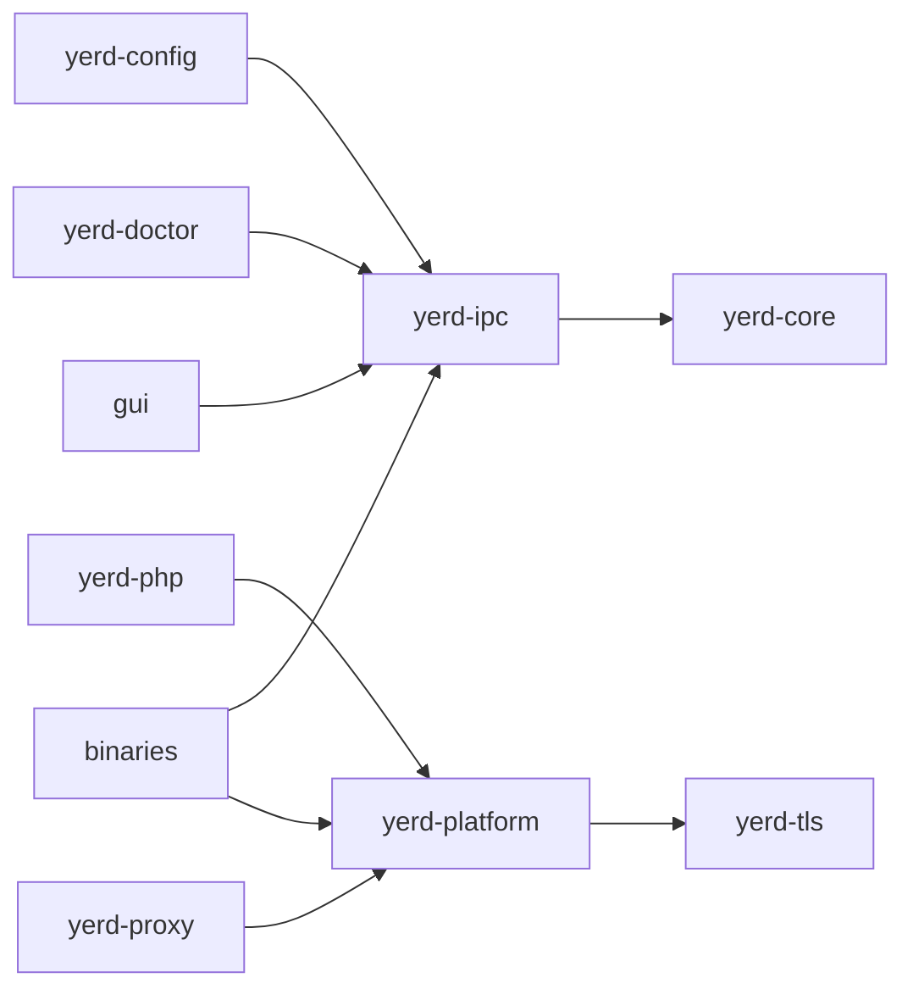

# Contributing

This page is the set of conventions every contribution to Yerd must follow. They
are not style preferences - most are mechanically enforced by `clippy`,
dependency-graph tests, and wire-stability tests, and CI fails the moment one is
violated. Read this before opening a pull request; it will save you a round-trip
through the gate.

For the *why* behind these rules, see [Architecture](./architecture) and the
[Cross-Platform Model](./cross-platform). For getting a working build, see
[Building from Source](./building).

::: info The one organising rule
> **Pure logic lives in library crates. I/O and OS calls are pushed to the edges
> behind traits.**

Everything below is a consequence of that single sentence. If a rule ever seems
arbitrary, re-read it in light of this one.
:::

## Layering and purity

Before you write a module, decide which layer it belongs to:

- **Pure** - no I/O, synchronous, runtime-free. It takes data in and returns
  data or a `Result`. It never reads the filesystem, network, clock, or
  environment, and never spawns a process. It must be unit-testable with
  in-memory fixtures and zero setup.
- **Edge** - does I/O, may be `async`. This is where side effects happen, behind
  a trait.

Do not mix the two in one function. Many crates split this physically: a `pure/`
module (sync, no runtime) and an `io/` or `os/` module (the side-effecting
edge). Put new code in the matching directory. `yerd-core` is the exemplar of a
fully pure crate - keep it pure.

If a pure function needs the clock, env, filesystem, network, or a child
process, **do not reach for it directly** - take it as a trait parameter and let
the caller inject it. The real implementations live in `yerd-platform` or in a
crate's `os/` module behind `#[cfg(...)]`; the existing traits include:

```
BackendResolver  CertStore   ChildHandle   Clock         Downloader
HealthProbe      Paths       PortBinder    PortRedirector ProcessSpawner
ResolverInstaller  SystemMetrics  TrustStore
```

Binaries (`bin/yerdd`, `bin/yerd`, `bin/yerd-helper`, and the Tauri
`src-tauri` layer) are **thin**. They wire crates together and own transports.
They contain orchestration, not behaviour - interesting logic belongs in a crate
with tests.

::: warning
The daemon (`yerdd`) is the single source of truth for runtime state. The CLI
and the GUI are both [`yerd-ipc`](./crates/yerd-ipc) *clients* - neither may
reimplement daemon logic. If you find yourself duplicating daemon behaviour in a
client, stop.
:::

### Dependency direction

Internal dependencies flow strictly downhill; there are no cycles.



- `yerd-core` depends on no other `yerd-*` crate.
- Libraries never depend on binaries.
- The CLI and GUI depend on `yerd-ipc` (plus its transport feature), not on the
  daemon's internals.

See the [Crates Overview](./crates) for the full map.

## Forbidden in non-test code

These constructs are **`clippy`-denied** workspace-wide via `[workspace.lints]`
in the root `Cargo.toml`, so `cargo clippy --workspace --all-targets -- -D
warnings` rejects them:

| Construct | Lint | Level |
|---|---|---|
| `unsafe` blocks | `unsafe_code` | `forbid` (rust) |
| `.unwrap()` | `clippy::unwrap_used` | `deny` |
| `.expect(...)` | `clippy::expect_used` | `deny` |
| `panic!` | `clippy::panic` | `deny` |
| `todo!` | `clippy::todo` | `deny` |
| `dbg!` | `clippy::dbg_macro` | `deny` |
| `v[i]` slice/array indexing | `clippy::indexing_slicing` | `deny` |

`unsafe_code` is `forbid` (stronger than `deny` - it cannot be locally
re-allowed), and crate roots additionally carry `#![forbid(unsafe_code)]` as a
belt-and-braces declaration:

```rust
#![forbid(unsafe_code)]
```

Instead of the forbidden forms, use total functions and explicit handling:
`get(i)` instead of `v[i]`, pattern matching or `?` instead of `unwrap`, and a
typed error variant instead of `panic!`/`unreachable!`. The pedantic clippy
group is `warn`-level too, with a handful of project-wide opt-outs
(`module_name_repetitions`, `missing_errors_doc`, `missing_panics_doc`,
`must_use_candidate`, `cast_possible_truncation`, `needless_pass_by_value`).

::: tip Tests are the only exception
Test files may use the forbidden constructs, but you must opt out **explicitly**
at the top of the file so the exception is visible and scoped:

```rust
#![allow(clippy::unwrap_used, clippy::expect_used, clippy::panic, clippy::indexing_slicing)]
```
:::

Also note: `missing_docs` is `warn`, so document every public item.

## Error handling

- **Libraries use `thiserror`.** Each crate exposes one typed error enum from
  `error.rs`, with specific, matchable variants. There is **no `anyhow` in
  library code, nor anywhere in a library's dependency graph.**
- **Binaries may use `anyhow`** at the top level (`main` / command handlers) for
  context-rich exit errors. Convert typed crate errors with `?` /
  `.context(...)`.
- Never collapse distinct failures into a generic `Internal`/`Other` variant
  when a caller could reasonably branch on them - add a variant.

A real example: `yerd-tls` carries typed sub-reasons rather than wrapping the
upstream `rcgen::Error` (which is not `Clone`), so its error type stays
`Clone + PartialEq + Eq`:

```rust
/// Errors produced by `yerd-tls`.
#[derive(Debug, Error, Clone, PartialEq, Eq)]
#[non_exhaustive]
pub enum TlsError {
    /// Failed while building or signing new certificate material.
    #[error("could not generate certificate material: {reason}")]
    Generate { reason: GenerateErrorReason },

    /// Failed while parsing CA material handed in via PEM strings.
    #[error("could not parse certificate material: {reason}")]
    Parse { reason: ParseErrorReason },

    /// Validity window failed construction-time validation.
    #[error("invalid validity window: {reason}")]
    Validity { reason: ValidityErrorReason },
}
```

Mark public error enums `#[non_exhaustive]` so adding variants stays
semver-compatible.

## Testing standard

A change is not done until it is tested at the right layer. The four kinds of
test, and where each applies:

1. **Table-driven unit tests for pure logic.** Pure functions get exhaustive,
   data-driven tests next to the code (or in the crate's `tests/`). This is the
   bulk of the suite and runs with zero setup.
2. **Fakes behind traits for side effects.** Never perform real I/O in a unit
   test. Inject a fake implementation of the relevant trait (`ProcessSpawner`,
   `TrustStore`, `Clock`, …) and assert on the recorded interactions. If you add
   a new side effect, it goes behind a trait *and* gets a fake-backed test.
3. **Integration tests for wiring.** When you wire crates together, add an
   integration test in the crate's `tests/` directory that exercises the seam.
4. **Wire-stability / golden tests.** `serde` JSON (IPC) and TOML (config)
   shapes are a contract, pinned byte-for-byte. `yerd-ipc` has
   `tests/wire_stability.rs`, `yerd-core` has its own `wire_stability.rs`, and
   `yerd-php` ships a `fpm_conf_golden.rs`.

The wire-stability tests assert exact serialized bytes for every IPC variant,
for example:

```rust
#[test]
fn request_park_byte_shape() {
    let r = Request::Park { path: PathBuf::from("/srv/foo") };
    let s = serde_json::to_string(&r).unwrap();
    assert_eq!(s, r#"{"type":"park","path":"/srv/foo"}"#);
    let back: Request = serde_json::from_str(&s).unwrap();
    assert_eq!(back, r);
}
```

::: warning Do not "fix" a wire-stability or golden failure by editing the expected output
A failing byte-shape or golden test almost always means an *accidental* rename,
reorder, or casing change - not that the literal is wrong. Only update the
expected output when you are deliberately making a contract change, and when you
do, bump the protocol version accordingly. See the
[IPC Protocol](./ipc-protocol) page for the additive-evolution rules.
:::

## Dependency policy and version pins

- **Add dependencies through `[workspace.dependencies]`** in the root
  `Cargo.toml` and reference them with `name.workspace = true`. Match the
  existing feature-flag style: `default-features = false` plus explicit features
  is the norm.
- **TLS is `rustls` + `rcgen`. Never OpenSSL or `native-tls`.** Several crates
  enforce this through the dep-graph test below.
- **Respect `=` version pins.** They exist for MSRV traps or to turn silent
  upstream `#[non_exhaustive]` additions into deliberate version bumps. Read the
  comment next to a pin in the root manifest before touching it.

The currently pinned crates (and the reason, abbreviated):

| Pin | Reason |
|---|---|
| `tempfile = "=3.10.1"` | version pin |
| `rcgen = "=0.13.2"` | `rcgen::Error` is `#[non_exhaustive]`; pin forces a deliberate bump that trips `yerd-tls`'s detail-table tripwire |
| `time = "=0.3.36"` | 0.3.37+ pulls `time-core` requiring edition2024; keeps resolved `time-core` at 0.1.2 |
| `hickory-proto`/`hickory-server`/`hickory-client = "=0.24.4"` | `ProtoErrorKind` / `RData` are `#[non_exhaustive]` upstream |
| `clap = "=4.5.20"` | version pin |

Further edition2024 / MSRV traps (`indexmap`, `idna_adapter`, `jobserver`,
`hyper-rustls`) are pinned in `Cargo.lock` via `cargo update --precise`; the
lockfile is the source of truth for those. The full rationale lives in the
comments at the bottom of the root `Cargo.toml`.

### The `no_runtime_deps` guard

Several crates ship a `tests/no_runtime_deps.rs` that walks the resolved
dependency graph with `cargo metadata` and fails if a forbidden crate (`anyhow`,
`reqwest`, `openssl*`, `native-tls`) is reachable through normal-kind edges, or
if a sensitive crate (`tokio`, `time`) resolves to more than one version. For
example, `yerd-tls`'s guard asserts:

```rust
// (1) No tokio in the runtime graph.
assert!(!reachable_pairs.iter().any(|(n, _)| *n == "tokio"), ...);
// (2) No anyhow in the runtime graph.
assert!(!reachable_pairs.iter().any(|(n, _)| *n == "anyhow"), ...);
// (3) Exactly one `time` version.
// (4) Exactly one `x509-parser` version.
```

If you add a dependency, run that crate's tests. **Do not weaken this guard** to
make it pass - a failure means the new dependency dragged in something
forbidden, and the fix is the dependency, not the test.

::: info Async only at the edge
Only edge layers may depend on `tokio`. Never add `tokio` (or any async runtime)
to a crate or module that is meant to be pure - the `no_runtime_deps` test will
catch it for the crates that ship the guard.
:::

## Cross-platform discipline

Per-OS code is selected with `#[cfg(target_os = ...)]`; exactly one of `linux`,
`macos`, or `unsupported` is active per build (Windows adapters are **planned**,
not implemented - do not assume Windows code paths exist).

- **Mirror per-OS changes.** When you touch one OS path, make the equivalent
  change - or a deliberate, commented no-op - in the others. A change that
  compiles only on the host OS will break CI on the other platform. CI runs on
  both Linux and macOS.
- **Keep OS-specific *decisions* in pure helpers** (parsing `profiles.ini`,
  planning ports, matching PEM, …) so they are unit-testable without the OS
  effect itself.
- **Watch for latent single-OS bugs** - macOS-only test fixtures or path
  assumptions are a recurring trap. A test that only the host happens to satisfy
  is a bug waiting for the other runner.

The [Cross-Platform Model](./cross-platform) page covers the `os/{linux,macos,
unsupported}` adapter layout in detail.

::: warning `yerd-helper` is the security boundary
`yerd-helper` is the only privileged surface. It takes strict typed arguments,
**never** shells out, **never** takes network input, performs exactly one
operation, and exits. The GUI process must **never** run as root. Treat any
change near this binary as security-sensitive. See
[yerd-helper](./binaries/yerd-helper).
:::

## Definition of Done

A change is complete only when every box is checked:

- [ ] Pure logic has **table-driven unit tests**.
- [ ] Every side-effecting path is **behind a trait and tested with a fake**.
- [ ] Wiring has an **integration test** in the crate's `tests/`.
- [ ] **No `unwrap`/`expect`/`panic`/indexing** outside tests; no `unsafe`.
- [ ] Errors are **typed (`thiserror`)**; no `anyhow` in a library.
- [ ] New deps are in `[workspace.dependencies]`, pins respected, and the
      `no_runtime_deps` guard still passes.
- [ ] Per-OS changes are **mirrored** across `linux` / `macos` / `unsupported`.
- [ ] Public items are **documented**; wire/golden tests changed only on purpose
      (with a protocol-version bump if the IPC contract moved).
- [ ] The full gate passes on **both Linux and macOS**:

```sh
cargo fmt --all --check
cargo clippy --workspace --all-targets -- -D warnings
cargo test --workspace
```

- [ ] Frontend changes pass `npm run test` and `npm run build` in
      `apps/yerd-gui`.

## When a task conflicts with these boundaries

Stop and surface the conflict rather than working around it. In particular: if a
change would add I/O to a pure crate, route a side effect around a trait, give
the GUI privileged access, or break the IPC contract - raise it in the pull
request or an issue instead of quietly implementing it.

The source lives at
[github.com/forjedio/yerd](https://github.com/forjedio/yerd). For the build
toolchain and GUI prerequisites, continue to [Building from Source](./building).
