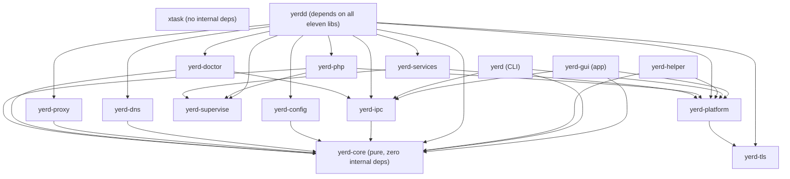

# Crates Overview

Yerd is a single Cargo workspace. The `[workspace]` members in
[`Cargo.toml`](https://github.com/forjedio/yerd/blob/main/Cargo.toml) split into
three layers:

- **Library crates** (`crates/*`) hold all the logic. Most are *pure* - no I/O,
  no clock, no env, no async - and the few that touch the world push their side
  effects behind traits.
- **Binaries** (`bin/*`) wire those libraries together: the unprivileged daemon
  (`yerdd`), the CLI client (`yerd`), and the privileged one-shot (`yerd-helper`).
- **The desktop app** (`apps/yerd-gui`) and **build automation** (`xtask`) sit at
  the top.

This page is the index. Each entry links to its own detailed reference page.

::: info Workspace facts
All members share `version = "2.0.1"`, `edition = "2021"`, and `rust-version = "1.77"`
from `[workspace.package]` - except `yerd-gui`, which pins `rust-version = "1.85"`
because current Tauri v2 needs edition2024 (rustc ≥ 1.85). The workspace forbids
`unsafe_code` and denies `unwrap`/`expect`/`panic`/`todo`/`dbg!`/`indexing_slicing`
in non-test code via `[workspace.lints]`. `yerd-gui` opts out of the strict lint
set (it wraps macro-heavy generated Tauri code) but still bans
`unwrap`/`expect`/`panic` in its own bridge code.
:::

## The workspace at a glance

### Library crates

| Crate | Purpose | Pure? | Page |
|---|---|:---:|---|
| `yerd-core` | Pure domain types (`Site`, `PhpVersion`, `Tld`) and host→site routing. The foundation every other crate depends on. | pure | [yerd-core](./crates/yerd-core) |
| `yerd-ipc` | IPC protocol, framing, and codec between `yerdd` and its clients. Length-prefixed JSON frames. | pure (default) | [yerd-ipc](./crates/yerd-ipc) |
| `yerd-config` | Persisted, schema-versioned TOML configuration. Pure parse/validate/serialise plus a thin atomic load/save. | mostly pure | [yerd-config](./crates/yerd-config) |
| `yerd-tls` | Pure-Rust local CA and per-site leaf certificate issuance (`rcgen` + `ring`). No I/O, no clock. | pure | [yerd-tls](./crates/yerd-tls) |
| `yerd-dns` | Authoritative `*.test` DNS responder plus `hickory-server` wiring. | owns I/O | [yerd-dns](./crates/yerd-dns) |
| `yerd-proxy` | Hand-rolled HTTP/HTTPS reverse proxy on `hyper` + `tokio-rustls`; serves static files and forwards to PHP-FPM over FastCGI. | owns I/O (pure submodule) | [yerd-proxy](./crates/yerd-proxy) |
| `yerd-supervise` | Process-agnostic supervision substrate: trait seams, the pure restart/health state machine, and tokio impls. Shared by `yerd-php` and `yerd-services`. | owns I/O (pure submodule) | [yerd-supervise](./crates/yerd-supervise) |
| `yerd-php` | PHP-FPM pool supervision and version management; discovery, install, health-probing. | owns I/O (pure submodule) | [yerd-php](./crates/yerd-php) |
| `yerd-services` | Local database / cache supervision (Redis/Valkey, MySQL, MariaDB, Postgres), version management, and SQL database administration. | owns I/O (pure submodule) | [yerd-services](./crates/yerd-services) |
| `yerd-doctor` | Pure diagnosis and fix-planning for `yerd doctor`. Turns a `StatusReport` into findings and safe auto-fixes. | pure | [yerd-doctor](./crates/yerd-doctor) |
| `yerd-platform` | OS abstraction layer: paths, trust store, resolver installer, port binder/redirector, metrics - one impl per OS. | owns I/O (pure submodule) | [yerd-platform](./crates/yerd-platform) |

### Binaries

| Binary | Purpose | Page |
|---|---|---|
| `yerdd` | The unprivileged per-user daemon. Wires every library together; owns all runtime state and serves the proxy, DNS, PHP pools, and database/cache services. | [yerdd (daemon)](./binaries/yerdd) |
| `yerd` | The CLI - a thin `yerd-ipc` client that talks to `yerdd` over a per-user socket. | [yerd (CLI)](./binaries/yerd) |
| `yerd-helper` | The privileged one-shot. Validates a typed `HelperInvocation`, performs exactly one root operation (CA install, resolver install, `setcap`), and exits. | [yerd-helper (privileged)](./binaries/yerd-helper) |

### App and tooling

| Member | Purpose | Page |
|---|---|---|
| `yerd-gui` (`apps/yerd-gui`) | Tauri v2 + Vue 3 desktop/tray app - another thin `yerd-ipc` client of `yerdd`, like the CLI. | [Desktop App Internals](./gui) |
| `xtask` | Build automation invoked as `cargo xtask <cmd>`: `deb`, `bump`, `version-check`. | [Build Automation (xtask)](./xtask) |

## Internal dependency graph

Dependencies run **downhill**: `yerd-core` is the bedrock at the bottom and has
zero internal dependencies; every arrow points down toward the things it relies
on. `yerd-tls` is the other leaf - it has no internal `yerd-*` dependencies at all.

Apps and tooling sit at the top, binaries in the middle, libraries below, with
`yerd-core` as the bedrock. `xtask` has no internal `yerd-*` deps, so it stands
alone. Arrows point from a crate to what it depends on.

Read as a nested list of direct internal dependencies (each verified against the
crate's `Cargo.toml`):

- **`yerd-core`** → *(none)*
- **`yerd-tls`** → *(none - workspace leaf)*
- **`yerd-ipc`** → `yerd-core`
- **`yerd-config`** → `yerd-core`
- **`yerd-dns`** → `yerd-core`
- **`yerd-proxy`** → `yerd-core`
- **`yerd-doctor`** → `yerd-core`, `yerd-ipc`
- **`yerd-platform`** → `yerd-tls`
- **`yerd-supervise`** → *(none - workspace leaf)*
- **`yerd-php`** → `yerd-core`, `yerd-platform`, `yerd-supervise`
- **`yerd-services`** → `yerd-platform`, `yerd-supervise`
- **`yerd-helper`** (bin) → `yerd-core`, `yerd-platform`
- **`yerd`** (bin) → `yerd-core`, `yerd-ipc` (`transport`), `yerd-platform`
- **`yerd-gui`** (app) → `yerd-core`, `yerd-ipc` (`transport`), `yerd-platform`
- **`yerdd`** (bin) → `yerd-core`, `yerd-config`, `yerd-ipc` (`transport`), `yerd-tls`, `yerd-platform`, `yerd-dns`, `yerd-supervise`, `yerd-php`, `yerd-services`, `yerd-proxy`, `yerd-doctor` - **all eleven libraries**
- **`xtask`** → *(no internal deps; `anyhow` + `clap` + `flate2` only)*

::: tip The daemon is the assembly point
Only `yerdd` depends on every library. It is where the pure logic, the OS
adapters, and the network servers are stitched into one running process. The CLI,
the helper, and the GUI each pull in only the narrow slice they need. This is what
the README means by "the daemon owns state; the CLI and GUI are clients."
:::

## Pure vs. I/O-owning crates

Yerd's central design rule (from the README): **pure logic lives in library
crates; I/O and OS calls are pushed to the edges behind traits**, with one trait
implementation per OS. That makes the bulk of the codebase unit-testable in-memory
with fakes, and keeps behaviour identical across platforms.

### Fully pure

These crates do no I/O, no async, and read no clock or environment. Callers pass
in everything (timestamps, reports) explicitly.

- **`yerd-core`** - `#![forbid(unsafe_code)]`, no async, no internal deps. The
  crate header states it plainly: *"It is **pure**: no I/O, no async, no internal
  `yerd-*` dependencies. Side effects belong behind traits in `yerd-platform`."*
- **`yerd-tls`** - *"It does **no I/O**, **no clock reads**, and **no env reads** -
  callers pass timestamps via [`Validity`]."* Persistence lives in `yerd-config`;
  trust-store install lives in `yerd-platform`.
- **`yerd-doctor`** - *"runtime-free and does no I/O."* `diagnose()` maps a
  `StatusReport` to findings; `plan_auto_fixes()` returns the safe unprivileged
  `FixAction`s. The daemon performs the actual I/O and re-runs `diagnose()`
  afterwards.
- **`yerd-ipc`** - the default build is pure: *"no sockets, no async, no I/O."*
  Only the optional `transport` feature pulls in `tokio` for the shared async
  read/write helpers (the daemon and CLI both enable it).

### Pure with a thin I/O seam

- **`yerd-config`** - *"Every function except `Config::load` and `Config::save`
  is pure."* Parse, validate, serialise, and migrate are all pure; load/save are a
  thin atomic file seam. Schema is versioned (`CURRENT_VERSION = 3`), decoupled
  from the IPC `PROTOCOL_VERSION`.

### I/O-owning, with a pure submodule

These crates genuinely own runtime side effects, but isolate their decision logic
in a `pure` module that is unit-tested in-memory.

- **`yerd-platform`** - the OS abstraction layer. Core traits (`Paths`,
  `TrustStore`, `ResolverInstaller`, `PortBinder`, `PortRedirector`) each have one
  thin `#[cfg(target_os = ...)]` impl; decision logic that needs no OS interaction
  lives in `pure`. It is **unprivileged**: operations needing root return
  `PlatformError::NeedsHelper` carrying a typed `HelperInvocation` for `yerd-helper`
  to execute - the OS impls never spawn the helper themselves.
- **`yerd-proxy`** - owns the `hyper` + `tokio-rustls` servers (`pub mod server`,
  `forward`, `tls`, `backend`), with a `pub mod pure` for the routing/decision
  logic (including `try_files` static-file resolution) and `pub mod traits`
  (`BackendResolver`, `CertStore`) at the edges.
- **`yerd-supervise`** - the shared supervision substrate. Pure `supervisor`
  (state machine), `listen`, and `error`; tokio adapters (`TokioProcessSpawner`,
  `SystemClock`, `TokioChild`) and the trait *definitions* (`ProcessSpawner`,
  `Clock`, `HealthProbe`, `Downloader`) in `real`/`traits`.
- **`yerd-php`** - supervises PHP-FPM processes. Drives the `yerd-supervise` state
  machine under `SupervisorPolicy::fpm()`; provides the `FastCgiProbe` `HealthProbe`
  impl, with `pure` holding the FPM-config and release-resolution logic.
- **`yerd-services`** - supervises database / cache engines. Drives the same
  `yerd-supervise` machine under `SupervisorPolicy::database()`; pure `service`,
  `database`, `config_render`, and `release` modules, with I/O in `manager` and
  `health`.
- **`yerd-dns`** - runs the authoritative responder on `tokio` + `hickory-server`.

::: details Where the traits are implemented
The trait *definitions* live in the library crates (e.g. `yerd-supervise`'s
`ProcessSpawner`, `yerd-platform`'s `TrustStore`). The library also ships the
production impls (`TokioProcessSpawner`, the per-OS `TrustStore`). Tests substitute
in-memory fakes. The privileged half of `yerd-platform`'s work is executed out of
process by `yerd-helper`, which the daemon or `sudo yerd elevate` invokes.
:::

## Where to go next

- For the runtime picture - how `yerdd` boots, supervises, and serves - see
  [Architecture](./architecture) and [The Daemon](../guide/daemon).
- For the wire contract between client and daemon, see
  [IPC Protocol](./ipc-protocol) and [yerd-ipc](./crates/yerd-ipc).
- For the per-OS adapter model, see [Cross-Platform Model](./cross-platform) and
  [yerd-platform](./crates/yerd-platform).
- To build the workspace, see [Building from Source](./building).
