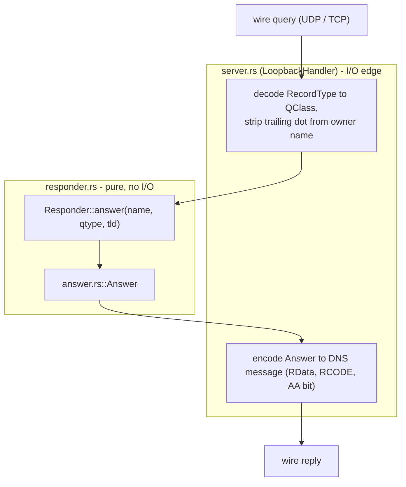

# yerd-dns

Authoritative `*.test` DNS responder for Yerd, plus the [hickory-dns](https://github.com/hickory-dns/hickory-dns) server wiring that puts it on the wire.

The crate's `Cargo.toml` describes it precisely:

> Authoritative `*.test` DNS responder + hickory server wiring for Yerd.

The whole point of `yerd-dns` is to resolve names under a configured TLD (by default `.test`) to loopback - `127.0.0.1` for `A`, `::1` for `AAAA` - so a browser request for `https://my-app.test` lands on Yerd's proxy. For how that fits into the wider system and how the OS is pointed at this responder, see [DNS & .test Domains](../../guide/dns).

::: info Scope boundary
This crate answers DNS queries. It does **not** configure the operating system's resolver to send `.test` queries here. That privileged, per-OS work lives behind `yerd_platform::ResolverInstaller` - see [yerd-platform](./yerd-platform) and [Elevation & Privileges](../../guide/elevation). `yerd-dns` only opens loopback sockets and replies to whatever queries arrive.
:::

## Design: a pure core at an I/O edge

The crate follows Yerd's standard split between deterministic pure logic and a thin I/O shell:



- **`responder.rs` / `answer.rs`** are pure: no async, no sockets, no `hickory` types in their visible API. Given a name, a query-type classification, and a TLD, `Responder::answer` returns an [`Answer`](#answer-the-decision-vocabulary) enum. This is the testable decision core.
- **`server.rs`** is the I/O edge: it binds UDP + TCP, decodes inbound queries into the pure vocabulary, calls the responder, and re-encodes the decision onto the wire via `hickory-server`.
- **`error.rs`** defines the single `DnsError` exposed by the fallible I/O surface.

The purity boundary is enforced mechanically - see [The purity tripwire](#the-purity-tripwire).

## Module / file map

| File | Role | Public exports |
| --- | --- | --- |
| `src/lib.rs` | Crate root, module wiring, constants | `Answer`, `Responder`, `Bound`, `DnsError`, `BindProto`, `ANSWER_TTL_SECS` |
| `src/answer.rs` | Output vocabulary + internal query classification | `Answer` (`QClass` is `pub(crate)`) |
| `src/responder.rs` | Pure `(name, qtype, tld) → Answer` mapping | `Responder` |
| `src/server.rs` | hickory bind/serve wiring + wire encoding | `Bound` |
| `src/error.rs` | Error type for the I/O surface | `DnsError`, `BindProto` |
| `tests/pure_responder_no_io.rs` | Source-byte purity tripwire | - |
| `tests/server_smoke.rs` | End-to-end UDP + TCP wire-shape test | - |

Two crate-level constants live in `lib.rs`:

```rust
/// TTL on every A/AAAA record we hand out.
pub const ANSWER_TTL_SECS: u32 = 60;

/// Number of UDP/TCP port-pair attempts on the ephemeral path.
pub(crate) const RETRY_BUDGET: usize = 5;
```

`#![forbid(unsafe_code)]` is set crate-wide.

## `Answer`: the decision vocabulary

`Answer` is the pure crate's output type. Wire-level encoding lives in `server.rs`; this enum is what the responder produces. It is `Copy` and `#[non_exhaustive]`:

```rust
#[derive(Debug, Clone, Copy, PartialEq, Eq)]
#[non_exhaustive]
pub enum Answer {
    /// Matched, qtype = A → 127.0.0.1 with TTL ANSWER_TTL_SECS.
    Loopback4,
    /// Matched, qtype = AAAA → ::1 with TTL ANSWER_TTL_SECS.
    Loopback6,
    /// Name belongs to the configured TLD but the qtype is not A/AAAA.
    /// Wire: NOERROR with empty answer + no SOA in authority.
    NoData,
    /// Name is within the configured TLD but does not exist.
    /// Wire: authoritative NXDOMAIN + no SOA.
    NxDomain,
    /// Name is outside the configured TLD - we are not authoritative.
    /// Wire: REFUSED with the AA bit cleared.
    Refused,
}
```

Each variant maps deterministically to a wire response - RCODE, answer records, and the authoritative (AA) bit - in `server.rs`:

| `Answer` | RCODE | Answer records | AA bit |
| --- | --- | --- | --- |
| `Loopback4` | `NoError` | one `A` → `127.0.0.1`, TTL 60 | set |
| `Loopback6` | `NoError` | one `AAAA` → `::1`, TTL 60 | set |
| `NoData` | `NoError` | none | set |
| `NxDomain` | `NXDomain` | none | set |
| `Refused` | `Refused` | none | **cleared** |

The `Refused` variant exists for a specific reason. If a resolver is misconfigured and routes a non-`.test` query to this responder, replying `REFUSED` with the AA bit cleared signals "ask someone else" rather than authoritatively denying a domain Yerd does not own.

Alongside `Answer`, `answer.rs` defines the crate-internal `QClass`, kept out of the responder's view of the upstream record-type enum so `responder.rs` stays free of the `hickory` dependency:

```rust
#[derive(Debug, Clone, Copy, PartialEq, Eq)]
pub(crate) enum QClass {
    A,
    Aaaa,
    /// MX, TXT, SOA, NS, ANY (per RFC 8482 §4.3), …
    Other,
}
```

`server.rs` is the only file that translates a wire `RecordType` into a `QClass`.

## `Responder`: the pure answer logic

`Responder` wraps a single TLD (a `yerd_core::Tld`) and classifies queries with no I/O:

```rust
use yerd_core::Tld;

pub struct Responder {
    tld: Tld,
}

impl Responder {
    #[must_use]
    pub fn new(tld: Tld) -> Self { /* … */ }

    pub(crate) fn answer(&self, name: &str, qtype: QClass) -> Answer { /* … */ }
}
```

::: info `answer` is `pub(crate)`
`Responder::new` is the only public method. `answer` takes a `pub(crate)` `QClass`, so it is not callable from outside the crate - the sole caller is `LoopbackHandler` in `server.rs`. External consumers (the daemon) construct a `Responder` and hand it to `Bound::serve`; the responder's logic is exercised in tests via the `tests/` integration suite and the in-module unit tests.
:::

The classification algorithm, copied from the source, runs in order:

```rust
let bytes = name.as_bytes();

// 1. Strip one trailing '.' (FQDN form).
let bytes = match bytes.split_last() {
    Some((&b'.', rest)) => rest,
    _ => bytes,
};

let tld_bytes = self.tld.as_str().as_bytes();

// 2. Is the name inside our zone? (apex, or *.<tld>) - case-insensitive.
let is_apex = bytes.len() == tld_bytes.len() && bytes.eq_ignore_ascii_case(tld_bytes);
let ends_in_dot_tld = bytes.len() > tld_bytes.len()
    && bytes.get(bytes.len() - tld_bytes.len() - 1) == Some(&b'.')
    && bytes
        .get(bytes.len() - tld_bytes.len()..)
        .is_some_and(|s| s.eq_ignore_ascii_case(tld_bytes));

// 3. Outside our zone ⇒ REFUSED.
if !is_apex && !ends_in_dot_tld {
    return Answer::Refused;
}

// 4. Apex (bare TLD) ⇒ NoData (no A/AAAA at the apex).
if is_apex {
    return Answer::NoData;
}

// 5. In-zone subdomain. Malformed label ⇒ authoritative NXDOMAIN.
if bytes.first() == Some(&b'.') {
    return Answer::NxDomain;
}
if bytes.windows(2).any(|w| w == b"..") {
    return Answer::NxDomain;
}

match qtype {
    QClass::A => Answer::Loopback4,
    QClass::Aaaa => Answer::Loopback6,
    QClass::Other => Answer::NoData,
}
```

Several decisions are worth noting:

- **Zone membership is decided before validity.** A name is in-zone when it is the bare TLD (apex) or ends in `.<tld>`. This ordering is what makes `app.testify` (TLD `test`) resolve to `Refused` rather than being treated as a `.test` name - the byte before the TLD suffix must be a literal `.`.
- **Case-insensitive matching.** Both apex and suffix comparisons use `eq_ignore_ascii_case`, so `APP.TEST` resolves the same as `app.test`.
- **Multi-label TLDs work.** The TLD is a single `yerd_core::Tld` string, so `dev.local` is a valid TLD: `app.dev.local` → `Loopback4`, `dev.local` (apex) → `NoData`, and `local` → `Refused`.
- **Malformed in-zone names are NXDOMAIN, not REFUSED.** `.test`, `x..test`, and `app..test` are within the `.test` zone but have an empty or doubled label, so they are authoritatively non-existent.

These rows are pinned exactly by the `answer_table` unit test in `responder.rs`, which asserts each `(name, qtype, tld) → Answer` pairing including the multi-label `dev.local` cases.

## `Bound`: the hickory server wrapper

`Bound` is a bound UDP + TCP socket pair on a single `SocketAddr`. It is constructed via `Bound::bind` and consumed by `Bound::serve` - a deliberate two-stage lifecycle.

```rust
pub struct Bound { /* udp, tcp, local_addr */ }

impl Bound {
    pub async fn bind(addr: SocketAddr) -> Result<Self, DnsError>;

    #[must_use]
    pub fn local_addr(&self) -> SocketAddr;

    pub async fn serve<S>(self, responder: Responder, shutdown: S) -> Result<(), DnsError>
    where
        S: Future<Output = ()> + Send + 'static;
}
```

### Why bind and serve are separate

The daemon needs the resolved `SocketAddr` - including the kernel-assigned port when the requested port was `0` - *before* it starts serving, so it can hand that address to `yerd_platform::ResolverInstaller::install`. Splitting `bind` from `serve` lets the daemon bind the sockets up front (alongside its HTTP/HTTPS listeners), read `local_addr()`, and only later spawn the serve loop.

In practice the daemon (`yerdd`) binds at the fixed configured `dns_port` so an installed resolver config keeps pointing at the same address across restarts; the ephemeral (`port == 0`) path is primarily for tests like `tests/server_smoke.rs`, which bind `127.0.0.1:0`.

### `bind` and the UDP/TCP port-pairing problem

DNS needs UDP **and** TCP on the *same* port. With an explicit port this is straightforward - bind UDP, bind TCP, return any failure as `DnsError::Bind`. With an ephemeral port (`addr.port() == 0`) the kernel picks the UDP port, and TCP must then match it:

1. Bind UDP at `addr`; read back `udp.local_addr()` to learn the kernel-assigned port.
2. Try to bind TCP at the *same* IP and port.
3. On TCP success, return the `Bound` pair.
4. On TCP failure with an ephemeral request, drop the UDP socket and retry - up to `RETRY_BUDGET` (5) attempts. After exhaustion, return `DnsError::PortPairMismatch`.
5. With an explicit (non-zero) port there is no retry; a TCP bind failure surfaces immediately as `DnsError::Bind`.

::: warning Loopback contract is documented, not enforced
`bind` documents that `addr.ip().is_loopback()` should hold (`127.0.0.0/8` or `::1`). Binding to `0.0.0.0` / `::` would expose the responder to the LAN. `yerd-dns` does **not** enforce this - the daemon validates inputs before opening sockets. Callers report `local_addr()` (the actual bound port) in operator logs, never the input `addr`.
:::

### `serve` and graceful shutdown

`serve` consumes the `Bound`, builds a `LoopbackHandler`, registers the UDP socket and TCP listener with a `hickory_server::ServerFuture`, and runs until the caller-supplied `shutdown` future resolves:

```rust
let handler = LoopbackHandler { responder };
let mut server = ServerFuture::new(handler);
server.register_socket(self.udp);
server.register_listener(self.tcp, std::time::Duration::from_secs(5));

tokio::pin!(shutdown);
tokio::select! {
    res = server.block_until_done() => res
        .map_err(|source| DnsError::ServerTask { source }),
    () = &mut shutdown => server.shutdown_gracefully().await
        .map_err(|source| DnsError::ServerTask { source }),
}
```

When `shutdown` fires, the responder calls hickory's `shutdown_gracefully` to drain in-flight requests and returns `Ok(())` once the drain completes. The TCP listener is registered with a 5-second per-connection timeout.

The `S: Send + 'static` bound is load-bearing: the daemon `tokio::spawn`s the future returned by `serve`, which captures `shutdown` across `.await` points. A `Send + 'static` static assertion in `server.rs` guards both `Bound` and `Responder` at type-check time, so an accidental borrowed field on either would fail to compile rather than silently break the daemon's spawn site.

### `LoopbackHandler`: wire ↔ pure translation

`LoopbackHandler` implements `hickory_server::server::RequestHandler`. Per request it:

1. Reads the single query (`request.query()`). Hickory's parser pre-handler has already `FORMERR`'d malformed packets - zero or more than one query - before this code runs, so the handler always sees exactly one query.
2. Maps the wire `RecordType` to a `QClass` (`A`, `AAAA`, or `Other`).
3. Stringifies the owner name and **strips the trailing dot** with `trim_end_matches('.')`. Hickory writes a trailing dot for FQDN-flagged names; trimming it lets the responder's exact-match path see the bare TLD. The comment flags this trim as "load-bearing."
4. Calls `self.responder.answer(name, qclass)`.
5. Encodes the resulting `Answer` into a response: it copies the request header (setting `QR=1`), sets the AA bit (cleared only for `Refused`), sets the RCODE, and attaches `A`/`AAAA` records for the loopback cases.

The response is built with **no SOA** record in the authority section (a deliberate RFC 2308 §3 decision for the `NoData`/`NXDOMAIN` cases) and no NS or additional records:

```rust
let response = builder.build(
    header,
    answers.iter(),
    std::iter::empty::<&Record>(), // name_servers - no NS records
    std::iter::empty::<&Record>(), // soa - RFC 2308 §3: deliberately no SOA
    std::iter::empty::<&Record>(), // additionals
);
```

## `DnsError`

`DnsError` is the single error type for every fallible public API in the crate. It is `#[non_exhaustive]` and, unlike `yerd-tls`'s `TlsError`, is **not** `Clone + Eq` - it carries `std::io::Error` and `hickory_proto::error::ProtoError` via `#[source]`. The daemon either logs it or maps it to a `yerd_ipc::ErrorCode` at the IPC boundary.

| Variant | Meaning |
| --- | --- |
| `Bind { proto, addr, source }` | UDP or TCP bind failed. `proto` is a `BindProto` (`Udp` / `Tcp`). |
| `PortPairMismatch { udp_addr, attempts, source }` | Ephemeral path only: UDP bound but TCP could not match the port after `RETRY_BUDGET` attempts. |
| `ServerTask { source }` | The `hickory_server::ServerFuture` task returned a `ProtoError`. |

`BindProto` is a small `Copy` enum (`Udp` / `Tcp`) with a `Display` impl rendering `UDP` / `TCP`. It is intentionally *not* `#[non_exhaustive]`: this crate services only unencrypted UDP/TCP, and `DoT` / `DoH` / `DoQ` would be separate crates entirely.

## Tests and invariants

### The purity tripwire

`tests/pure_responder_no_io.rs` is a source-byte scan that fails the build if `src/responder.rs` or `src/answer.rs` contains any I/O-shaped substring:

```rust
const FORBIDDEN: &[&[u8]] = &[
    b"tokio", b"hickory", b"std::net", b"std::io", b"std::fs",
    b"std::env", b"std::process", b"std::time::Instant", b"std::time::SystemTime",
];

const SCANNED: &[&str] = &["src/responder.rs", "src/answer.rs"];
```

The scan includes comments, which is why the pure modules avoid even *naming* the forbidden crates in commentary. It is a smoke check, not a purity proof - a determined contributor can alias their way past it - but it reliably catches the realistic regression: an accidental `use tokio::…` line.

A second compile-time guard lives in `answer.rs`: `answer_match_is_exhaustive` forces a `match` over every `Answer` variant, so adding a variant without updating the encoding table in `responder.rs`/`server.rs` breaks the build.

### End-to-end wire shape

`tests/server_smoke.rs` binds a real `Bound` on `127.0.0.1:0`, spawns `serve`, and drives it with `hickory-client` over both UDP and TCP. It runs for both a single-label TLD (`test`) and a multi-label TLD (`dev.local`) and asserts:

- `<site> A` → `NoError`, exactly one answer, TTL `ANSWER_TTL_SECS`, RData `127.0.0.1`.
- `<site> AAAA` → `NoError`, one answer, RData `::1`.
- `<site> MX` → `NoError`, **zero** answers and **zero** authority records (pins the no-SOA `NoData` decision).
- `unrelated.com A` → `Refused` with the AA bit **cleared**.
- `<apex> A` → `NoError`, zero answers (apex carve-out).
- The same `<site> A` query over **TCP** returns the loopback `A` record, exercising the TCP listener path.
- A hand-crafted malformed UDP packet (`QDCOUNT=0`) gets a `FORMERR` reply from hickory's pre-handler - never reaching `LoopbackHandler` - with the request ID echoed.
- Shutdown completes within a bounded 5-second timeout.

`error.rs` additionally unit-tests `Display` output per `DnsError` variant and the `BindProto` rendering.

## Where this crate sits

- **Consumed by:** `yerdd` (the daemon). It binds `Bound` during startup at `SocketAddr::new(DNS_IP, config.dns_port)`, reads `local_addr()`, and spawns `Bound::serve(Responder::new(tld), shutdown)` on the runtime. See [yerdd (daemon)](../binaries/yerdd).
- **Depends on:** [`yerd-core`](./yerd-core) for the `Tld` newtype; `hickory-proto` / `hickory-server` for the wire layer; `tokio` for the sockets.
- **Does not depend on:** [`yerd-platform`](./yerd-platform). Pointing the OS resolver at this responder is a separate, privileged concern handled by `ResolverInstaller`.

For the operator's-eye view of how `.test` resolution is set up and verified, see [DNS & .test Domains](../../guide/dns) and [Elevation & Privileges](../../guide/elevation). For the surrounding architecture, see the [Crates Overview](../crates) and [Architecture](../architecture).

Source: [`crates/yerd-dns`](https://github.com/forjedio/yerd/tree/main/crates/yerd-dns).
