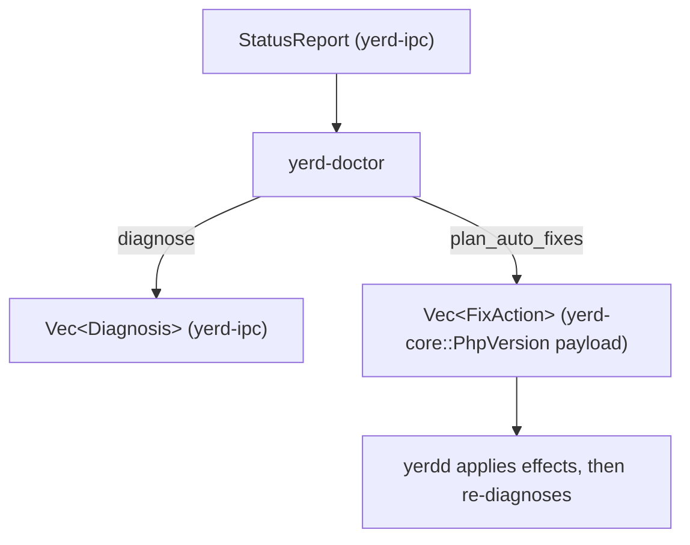

# yerd-doctor

`yerd-doctor` is the pure decision layer behind `yerd doctor` and `yerd doctor fix`. It takes a typed health snapshot - a [`StatusReport`](./yerd-ipc) - and turns it into two things: a list of human-readable findings ([`Diagnosis`](./yerd-ipc)), and a list of safe, unprivileged repairs the daemon may apply automatically ([`FixAction`]).

The crate is deliberately tiny and runtime-free. It does **no I/O**, spawns no tasks, and touches no filesystem, network, or process. Every byte of "state" it reasons about arrives in the `StatusReport` argument; everything it produces is a return value. The daemon ([yerdd](../binaries/yerdd)) owns all effects - assembling the report, restarting pools, re-running diagnosis - and uses this crate only to decide *what* a snapshot means and *which* fixes are safe.

For the user-facing walkthrough of `yerd doctor`, see [Diagnostics](../../guide/diagnostics).

## Why this crate exists separately

Diagnosis is a pile of conditional rules: "a privileged port that fell back is a warning - unless a pf redirect makes it reachable anyway"; "an undeterminable CA-trust probe must stay silent rather than cry wolf"; "no PHP at all should suppress the narrower *default-not-installed* finding." That logic is worth testing exhaustively and in isolation, with no daemon, no sockets, and no OS. Pulling it into a `#![forbid(unsafe_code)]`, dependency-light crate (`yerd-core` + `yerd-ipc` only) makes the rules a pure function of an input struct - trivially unit-testable, and impossible to accidentally entangle with I/O.

```toml
# crates/yerd-doctor/Cargo.toml
[dependencies]
yerd-core = { path = "../yerd-core" }
yerd-ipc  = { path = "../yerd-ipc" }
```

## File map

The whole crate is one module.

| Path | Contents |
| --- | --- |
| `crates/yerd-doctor/src/lib.rs` | `FixAction`, `diagnose`, `plan_auto_fixes`, `is_auto_fixable`, plus private helpers (`privileged_fallback`, `port_findings`, `resolver_backup_finding`, `warn`, `fail`) and the full unit-test module. |

Source: [`crates/yerd-doctor/src/lib.rs`](https://github.com/forjedio/yerd/blob/main/crates/yerd-doctor/src/lib.rs).

## Public API

### `diagnose(&StatusReport, Option<bool>) -> Vec<Diagnosis>`

Runs every check against the report and returns the findings in a stable order.
The second argument, `path_needs_setup`, lets the caller surface a
`BinDirNotOnPath` warning when the yerd bin dir isn't on `PATH` (`None` = unknown,
skip that check).

```rust
#[must_use]
pub fn diagnose(report: &StatusReport, path_needs_setup: Option<bool>) -> Vec<Diagnosis>;
```

Two cross-cutting invariants hold for the output:

- **Always non-empty.** When no `Warn`/`Fail` finding is produced, a single [`DiagnosisCode::AllGood`] `Ok` finding is appended, so a caller always has something to render.
- **No false alarms from unknowns.** Probes typed as `Option<bool>` that come back `None` ("couldn't determine") emit **no** finding. Only an explicit `Some(false)` raises a warning. This is why the CA and resolver checks compare against `Some(false)` rather than `!= Some(true)`.
- **Most-specific port finding wins.** `port_findings` raises `ForeignWebListener` when `report.foreign_web_listener == Some(true)` (a non-Yerd process on 80/443) and *suppresses* the generic `PortFallback` in that case - telling the user to free the port, not to elevate (which can't bind a port someone else owns). An active macOS redirect (`port_redirect == Some(true)`) likewise suppresses `PortFallback`.

### `plan_auto_fixes(&StatusReport) -> Vec<FixAction>`

Returns the safe, unprivileged fixes the daemon may apply for this report.

```rust
#[must_use]
pub fn plan_auto_fixes(report: &StatusReport) -> Vec<FixAction> {
    report
        .php
        .iter()
        .filter(|p| p.state == PoolRunState::Failed)
        .map(|p| FixAction::RestartFpm(p.version))
        .collect()
}
```

Conservative by design: the *only* auto-fix is restarting a failed FPM pool, which needs no elevation. Privileged or slow remediation - CA trust, resolver install, `setcap`/pf, PHP install - is never auto-applied; it is left to the user to run the suggested command.

### `is_auto_fixable(DiagnosisCode) -> bool`

```rust
#[must_use]
pub fn is_auto_fixable(code: DiagnosisCode) -> bool {
    matches!(code, DiagnosisCode::FpmPoolFailed)
}
```

Lets the daemon drop already-handled findings from the "manual" remainder it reports after a fix run. It is kept in lockstep with `plan_auto_fixes`: `FpmPoolFailed` is the single code both treat as auto-fixable.

### `FixAction`

```rust
/// A safe, fast, unprivileged fix the daemon may apply automatically.
#[derive(Debug, Clone, PartialEq, Eq)]
#[non_exhaustive]
pub enum FixAction {
    /// Restart the FPM pool for this PHP version.
    RestartFpm(PhpVersion),
}
```

`#[non_exhaustive]` so new variants can be added without a breaking change. Note the payload is a typed `yerd_core::PhpVersion`, not a string - this is the crux of the design decision below.

## Why plan from `StatusReport`, not from `Diagnosis`

A natural-looking alternative API would be `auto_fix(&Diagnosis)`. It does not work, and the crate documents why in its module docs:

> A wire `Diagnosis` carries only strings, so it cannot hand back the typed `PhpVersion` a `FixAction::RestartFpm` needs. Planning fixes from the typed report instead keeps the action list precise.

A [`Diagnosis`](./yerd-ipc) is a *wire* type - `code`, `severity`, `title`, `detail`, and an `Option<String> remedy`. The version of a failed pool only ever appears interpolated into human prose ("The PHP 8.5 FPM pool is not running"). Recovering a `PhpVersion` from that text would mean re-parsing a sentence. By planning from the *typed* `StatusReport`, `plan_auto_fixes` reads `PoolRunState::Failed` entries directly and carries each `PhpPoolStatus::version` straight into a `FixAction::RestartFpm(version)` - no stringly-typed round-trip, no parsing.

This is the same separation the rest of Yerd uses: structured truth in `StatusReport`, presentation in `Diagnosis`.

## No I/O - the daemon owns effects

`diagnose` and `plan_auto_fixes` only read their `&StatusReport` argument and allocate the returned `Vec`s. The daemon supplies the snapshot and applies the effects. The `doctor fix` flow in [yerdd](../binaries/yerdd) is the canonical consumer and shows the full round-trip:

```rust
// bin/yerdd/src/ipc_server.rs - run_doctor_fix (abridged)
let report = build_status_report(state).await;          // daemon does the I/O
let mut performed: Vec<FixResult> = Vec::new();

for action in yerd_doctor::plan_auto_fixes(&report) {     // pure planning
    if let yerd_doctor::FixAction::RestartFpm(v) = action {
        let outcome = { state.php_manager.lock().await.restart(v).await }; // effect
        performed.push(/* FixResult { code: FpmPoolFailed, ok, message } */);
    }
}

// Re-diagnose against a *fresh* report; surface what still needs the user.
let after  = build_status_report(state).await;            // daemon does the I/O again
let manual = yerd_doctor::diagnose(&after)                // pure, on fresh state
    .into_iter()
    .filter(|d| matches!(d.severity, Severity::Warn | Severity::Fail))
    .collect();

Response::DoctorFix { report: FixReport { performed, manual } }
```

The shape of this loop matters:

1. The daemon assembles a `StatusReport` (`build_status_report`).
2. `plan_auto_fixes` turns it into `FixAction`s - *pure*.
3. The daemon performs each action (`PhpManager::restart`) - *effect*.
4. The daemon assembles a **fresh** report and calls `diagnose` again - *pure*, against post-fix reality.
5. Warn/Fail findings from that second pass become `FixReport::manual`.

Re-diagnosing from a freshly-built report (rather than mutating the old one or trusting the fix succeeded) means `manual` reflects what is actually still broken - including any fix that failed to take. The `#[non_exhaustive]` `FixAction` is handled with `if let`, so a future variant the daemon doesn't yet know how to apply is silently skipped rather than mis-handled.

The plain `yerd doctor` path is even simpler - it just renders `diagnose(&build_status_report(state))`. When the CLI can't reach the daemon at all, it never enters this crate; [yerd](../binaries/yerd) substitutes a synthetic `DiagnosisCode::DaemonDown` `Fail` so the down state still renders and exits non-zero.

## The checks, in emission order

`diagnose` pushes findings in a fixed sequence. The table lists each rule, its trigger, and the severity it emits.

| # | `DiagnosisCode` | Severity | Triggers when | Remedy / note |
| --- | --- | --- | --- | --- |
| 1 | `PortFallback` | `Warn` | A *privileged* configured port (`requested < 1024`) fell back **and** `port_redirect != Some(true)` | `sudo yerd elevate ports` |
| 2 | `CaNotTrusted` | `Warn` | `ca.trusted_system == Some(false)` | `sudo yerd elevate trust` |
| 3 | `ResolverNotInstalled` | `Warn` | `resolver_installed == Some(false)` | `sudo yerd elevate resolver` |
| 4 | `NoPhpInstalled` | `Fail` | `php.is_empty()` | `yerd install php <default>` (suppresses #5) |
| 5 | `DefaultPhpNotInstalled` | `Fail` | `default_php` not among installed `php` | `yerd install php <default>` |
| 6 | `FpmPoolFailed` | `Fail` | one per pool with `state == Failed` | auto-fixed by `yerd doctor fix`, or `yerd use <ver>` |
| 7 | `ServiceFailed` | `Fail` | one per DB/cache service with `state == Failed` | `yerd service restart <svc>` |
| 8 | `PhpUpdateAvailable` | `Ok` | a pool has `update_available = Some(latest)` | `yerd update php <ver>` |
| 9 | `ResolverBackupSaved` | `Ok` | `resolver_backup == Some(path)` | informational, **no** remedy |
| 10 | `NoSites` | `Ok` | `sites.parked == 0 && sites.linked == 0` | `yerd park <dir>` / `yerd link <name> <dir>` |
| 11 | `BinDirNotOnPath` | `Warn` | `path_needs_setup == Some(true)` (a dev tool is installed but `{data}/bin` isn't on `PATH`) | `yerd path install` |
| 12 | `AllGood` | `Ok` | no `Warn`/`Fail` finding was produced | appended last |

A few rules carry subtle logic worth calling out.

### Privileged-port fallback (`PortFallback`)

```rust
const PRIVILEGED_PORT_CEILING: u16 = 1024;

fn privileged_fallback(report: &StatusReport) -> bool {
    (report.http.requested  < PRIVILEGED_PORT_CEILING && report.http.fell_back)
        || (report.https.requested < PRIVILEGED_PORT_CEILING && report.https.fell_back)
}
```

Only a port configured **below 1024** that fell back counts - a user who deliberately runs on `8080` and sees it bump to `8081` is not nagged. And even a genuine privileged fallback is suppressed when `report.port_redirect == Some(true)`: on macOS the daemon keeps binding the rootless ports after elevation, but an active pf `rdr` makes 80/443 reachable anyway, so the warning would be misleading. `Some(false)` (redirect present but inactive) and `None` (Linux / not applicable) both leave the warning in place. See [Elevation & Privileges](../../guide/elevation).

### "Unknown is silent" probes

`CaNotTrusted` and `ResolverNotInstalled` fire **only** on an explicit `Some(false)`. A `None` probe means "couldn't determine" - for example a CA store the daemon couldn't read - and produces no finding at all. This keeps the doctor from inventing problems out of missing data.

### PHP install findings are mutually exclusive

`NoPhpInstalled` (nothing installed) and `DefaultPhpNotInstalled` (the configured default specifically is missing) are wired as `if … else if …`, so an empty install only ever emits the broader `NoPhpInstalled`. See [PHP Versions](../../guide/php-versions).

### Informational findings never suppress `AllGood`

`PhpUpdateAvailable`, `ResolverBackupSaved`, and `NoSites` are all `Severity::Ok`. The `AllGood` summary is appended whenever no `Warn`/`Fail` exists - so a perfectly healthy machine that merely has an update available still shows the green "all checks passed" line alongside the informational ones.

### `ResolverBackupSaved` has no remedy on purpose

```rust
fn resolver_backup_finding(report: &StatusReport) -> Option<Diagnosis> {
    let path = report.resolver_backup.as_ref()?;
    Some(Diagnosis {
        code: DiagnosisCode::ResolverBackupSaved,
        severity: Severity::Ok,
        title: "Resolver file replaced".to_owned(),
        detail: format!(/* …saved to {path}… safe to delete, or copy it back… */),
        remedy: None,   // a path is not a runnable command
    })
}
```

The GUI renders `remedy` as a copy-the-command chip. The backup is a file *path*, not a command, so emitting it as a remedy would misrepresent it as runnable - hence `remedy: None`. The daemon only sets `resolver_backup` for a recent backup, so this finding auto-clears instead of nagging forever. See [DNS & .test Domains](../../guide/dns).

## Tests and invariants

The unit-test module builds a fully-healthy baseline `StatusReport` (`fn healthy()`) and perturbs single fields, asserting on the resulting `DiagnosisCode` set. The cases pin the rules above:

| Test | Invariant it locks in |
| --- | --- |
| `healthy_report_is_all_good_only` | a healthy report yields exactly `[AllGood]`, and `plan_auto_fixes` is empty |
| `privileged_fallback_warns_but_high_ports_do_not` | only sub-1024 requested ports warn on fallback |
| `active_port_redirect_suppresses_fallback_warning` | `Some(true)` suppresses; `Some(false)`/`None` do not |
| `ca_and_resolver_unknown_is_silent` | `None` probes emit nothing |
| `ca_and_resolver_false_warns` | `Some(false)` probes warn |
| `no_php_suppresses_default_not_installed` | empty install → only `NoPhpInstalled` |
| `default_not_installed_when_other_versions_present` | other versions installed but default missing → `DefaultPhpNotInstalled` |
| `failed_pool_is_fail_and_auto_fixable` | failed pool ⇒ `FpmPoolFailed` Fail, planned `RestartFpm(version)`, and `is_auto_fixable` agrees |
| `update_available_is_informational_and_still_all_good` | `Ok` findings coexist with `AllGood` |
| `resolver_backup_surfaces_as_ok_finding_with_no_remedy` | backup is `Ok`, `remedy.is_none()`, not auto-fixable |
| `no_sites_is_informational` | empty parked+linked ⇒ `NoSites` |
| `problems_suppress_all_good` | any `Warn`/`Fail` removes `AllGood` |

::: tip Adding a new check
Add the `Severity::Ok/Warn/Fail` finding in `diagnose` (use the `warn`/`fail` helpers), give it a new `DiagnosisCode` variant in `yerd-ipc` (additive - `DiagnosisCode` is `#[non_exhaustive]`), and pin it with a test off the `healthy()` baseline. If it should be auto-repairable, add a `FixAction` variant, emit it from `plan_auto_fixes`, list its code in `is_auto_fixable`, and teach the daemon's `run_doctor_fix` how to apply it.
:::

::: warning Keep `plan_auto_fixes` and `is_auto_fixable` in sync
`is_auto_fixable` is what the daemon uses to drop already-handled findings from the manual remainder. If a `FixAction` is added without updating `is_auto_fixable`, the daemon will both fix the problem *and* report it as still-manual.
:::

## Relationship to neighbouring crates



- [`yerd-ipc`](./yerd-ipc) - owns every wire type this crate reads and writes (`StatusReport`, `Diagnosis`, `DiagnosisCode`, `Severity`, `PoolRunState`, plus the `FixReport`/`FixResult` the daemon wraps results in).
- [`yerd-core`](./yerd-core) - provides `PhpVersion`, the typed payload of `FixAction::RestartFpm`.
- [yerdd](../binaries/yerdd) - the sole consumer; builds the report, runs the fixes, re-diagnoses.
- [yerd](../binaries/yerd) - renders the `Diagnosis` list and computes the doctor-aware exit code.

See the [Crates Overview](../crates) for how the layer fits the wider workspace.
