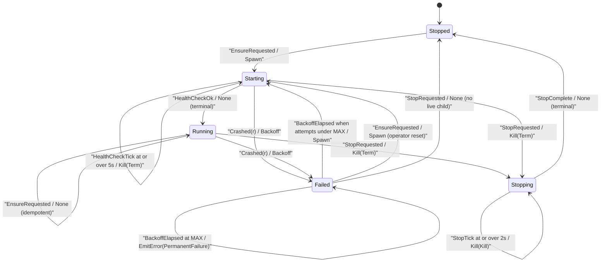

# yerd-php

`yerd-php` owns two responsibilities for the daemon:

1. **PHP-FPM pool supervision** - spawn one FPM master per installed PHP version, health-check it, restart it on crash with backoff, and tear it down cleanly.
2. **Version & release management** - discover the bundled PHP installs on disk and resolve which prebuilt static-PHP artifact to download for a requested major.minor.

The crate is consumed almost entirely by [`yerdd`](../binaries/yerdd) (the long-running daemon). It is structured so that every decision is unit-testable in memory and every byte of I/O lives behind an injected trait, which is why the test suite runs identically on every CI target - including ones with no live FPM binary.

::: info Crate metadata
`description`: *PHP-FPM pool supervision and version management for Yerd.*
`#![forbid(unsafe_code)]`. Default runtime graph deliberately excludes `anyhow`, `reqwest`, and any OpenSSL / `native-tls` variant - see [No runtime deps](#no-runtime-deps-test). The only async runtime is `tokio` (the supervisor is intrinsically async).
:::

See also the [Crates overview](../crates), [`yerd-platform`](./yerd-platform) (for `PlatformDirs` / `PortBinder`), and the user-facing [PHP Versions guide](../../guide/php-versions).

## Module map

The crate mirrors the `pure` / `io` split used across the Yerd workspace: all *decisions* are synchronous and runtime-free; all *effects* (sockets, processes, filesystem) sit behind a thin I/O layer or an injected trait.

```text
src/
├── lib.rs            # re-exports + a compile-time Send+'static guard
├── error.rs          # PhpError (re-exports ExitReason/etc. from yerd-supervise)
├── traits.rs         # re-export shim → yerd_supervise::traits::*
├── listen.rs         # AllocatedListen::plan (Listen itself comes from yerd-supervise)
├── pool.rs           # PoolConfig, ProcessManagerMode, dev_defaults
├── manager.rs        # PhpManager - the driver that runs the state machine
├── real.rs           # re-export shim → yerd_supervise (SystemClock, TokioProcessSpawner…)
├── release.rs        # artifact URL resolution from the distribution listing
├── version.rs        # discover_bundled - scan the on-disk install root
├── pure/
│   ├── fpm_conf.rs   # render_fpm_conf - PoolConfig → php-fpm.conf text
│   ├── supervisor.rs # re-export shim → yerd_supervise::supervisor::*
│   └── env_scrub.rs  # allowlist filter over an env snapshot
└── io/
    ├── atomic_write.rs   # tempfile + rename
    └── fastcgi_probe.rs  # FastCgiProbe - the production HealthProbe
```

::: info The supervision substrate moved to `yerd-supervise`
The trait seams (`ProcessSpawner`, `ChildHandle`, `Clock`, `HealthProbe`,
`Downloader`), the production tokio impls (`SystemClock`, `TokioProcessSpawner`,
`TokioChild`), the `Listen` type, and the **pure state machine** now live in
[`yerd-supervise`](./yerd-supervise) so [`yerd-services`](./yerd-services) can
reuse them. `yerd-php`'s `traits.rs` re-exports them, and `manager.rs` drives the
shared machine under `SupervisorPolicy::fpm()`. `yerd-php` itself now owns only the
PHP-specific pieces: FPM config rendering, the FastCGI health probe, release
resolution, and the manager.
:::

[Browse the source on GitHub.](https://github.com/forjedio/yerd)

## The `pure/` layer

Everything under `pure/` is synchronous, I/O-free, and trivially unit-testable. The driver in `manager.rs` and the helpers under `io/` are the only places that touch tokio, sockets, or the filesystem.

### `fpm_conf` - config rendering

`render_fpm_conf(&PoolConfig) -> String` produces the text of a `php-fpm.conf` file. The caller writes the returned string to disk (the function does no I/O).

```rust
#[must_use]
pub fn render_fpm_conf(cfg: &PoolConfig) -> String
```

The layout is a `[global]` block followed by one `[yerd-<version>]` pool block. A canonical render (pinned byte-for-byte by [`fpm_conf_golden`](#fpm-conf-golden-test)):

```ini
[global]
pid = /yerd/state/fpm-8.3-1234.pid
error_log = /yerd/state/fpm-8.3-1234.log
daemonize = no

[yerd-8.3]
listen = /yerd/run/fpm-8.3-1234.sock
pm = ondemand
pm.max_children = 16
clear_env = no
catch_workers_output = yes
```

Design decisions baked into the template:

| Key | Value | Rationale |
| --- | --- | --- |
| `daemonize` | `no` | Yerd supervises FPM in the foreground. `--nodaemonize` is **not** also passed on the CLI - the config file is the single source of truth. |
| `clear_env` | `no` | Deliberate: the manager pre-scrubs the environment via [`env_scrub::allowlist`](#env_scrub-the-security-boundary) before spawn, rather than letting FPM do its own (more aggressive) scrub. The allowlist is the security boundary. |
| `catch_workers_output` | `yes` | Worker stdout/stderr is captured into `error_log` for diagnostics. |
| pool name | `yerd-<version>` | Disambiguates pools by version (e.g. `[yerd-8.3]`). |

The `listen` value is rendered by `render_listen`: a `Listen::UnixSocket` writes its path verbatim; a `Listen::TcpLoopback` writes the `127.0.0.1:<port>` literal. The `pm` value comes from `render_pm`: `Static -> "static"`, `Dynamic -> "dynamic"`, `OnDemand -> "ondemand"`.

After the standard pool keys, `render_fpm_conf` appends global PHP ini directives from `cfg.ini`. Each `(key, value)` is **re-validated defensively** even though the daemon already validates on set:

```rust
for (key, value) in &cfg.ini {
    if let Some(directive) = yerd_core::php_settings::directive(key) {
        if yerd_core::php_settings::validate_value(key, value).is_ok() {
            let _ = writeln!(out, "{directive}[{key}] = {value}");
        }
    }
}
```

`directive()` picks `php_value` vs `php_flag`. Because this module is *pure*, it cannot log - so an unsupported key or unsafe value is silently skipped rather than written raw into the FPM master config. The tests confirm `php_value[memory_limit] = 512M` / `php_flag[display_errors] = On` rendering and that `not_a_setting` (unsupported) and `256M; evil` (unsafe value) never reach the output.

### `supervisor` - the pool state machine

The supervisor state machine is the heart of supervision, but it now lives in [`yerd-supervise`](./yerd-supervise) (`yerd_supervise::supervisor`) so the services crate can reuse it. It is a pure transition function plus the data types around it. Time enters as `Elapsed(Duration)` rather than `Instant::now()`, so a test can construct any state without a real clock. The timing/restart knobs are passed per call via a `SupervisorPolicy`, and `yerd-php` always supplies `SupervisorPolicy::fpm()`.

```rust
#[must_use]
pub fn transition(
    state: PoolState,
    event: Event,
    policy: &SupervisorPolicy,
) -> (PoolState, Action)
```

The five pool states:

```rust
pub enum PoolState {
    Stopped,
    Starting { attempts: u32, pid: Option<u32> },
    Running  { pid: u32 },
    Failed   { last_exit: ExitReason, attempts: u32 },
    Stopping { sigkilled: bool },
}
```

The driver feeds back `Event`s (`EnsureRequested`, `SpawnSucceeded`, `HealthCheckOk`, `HealthCheckTick`, `Crashed`, `StopRequested`, `StopComplete`, `StopTick`, `BackoffElapsed`) and receives one `Action` to execute (`None`, `Spawn`, `HealthCheck`, `Backoff { wait }`, `Kill { signal }`, `EmitError(ErrorTag)`).

The `SupervisorPolicy::fpm()` profile `yerd-php` uses:

| Field | Value | Meaning |
| --- | --- | --- |
| `health_check_window` | 5 s | Max total time `Starting` may persist before health-check timeout. |
| `backoff_initial` | 100 ms | First retry wait. |
| `backoff_max` | 10 s | Cap; exponential doubling saturates here. |
| `max_restart_attempts` | 3 | Consecutive failures before `PermanentFailure`. |
| `stop_grace` | 2 s | Window between SIGTERM and SIGKILL. |

(The other profile, `SupervisorPolicy::database()`, has a far wider 60 s window and 10 s stop grace - that one is used by [`yerd-services`](./yerd-services).)

`backoff_for(attempts, policy)` computes `min(backoff_initial * 2^(attempts-1), backoff_max)`, saturating. The table test pins the fpm profile: `1→100ms, 2→200ms, 3→400ms, … 7→6.4s, 8→10s, 100→10s`.

A walk through the key transitions:



Several invariants are encoded directly in the table and asserted by tests:

- A `HealthCheckOk` arriving **before** `SpawnSucceeded` is treated as an out-of-order event and ignored (state unchanged, `Action::None`).
- An operator `EnsureRequested` on a `Failed{MAX}` pool **resets the restart budget** to a fresh `Starting{1, None}`.
- A `StopRequested` from `Failed` short-circuits straight to `Stopped` with no kill (there is no live child to signal).
- A catch-all arm maps every unhandled `(state, event)` pair to `(state, Action::None)` so the machine never panics. The `no_accidental_transitions` test pins two of these (e.g. `Stopped + HealthCheckTick` stays `Stopped`).

### `env_scrub` - the security boundary

Because the FPM config sets `clear_env = no`, the manager is responsible for handing FPM an already-scrubbed environment. `env_scrub::allowlist` is pure - it takes a snapshot slice and never reads `std::env` itself (the caller snapshots before invoking).

```rust
#[must_use]
pub fn allowlist(snapshot: &[(String, String)]) -> Vec<(String, String)>
```

Retained keys:

- **Exact:** `PATH`, `HOME`, `USER`, `LANG`
- **Prefix:** `LC_`, `XDEBUG_`, `PHP_`

Everything else (e.g. `AWS_SECRET_ACCESS_KEY`, `SECRET_KEY`) is dropped. Matching is case-sensitive - `xdebug_lower` and `LANG_OVERRIDE` are *not* kept. The output preserves the input ordering.

## The `io/` layer

These helpers do filesystem and socket work and are therefore deliberately *not* in `pure/`.

### `atomic_write`

```rust
pub fn write(path: &Path, bytes: &[u8]) -> io::Result<()>
```

Writes via a `tempfile::NamedTempFile` in the same directory followed by `persist` (rename). If `path`'s parent does not exist it returns `io::ErrorKind::NotFound` rather than attempting `create_dir_all` - directory creation is the caller's contract. (It is inlined here rather than reused from `yerd-config` because that crate's equivalent is `pub(crate)`.)

### `fastcgi_probe` - the production `HealthProbe`

`FastCgiProbe` is the real liveness check. It opens a stream to the pool's listen address, writes a single 8-byte `FCGI_GET_VALUES` request (an empty-body FastCGI record), and reads back exactly one 8-byte record header. The reply is accepted only if its version byte equals `FCGI_VERSION_1` (`1`):

```rust
const FCGI_VERSION_1: u8 = 1;
const FCGI_GET_VALUES: u8 = 9;
// request header: [version, type, idB1, idB0, lenB1, lenB0, padLen, reserved]
let header: [u8; 8] = [FCGI_VERSION_1, FCGI_GET_VALUES, 0, 0, 0, 0, 0, 0];
```

Validating the version byte is what lets the probe distinguish *"FPM answered"* from *"a TCP accept queue with nothing behind it"* - a Windows edge case where a connection can succeed without an FPM master. A short read surfaces as `UnexpectedEof`; a wrong version byte surfaces as `io::ErrorKind::Other`. On a non-Unix target a `Listen::UnixSocket` is rejected as `Unsupported`.

## The trait seams

Every effect the supervisor needs is injected so the driver can be tested with fakes - no real process spawns, no real sockets, no real clock. The trait *definitions* live in [`yerd-supervise`](./yerd-supervise) and are re-exported by `yerd-php`'s `traits.rs`; `yerd-php`'s production impls are the `FastCgiProbe` `HealthProbe` and (from `yerd-supervise`) `TokioProcessSpawner` / `SystemClock`.

```rust
pub trait ProcessSpawner: Send + Sync + 'static {
    type Child: ChildHandle;
    fn spawn(&self, cmd: std::process::Command) -> Result<Self::Child, io::Error>;
}

#[async_trait]
pub trait ChildHandle: Send + 'static {
    fn id(&self) -> u32;
    fn try_wait(&mut self) -> Result<Option<ExitReason>, io::Error>;
    async fn wait(&mut self) -> Result<ExitReason, io::Error>;
    async fn kill(&mut self, signal: KillSignal, protocol: StopProtocol) -> Result<(), io::Error>;
}

pub trait Clock: Send + Sync + 'static {
    fn now(&self) -> std::time::Instant;
}

#[async_trait]
pub trait HealthProbe: Send + Sync + 'static {
    async fn probe(&self, listen: &Listen) -> Result<(), io::Error>;
}

#[async_trait]
pub trait Downloader: Send + Sync + 'static {
    async fn download(&self, url: &str) -> Result<Vec<u8>, DownloadError>;
}
```

`ChildHandle::kill` takes a `StopProtocol` (FPM uses the default `GroupTerm` - SIGTERM to the whole process group). The error/reason types `ExitReason`, `SpawnFailureReason`, and `DownloadError` also live in `yerd-supervise`; `yerd-php`'s `error.rs` keeps only `PhpError`, which wraps them.

`ProcessSpawner::spawn` takes a `std::process::Command` (not a tokio one) so the trait itself stays runtime-free; the production impl converts internally.

::: warning Process-group signalling (Unix)
`ChildHandle::kill` signals the **process group** on Unix, not just the master PID. `TokioProcessSpawner` sets `process_group(0)` at spawn time (via the manager's `build_cmd`), so the child's PID is also the process-group ID, and `real::TokioChild::kill` calls `nix::sys::signal::killpg`. This is what reaps the FPM workers along with the master. **Never refactor the Unix impl to `kill(pid)` - that would leak workers.** On Windows both signals collapse to `tokio::process::Child::kill`, and workers are taken down by tokio's `kill_on_drop(true)`; a future ticket adds job-object teardown via the helper.
:::

### The `Downloader` seam and offline tests

`yerd-php` is dependency-light on purpose. The `Downloader` trait is transport-agnostic - only `async-trait`, no `reqwest`. The real `reqwest`-backed implementation lives in the daemon (`bin/yerdd`), and tests inject a fake. `DownloadError` carries a *flattened* message string rather than wrapping a transport type, so a test fake can construct it without pulling in `reqwest`. **SHA-256 verification of the fetched bytes is the caller's job, not the downloader's.**

### Production impls (`real.rs`)

`SystemClock` wraps `Instant::now()`. `TokioProcessSpawner` converts the std `Command` to a tokio one, sets `kill_on_drop(true)` (so a daemon crash takes FPM with it), spawns, and reads the PID once. `TokioChild` wraps `tokio::process::Child`; its `try_wait` / `wait` translate `ExitStatus` into `ExitReason` via `ExitReason::from_status` (which maps a Unix termination signal to `ExitReason::Signal`, otherwise the exit code, otherwise `Unknown`).

## The `Listen` enum: Unix socket vs TCP loopback

FPM listens on either a Unix domain socket or a TCP loopback address. `Listen` now lives in [`yerd-supervise`](./yerd-supervise) (re-exported here); `AllocatedListen::plan` - the PHP-specific planning around it - stays in `yerd-php`'s `listen.rs`.

```rust
pub enum Listen {
    UnixSocket(PathBuf),   // Unix only
    TcpLoopback(SocketAddr), // always valid; required on Windows
}
```

`Listen` is deliberately **not** `#[non_exhaustive]` - exhaustive matching on the two cases is intended. `AllocatedListen::plan` is the planner-side entry. The daemon calls it before rendering the pool config, then bakes the resolved address into the template. Its behaviour is `cfg`-split:

- **Unix:** returns `Listen::UnixSocket(dirs.runtime / "fpm-<version>-<instance_id>.sock")`. No socket is created yet - FPM creates it itself on start. The `PortBinder` argument is ignored (a Unix test stub panics if `bind` is ever called).
- **Windows:** Windows has no FPM Unix sockets, so the planner binds `127.0.0.1:0` via the supplied `PortBinder`, captures the resolved port, **drops** the listener, and returns `Listen::TcpLoopback`.

::: warning The Windows drop-then-rebind race
There is no portable way to inherit an open `TcpListener` into the FPM child, so the planner must bind-find-port, drop, and let FPM rebind. That window is racy, so `PhpManager::ensure` retries `AllocatedListen::plan` up to `MAX_BIND_ATTEMPTS` (5). On Unix this loop runs at most once because no binding happens.
:::

The `instance_id` is the daemon's `std::process::id()`. It is embedded into Unix socket (and pid/log/config) basenames so concurrent Yerd daemons on the same host never clobber each other. On Windows it isn't embedded - the kernel assigns a unique ephemeral port - but the parameter shape stays uniform.

## `PoolConfig` and `PhpManager`

`PoolConfig` (`#[non_exhaustive]`) is the input to `render_fpm_conf`. `PoolConfig::dev_defaults(version, listen, dirs, instance_id)` builds a sane local-dev config: `pm = OnDemand`, `max_children = 16` (enough for Laravel + Vite + several tabs), pid/log under `dirs.state`, config under `dirs.config`, all basenames embedding both version and instance id. Its `extension: Option<PathBuf>` and `ini_defines: Vec<(String, String)>` fields are populated by `ensure` from `DumpExtSettings` (see [Dump-extension loading](#dump-extension-loading)) and become the `-d` arguments on the spawned command.

`PhpManager<S, C, P>` is generic over the `ProcessSpawner`, `Clock`, and `HealthProbe` seams; it holds one `Pool` per `PhpVersion` in a `BTreeMap` (so shutdown order is deterministic). `lib.rs` includes a compile-time assertion that the production instantiation is `Send + 'static`:

```rust
const _: () = {
    const fn assert_send_static<T: Send + 'static>() {}
    assert_send_static::<PhpManager<TokioProcessSpawner, SystemClock, FastCgiProbe>>();
};
```

### The driver

`PhpManager::drive` is the loop that pumps `transition` and performs the I/O each `Action` demands. Public entry points feed the initial event and `drive` runs the machine to a terminal state:

| Method | Behaviour |
| --- | --- |
| `ensure(v)` | Idempotent. Fast path: if the pool is `Running` and `try_wait` shows the child still alive, return the cached listen address. Otherwise plan the address, create parent dirs, render + atomically write the config, scrub the env, then drive from `Stopped` via `EnsureRequested`. Returns the `Listen`. |
| `restart(v)` | `stop` then `ensure` (stop errors are swallowed; the pool is gone from the map either way). |
| `stop(v)` | No-op if no pool. Drives from the stored state via `StopRequested`, then removes any leftover Unix socket file. |
| `shutdown()` | Stops every pool in `BTreeMap` key order, returning the first error encountered. |
| `snapshots()` | Read-only-intent status report (`&mut self` because `try_wait` needs `&mut`). Each pool is reported `Running` (with PID) only if its stored state is `Running` *and* the child is still alive; otherwise `Failed`. Does not reconcile the pool set. |
| `set_binaries(map)` | Replaces the known-binary map. A version installed at runtime (`yerd install php`) is invisible to a long-running manager until the daemon calls this. |
| `set_ini_settings(v)` | Replaces the global ini settings injected into each pool's config on the next `ensure`. |
| `set_dump_ext(opt)` | Configures (or, with `None`, disables) daemon-managed dump-extension loading. Takes effect on the next `ensure` / restart of a pool. |

The spawned command is assembled by `build_cmd`: `php-fpm --fpm-config <path>`, with `env_clear()` followed by the scrubbed allowlist, and `process_group(0)` on Unix. When dump-extension loading is active for the version, `build_cmd` prepends `-d extension=<so>` plus one `-d key=value` per ini define **before** `--fpm-config` (startup-INI overrides must precede it so they apply at PHP `MINIT`, which the extension needs to register its observers).

### Dump-extension loading

`PhpManager::set_dump_ext(Option<DumpExtSettings>)` wires the Laravel ▸ Dumps extension into FPM pools. `DumpExtSettings` is:

```rust
pub struct DumpExtSettings {
    pub so_dir: PathBuf,                  // base dir of per-version extensions
    pub ini_defines: Vec<(String, String)>, // extra -d key=value defines
}
```

On each `ensure`, if `dump_ext` is set the manager probes for `so_dir/php-<version>/yerd-dump.so`. When that file exists, the pool spawns with `-d extension=<so>` plus one `-d key=value` per entry in `ini_defines` (e.g. `yerd_dump.state_path=<path>`).

::: warning It is `extension=`, not `zend_extension=`
The yerd-dump build is a regular PHP extension, so the spawn code emits `-d extension=<so>` - **not** `-d zend_extension=<so>`. A stale code comment on `set_dump_ext` still says `zend_extension`; the authoritative behaviour is the `build_cmd` body, which writes `extension={so}`. Document and rely on `extension=`.
:::

The probe gates **only on the `.so` being present**, not on the `dumps.enabled` config flag. The extension self-disables via its on-disk state file, so the daemon loads it into every pool whenever a matching artifact exists and lets the extension decide per-request whether to capture. Toggling `dumps.enabled` rewrites the state file rather than restarting FPM.

::: details Driver invariants (from manager.rs)
Inside `drive`, the events fed into `transition` never produce `Action::None` in a *non-terminal* state. The `Action::None` arm returns the running child (`Outcome::Running`) or `Stopped`, and **panics** on any other state as an explicit invariant violation. The driver never re-feeds `EnsureRequested` mid-loop, and never feeds `StopTick` after a SIGKILL (the SIGKILL path waits unconditionally and feeds `StopComplete`). `ensure` cleans a stale socket before spawn and `stop` removes it on the way out - the only two serialisation points against stale sockets.

During `HealthCheck`, the driver `tokio::select!`s the FastCGI probe (wrapped in a 500 ms `HEALTH_PROBE_TIMEOUT`) against `child.wait()`. If the child wins the race, that becomes a `Crashed` event; a 100 ms `HEALTH_PROBE_GAP` floor between retries prevents hot-spinning on connection-refused.
:::

## Error model

`PhpError` (`#[non_exhaustive]`) is intentionally **not** `Clone + Eq` because it wraps `std::io::Error` and `yerd_platform::PlatformError`. Its variants pin the operational failure surface: `VersionNotInstalled`, `DiscoveryIo`, `Spawn { reason: SpawnFailureReason, .. }`, `ConfigWrite`, `HealthCheckTimedOut`, `PermanentFailure`, `Bind` (Windows-only listen allocation), `Kill`, `UnsupportedPlatform`, `VersionUnavailable`, `Download(DownloadError)`, and `Extract`.

`SpawnFailureReason::from_kind` classifies an `io::ErrorKind`: `NotFound → BinaryNotFound`, `PermissionDenied → PermissionDenied`, anything else `→ Other` (plus `WaitFailed` for a wait that fails mid-supervision). `ExitReason` (`Code(i32)`, `Signal(i32)`, `Unknown`) implements `Hash` so callers can aggregate exits for telemetry.

## Version & release handling

::: tip PHP is downloaded, not bundled
Yerd does not ship PHP. It downloads prebuilt, statically-linked PHP builds that Yerd publishes itself (the `forjedio/yerd-php` build repo) on demand when you run `yerd install php`. Those builds link libcurl **without c-ares** so PHP resolves Yerd's scoped `.test` resolver, and ship the **bulk** extension set (glibc on Linux) so common Laravel needs like `intl`, `sodium`, and `mysqli` are included. See the [PHP Versions guide](../../guide/php-versions).
:::

### `release.rs` - pure manifest resolution

Supported versions come from Yerd's signed `php.json` manifest. The daemon fetches `php.json` + its detached `php.json.minisig`, **verifies the minisign signature** (at the I/O edge, against the embedded `PHP_LISTING_PUBLIC_KEY`), then hands the trusted JSON body to the pure functions here. Each build also carries a per-tarball SHA-256 (verified after download) and a `revision` (`-N`) counter:

| Function | Purpose |
| --- | --- |
| `resolve_from_listing(listing, version, os, arch)` | Selects the single `(minor, os, arch)` build and returns an `Artifact` with `cli_url`/`fpm_url`, their `sha256`s, and the `revision`. Errors `VersionUnavailable` if none match, or `UnsupportedListingSchema` / `ListingParse` on a bad manifest. |
| `available_minors(listing, os, arch)` | Every distinct major.minor with a build for the platform, sorted + deduped. Feeds the GUI dropdown / `yerd list php`. |
| `listing_url()` / `listing_sig_url()` | URLs of the `php.json` manifest and its detached signature. |
| `is_safe_member(name)` | Zip-slip guard: a tar member is trusted only if relative with no `..`, root, or prefix components. |
| `is_newer_build` / `patch_of` / `display_build` | Build-level `(patch, revision)` comparison for update checks, and the `<patch>-<revision>` display string. |

`Os` is `Linux | Macos` and `Arch` is `X86_64 | Aarch64` (the `std::env::consts` spellings the manifest uses); `current_os_arch()` errors with `UnsupportedPlatform` on anything else (e.g. Windows, 32-bit) and must be called before any download. The `revision` dimension is what makes a rebuild of an unchanged patch (e.g. the c-ares cutover, `8.5.7-1`) reach an existing install: a pre-cutover install recorded as revision 0 is offered the `-1` rebuild.

`BinaryKind` (`Cli` / `Fpm`) maps to install layout: CLI installs to `bin/php`, FPM to `sbin/php-fpm`, and the archive members are named `php` / `php-fpm`.

### `version.rs` - bundled discovery

`discover_bundled(&PlatformDirs)` walks `dirs.data / "php"` for per-version FPM binaries and returns `(PhpVersion, PathBuf)` tuples sorted by version. The daemon calls it at startup to populate the manager's `binaries` map.

It is now also the single source of truth for **cover-shim reconciliation**: the daemon (`bin/yerdd`) takes one `discover_bundled` snapshot and uses it to build and prune the `{data}/bin` shim set - including the per-version `php<X.Y>cover` (and `phpcover`) symlinks that front pcov-enabled coverage runs. A single snapshot drives both create and prune so the scan can't straddle a concurrent install. The shim-building/pruning logic itself lives in `bin/yerdd` (`php_install::reconcile_shims`), not in this crate; `yerd-php` only provides `discover_bundled` (version enumeration) plus the PHP install/layout primitives it builds on.

```text
{dirs.data}/php/php-8.3/sbin/php-fpm     (Unix)
{dirs.data}\php\php-8.3\php-fpm.exe      (Windows)
```

A directory whose name doesn't parse as `php-<maj>.<min>` (case-insensitive prefix) is skipped, as is one with no FPM binary present. A missing root returns `Ok(vec![])` (empty install); any other `read_dir` error becomes `DiscoveryIo`.

## Tests & invariants

The test suite is split between in-module unit tests and three integration tests under `tests/`.

### `supervisor_states` test

End-to-end driver coverage using fakes for `ProcessSpawner`, `Clock`, `HealthProbe`, and `ChildHandle`. A `FakeChild` is programmed with `ChildBehavior::{Crashes, Lives, LivesUntilKilled}`; `FakeProbe` replays a programmed sequence of probe outcomes. The cases exercise the happy path (`ensure` returns the listen address and is idempotent), crash + recovery (crash once, second spawn lives), permanent failure (`MAX_RESTART_ATTEMPTS` crashes → `PermanentFailure`), clean stop (a `LivesUntilKilled` child receives a SIGTERM), runtime install visibility via `set_binaries`, and parent-dir creation for logs. Live FPM coverage lives in the daemon's integration suite so this test stays fakes-only and passes on every CI target.

### `fpm_conf_golden` test

A byte-exact golden test that pins the rendered FPM config format. Future template edits must flip this test deliberately.

### `no_runtime_deps` test {#no-runtime-deps-test}

A dependency-graph invariant, modelled on the equivalent in `yerd-platform`. It runs `cargo metadata --locked --filter-platform <host>`, walks the normal-dependency graph reachable from `yerd-php`, and asserts that none of `anyhow`, `reqwest`, `openssl`, `openssl-sys`, or `native-tls` appear, and that `tokio` resolves to a single version. This is the machine-checked guarantee behind "downloads go through the `Downloader` trait; no `reqwest` in the default graph."
