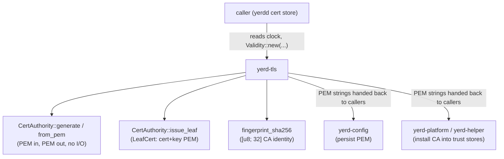

# yerd-tls

`yerd-tls` is the pure-Rust certificate engine behind Yerd's local HTTPS. It generates a self-signed local **Certificate Authority**, reloads that CA from PEM, computes its SHA-256 fingerprint, and issues per-site **leaf certificates** signed by the CA. It is built on [rcgen](https://github.com/rustls/rcgen) (backed by `ring`) - **no OpenSSL, no shelling out**.

The defining constraint is purity: the crate does **no file or socket I/O, never reads the clock, and never reads the environment**. Callers pass timestamps in via [`Validity`](#validity) and pass/receive certificate material as PEM strings. Persistence lives in the daemon (`yerdd`'s cert store); trust-store installation lives in `yerd-platform` and `yerd-helper`. This crate just turns inputs into bytes.

For the end-to-end HTTPS story - how the CA is installed into system trust stores, how leaves are minted per site, and what users actually run - see [HTTPS & Certificates](../../guide/https). This page is the contributor-facing reference for the crate itself.

::: info Dependency-graph position
`yerd-tls` is a **leaf in the workspace dependency graph**: it has zero internal (`yerd-*`) dependencies. Its only crates are `rcgen`, `pem`, `rustls-pki-types`, `sha2`, `thiserror`, `time`, and `x509-parser`. It is consumed by `yerdd` (the daemon's cert store) and indirectly underpins the `yerd-proxy` HTTPS path.
:::

## Module map

```
crates/yerd-tls/
├── src/
│   ├── lib.rs       - crate root; re-exports the public surface; #![forbid(unsafe_code)]
│   ├── ca.rs        - CertAuthority: generate / from_pem / fingerprint / issue_leaf
│   ├── leaf.rs      - LeafCert: cert_pem / key_pem / chain_pem
│   ├── params.rs    - rcgen CertificateParams builders for CA and leaf (crate-private)
│   ├── validity.rs  - Validity: clock-free NotBefore/NotAfter window
│   └── error.rs     - TlsError + typed *Reason sub-enums; rcgen_detail() mapping
└── tests/           - integration tests (chain, fingerprint, sans, validity, roundtrip, …)
```

The public surface re-exported from `lib.rs` is small:

```rust
pub use ca::CertAuthority;
pub use error::{GenerateErrorReason, ParseErrorReason, TlsError, ValidityErrorReason};
pub use leaf::LeafCert;
pub use validity::Validity;
```

A compile-time test (`re_exports_compile`) asserts all of these stay nameable through the crate root.

## The `CertAuthority` API

`CertAuthority` holds the CA's certificate and key material. Its layout deliberately duplicates a few representations:

```rust
#[non_exhaustive]
pub struct CertAuthority {
    cert_pem: String,   // canonical PEM wire form
    cert_der: Vec<u8>,  // canonical DER wire form (what gets fingerprinted)
    key_pem: String,    // canonical PEM key form
    key_pair: KeyPair,  // live rcgen signing context for issue_leaf
}
```

The duplication is intentional: `cert_pem`/`cert_der` are the canonical wire forms returned by accessors, while `key_pair` is the live signing context used by `issue_leaf`. After `from_pem`, the cached strings and bytes are the caller's input *verbatim*, so the PEM accessors and the fingerprint round-trip losslessly.

### `generate`

```rust
pub fn generate(common_name: &str, validity: Validity) -> Result<Self, TlsError>
```

Generates a fresh CA. The signing algorithm is **explicitly pinned to ECDSA P-256 / SHA-256**:

```rust
fn key_alg() -> &'static rcgen::SignatureAlgorithm {
    &rcgen::PKCS_ECDSA_P256_SHA256
}
```

Pinning the algorithm guards against rcgen changing the default of `KeyPair::generate()`. (`PKCS_ECDSA_P256_SHA256` is a `static`, not a `const`, so the code takes a reference at the call site.) `generate` calls `params::ca_params`, generates the key pair, self-signs, then caches `cert.pem()`, `cert.der()`, and `key_pair.serialize_pem()`.

### `from_pem`

```rust
pub fn from_pem(cert_pem: &str, key_pem: &str) -> Result<Self, TlsError>
```

Reloads a previously-persisted CA. It runs a layered validation gauntlet - each layer maps to a precise [`ParseErrorReason`](#error-model):

1. **Cert PEM tag check** - decode with the `pem` crate and require the tag `"CERTIFICATE"`. Failure → `InvalidCertificatePem`.
2. **Key PEM tag check** - decode and require the tag `"PRIVATE KEY"`. This is a *defensive* layer: rcgen's `from_pem` does not enforce tags itself. Failure → `InvalidPrivateKeyPem`.
3. **Key parse** - `KeyPair::from_pem`. Failure (e.g. a non-PKCS#8 body) → `InvalidPrivateKeyPem`.
4. **SPKI byte-comparison** - parse the cert DER with `x509-parser`, extract `tbs_certificate.subject_pki.raw`, and byte-compare it against `key_pair.public_key_der()`. Mismatch → `KeyDoesNotMatchCertificate`. **This is the primary safeguard**: rcgen does *not* check that the supplied key actually corresponds to the supplied cert, so `from_pem(a.cert, b.key)` would otherwise succeed silently.
5. **rcgen parseability probe** - `CertificateParams::from_ca_cert_der`. This is run eagerly so `issue_leaf` cannot surprise the caller later; it catches multi-AVA RDN subjects, unsupported extensions, and similar. Failure → `InvalidCertificateDer { detail }`.

::: tip Why the eager rcgen probe matters
The same `from_ca_cert_der` call is what `issue_leaf` uses to reconstruct the issuer. Running it at load time converts a *deferred* failure (issuance breaks weeks later) into an *immediate, attributable* one (`from_pem` rejects the bad CA up front).
:::

### Accessors and fingerprint

```rust
pub fn cert_pem(&self) -> &str
pub fn key_pem(&self) -> &str
pub fn cert_der(&self) -> &[u8]
pub fn fingerprint_sha256(&self) -> [u8; 32]
```

`fingerprint_sha256` is a plain SHA-256 over the cached **certificate DER** (not the PEM, not the key). Because the DER is the input PEM decoded exactly once, the fingerprint is **stable across a `from_pem` round-trip** and identical between two `from_pem` calls on the same input - both invariants are pinned by tests. The fingerprint is what the daemon and trust-store layers use to identify "the current CA" without comparing whole certificates.

### `issue_leaf`

```rust
pub fn issue_leaf(&self, names: &[String], validity: Validity) -> Result<LeafCert, TlsError>
```

Issues a leaf certificate whose Subject Alternative Names are exactly `names`. The mechanism is worth understanding:

1. Build leaf `CertificateParams` via `params::leaf_params` (SAN validation happens here).
2. **Reconstruct a synthetic issuer** from the cached cert DER plus the live `key_pair`, via `CertificateParams::from_ca_cert_der(...).self_signed(&self.key_pair)`. The synthetic issuer cert gets a fresh random serial and signature, but the same SPKI / DN / key - which is all rcgen's leaf-signing path reads.
3. Generate a **fresh** key pair for the leaf (same P-256 algorithm).
4. Sign with `leaf_params.signed_by(&PublicKeyHandle(&leaf_key), &issuer_cert, &self.key_pair)`.

`PublicKeyHandle` is a thin newtype that implements rcgen's `PublicKeyData` trait by delegating to the wrapped `KeyPair` - it exists purely to satisfy the `&impl PublicKeyData` argument shape on `signed_by`.

The chain tests verify the result rigorously: the leaf's issuer DN equals the CA subject DN; the leaf's **AKI equals the CA's SKI byte-for-byte** (and that SKI equals `Sha256(SPKI)[..20]` under rcgen's `KeyIdMethod::Sha256`); the leaf signature verifies against the CA public key; and successive issuances carry **distinct serials**. A `from_pem`-reloaded CA produces leaves with the same issuer/AKI alignment.

### Debug redaction

`CertAuthority` has a hand-written `Debug` impl that prints only the hex fingerprint and `key: "(elided)"`:

```rust
CertAuthority { fingerprint_sha256: "ab12…", key: "(elided)" }
```

The default derive would print the full `key_pem`, which `tracing::error!(?ca)` in the daemon would leak into logs. The `debug_redacts_key_material` test asserts the formatted output contains neither `"BEGIN"`, nor `"PRIVATE KEY"`, nor the base64 key body.

`CertAuthority` is also asserted `Send + Sync`.

## `LeafCert`

```rust
#[derive(Debug, Clone)]
#[non_exhaustive]
pub struct LeafCert { /* cert_pem, key_pem */ }

impl LeafCert {
    pub fn cert_pem(&self) -> &str;
    pub fn key_pem(&self) -> &str;
    pub fn chain_pem(&self, ca_cert_pem: &str) -> String;
}
```

A `LeafCert` is just the signed leaf certificate plus its private key, both as PEM. Its constructor is `pub(crate)` - user code must always go through `CertAuthority::issue_leaf`, so a leaf can never exist without a real signing operation behind it.

`chain_pem` returns `format!("{leaf_pem}\n{ca_cert_pem}")` - leaf first, then the CA cert, joined by exactly one `\n`. It performs **no validation** of `ca_cert_pem` (a test, `chain_pem_passes_through_arbitrary_ca_string`, pins this no-validation invariant so a future contributor cannot quietly add "smart" validation). This is the form a TLS server hands to a client as its certificate chain.

::: warning PEM block separation
`chain_pem` always inserts a single `\n` between the two blocks. RFC 7468 §3 *permits* but does not *mandate* whitespace tolerance between blocks; `rustls` and the `pem` crate accept this form, but a strict downstream parser might differ.
:::

## Parameter builders (`params.rs`)

`params.rs` is crate-private and owns all the X.509 policy. Two builders.

### CA parameters

`ca_params(common_name, validity)`:

| Field | Value |
| --- | --- |
| `not_before` / `not_after` | from `validity` |
| `is_ca` | `IsCa::Ca(BasicConstraints::Constrained(0))` - CA:TRUE, **path length 0** (no intermediates) |
| `key_usages` | `KeyCertSign`, `CrlSign` |
| `extended_key_usages` | empty |
| `subject_alt_names` | empty (CA carries no SAN) |
| `use_authority_key_identifier_extension` | `false` |
| `distinguished_name` | single `CommonName` = `common_name` |

The common name is validated up front: empty → `EmptyCommonName`; longer than `CN_MAX_BYTES` (**64**, the RFC 5280 §A.1 `ub-common-name` cap) → `CommonNameTooLong { max }`. 64 bytes exactly is accepted.

### Leaf parameters

`leaf_params(names, validity)`:

| Field | Value |
| --- | --- |
| `not_before` / `not_after` | from `validity` |
| `is_ca` | `IsCa::ExplicitNoCa` - CA:FALSE |
| `subject_alt_names` | one `SanType::DnsName` per entry in `names` |
| `key_usages` | `DigitalSignature`, `KeyEncipherment` |
| `extended_key_usages` | `ServerAuth` only |
| `use_authority_key_identifier_extension` | `true` |
| `distinguished_name` | **empty** (no CN - modern browsers want SAN-only) |

An empty `names` slice → `EmptyNameSet`. Each name is validated as an `Ia5String` (ASCII); a non-IA5 entry → `InvalidDnsName { index }`, carrying the **0-based index** of the offending name so the caller can report exactly which name failed (e.g. `föö.test` at index 1). Wildcards like `*.foo.test` pass through and are preserved as DNS-name SANs.

::: info The AKI toggle
`use_authority_key_identifier_extension = true` on leaves is load-bearing: without it rcgen does not emit the Authority Key Identifier extension at all (`rcgen-0.13.2/src/certificate.rs:680-704`). The `leaf_params_enables_aki` test pins this so the AKI→SKI chain link cannot silently disappear.
:::

## `Validity`

```rust
#[derive(Debug, Clone, Copy, PartialEq, Eq)]
#[non_exhaustive]
pub struct Validity { /* not_before, not_after: OffsetDateTime */ }

impl Validity {
    pub fn new(not_before: OffsetDateTime, not_after: OffsetDateTime) -> Result<Self, TlsError>;
    pub fn not_before(&self) -> OffsetDateTime;
    pub fn not_after(&self) -> OffsetDateTime;
}
```

`Validity` is the **only timestamp-shaped type in the public surface**, and it is the mechanism that keeps the crate clock-free: every cert-generating call takes one by value, and the crate never reads "now". The daemon reads the clock and constructs the window.

`new` enforces two rules:

- `not_before > not_after` → `NotBeforeAfterNotAfter`. (Equal endpoints are allowed.)
- `not_before.year() > 9998` **or** `not_after.year() > 9998` → `YearAbove9998`.

The year cap reserves a one-year gap below `time`'s representable ceiling (±9999 without the `large-dates` feature) so callers cannot accidentally emit `99991231235959Z` `GeneralizedTime`, which several trust stores treat as "no expiry" or refuse outright. **Pre-1950 timestamps are not rejected** - RFC 5280 §4.2.1.5 permits `GeneralizedTime` for them, and "no certs before the unix epoch" is a policy decision for the daemon, not this crate. Round-trip tests confirm validity windows survive the cert's ASN.1 time encoding to second precision, across the 2049/2050 UTCTime→GeneralizedTime cutover.

## Error model (`error.rs`)

`TlsError` is the single error type returned by every fallible API. It has three variants, each carrying a typed `*Reason` sub-enum so callers match on precise failure modes instead of parsing message strings:

```rust
#[derive(Debug, Error, Clone, PartialEq, Eq)]
#[non_exhaustive]
pub enum TlsError {
    Generate { reason: GenerateErrorReason },
    Parse    { reason: ParseErrorReason },
    Validity { reason: ValidityErrorReason },
}
```

| Sub-enum | Notable variants |
| --- | --- |
| `GenerateErrorReason` | `EmptyCommonName`, `CommonNameTooLong { max }`, `EmptyNameSet`, `InvalidDnsName { index }`, `KeyGenerationFailed { detail }`, `SelfSignFailed { detail }`, `SignByCaFailed { detail }` |
| `ParseErrorReason` | `InvalidCertificatePem`, `InvalidCertificateDer { detail }`, `InvalidPrivateKeyPem`, `KeyDoesNotMatchCertificate` |
| `ValidityErrorReason` | `NotBeforeAfterNotAfter`, `YearAbove9998` |

Every enum is `#[non_exhaustive]` (semver-safe additions) and the reason enums are `Copy`. Crucially, `TlsError` is `Clone + PartialEq + Eq + Send + Sync`.

### The rcgen `=` pin and the tripwire test

`TlsError` deliberately does **not wrap `rcgen::Error`** - `rcgen::Error` is neither `Clone` nor `Eq`, and wrapping it would forfeit those derives across the whole error type. Instead, the crate-private `rcgen_detail` function maps each `rcgen::Error` variant to a stable `&'static str` tag (`"RingUnspecified"`, `"UnsupportedExtension"`, …), surfaced through the `detail` fields above. Unknown variants fall through to `"Unknown"`.

The risk: `rcgen::Error` is `#[non_exhaustive]` upstream, so a future rcgen release can *add* a variant. If that happened silently, real failures would map to `"Unknown"` and lose diagnostic value. Two mechanisms prevent it:

1. **The `=` version pin.** The workspace `Cargo.toml` pins `rcgen = "=0.13.2"`. The exact-version pin means a maintainer must make a *deliberate edit* to bump rcgen - it cannot drift in via a routine `cargo update`.

2. **The `rcgen_error_detail_table_is_current` tripwire test.** It enumerates every `rcgen::Error` variant present under our feature set and asserts each maps to a tag that is neither `"Unknown"` nor empty. When the rcgen bump lands, this test fires until the maintainer maps the new variant in `rcgen_detail`.

Together they convert a silent upstream addition into a compile-and-test failure exactly at bump time. (`MissingSerialNumber` is cfg-gated to `not(crypto)` upstream and excluded, since the crate enables the `crypto` feature.)

## Purity & dependency invariants

The crate header forbids `tokio`, `std::fs`, `std::time::SystemTime`/`Instant`, and env reads. All random material comes from rcgen's configured backend (`ring`). These properties are not just documented - they're **tested** in `tests/no_runtime_deps.rs`, which walks `cargo metadata` over normal-kind edges from the `yerd-tls` node and asserts:

- no `tokio` in the runtime graph;
- no `anyhow` in the runtime graph;
- exactly one `time` version;
- exactly one `x509-parser` version.

This is a deterministic replacement for earlier grep- and `cargo deny`-based gates.

## Test suite

The integration tests under `tests/` form the behavioural contract:

| File | Covers |
| --- | --- |
| `roundtrip.rs` | PEM/DER/fingerprint byte-identical round-trips through `from_pem`; signing capability recovered |
| `fingerprint.rs` | fingerprint = hand-computed `Sha256(DER)`; differs between independent generations; stable after reload |
| `chain.rs` | issuer DN = CA subject DN; leaf AKI = CA SKI = `Sha256(SPKI)[..20]`; signature verification; unique serials |
| `sans.rs` | every passed name appears as a SAN; wildcard preserved; CA/leaf BasicConstraints, KeyUsage, EKU |
| `validity.rs` | NotBefore/NotAfter round-trip to second precision; post-2050 and pre-2050 encodings; leaf validity independent of CA validity |
| `pem_edge_cases.rs` | multi-block PEM (first block wins); encrypted/non-PKCS#8 key rejected; whitespace-in-label rejected; trailing-newline tolerance |
| `issuance_negative.rs` | every rejected-input path: empty/overlong CN, empty/non-IA5 names, reversed validity, garbage/mismatched/cross-algorithm PEM, wrong tags |
| `no_runtime_deps.rs` | the dependency-graph invariants above |

## Where this fits



See also: [HTTPS & Certificates](../../guide/https) for the user-facing workflow, the [Crates Overview](../crates) for how `yerd-tls` sits among the other crates, [yerd-platform](./yerd-platform) for trust-store installation, and [yerdd](../binaries/yerdd) for the daemon that drives issuance. Source: [`crates/yerd-tls`](https://github.com/forjedio/yerd/tree/main/crates/yerd-tls).
