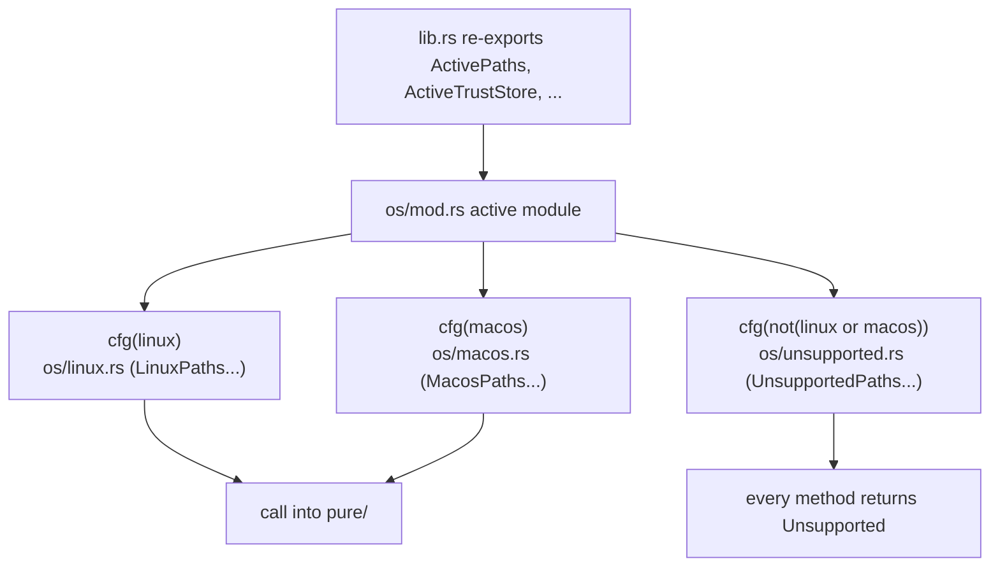

# Cross-Platform Model

Yerd supports macOS and Linux from a single workspace, with Windows compiling (but not yet functioning) against a stub. Almost all of the OS-specific surface area is concentrated in one crate, [`yerd-platform`](./crates/yerd-platform). This page walks the actual module map, the compile-time OS selection, the purity discipline that keeps decisions testable, the privilege boundary that keeps the library unprivileged, and the per-OS behaviour matrices for the four privileged subsystems.

::: info Where this lives in the architecture
`yerd-platform` is unprivileged library code. The daemon ([`yerdd`](./binaries/yerdd)) calls it; the privileged work is delegated to [`yerd-helper`](./binaries/yerd-helper). For the bigger picture see [Architecture](./architecture); for the runtime story see [Elevation & Privileges](../guide/elevation).
:::

## Design goals

The crate doc (`crates/yerd-platform/src/lib.rs`) states the contract directly:

```rust
//! The core traits live here - Paths, TrustStore, ResolverInstaller,
//! PortBinder, and PortRedirector - each with a single thin
//! implementation per OS selected by #[cfg(target_os = ...)].
//! macOS and Linux ship in Phase 1; Windows compiles against the
//! os::unsupported stub that returns PlatformError::Unsupported for
//! every method.
```

Three rules follow from this and recur throughout the crate:

1. **Exactly one OS implementation is active per build**, chosen at compile time by `#[cfg(target_os = ...)]`. There is no runtime OS dispatch.
2. **Decisions live in `pure/`, side effects live in the OS impls.** Anything that can be expressed as "given this text/these outcomes, what should happen?" is a pure, runtime-free, I/O-free function with table-style unit tests. The OS impl only does the file reads, binds, and command spawns.
3. **The platform crate never elevates itself.** Operations needing root return `PlatformError::NeedsHelper` carrying a typed operation tag; the daemon owns the spawn of `yerd-helper`.

The crate is also `#![forbid(unsafe_code)]`, and a dep-graph test (`tests/no_runtime_deps.rs`) asserts that `tokio`, `anyhow`, `reqwest`, and any OpenSSL/native-tls variant never enter its runtime graph.

## The trait surface

Every OS difference is funnelled through six small traits, each defined in its own module and re-exported from `lib.rs`:

| Trait | Module | Responsibility |
| --- | --- | --- |
| `Paths` | `paths.rs` | Resolve config / data / state / cache / runtime directories into `PlatformDirs`. |
| `TrustStore` | `trust_store.rs` | Install / uninstall / probe a root CA in the **system** store, plus a per-user Firefox/NSS install. |
| `ResolverInstaller` | `resolver.rs` | Install / uninstall / probe the per-TLD OS resolver redirect. |
| `PortBinder` | `port_binder.rs` | Bind a single TCP listener, plus an atomic 80+443 (or rootless 8080+8443) pair. |
| `PortRedirector` | `port_redirect.rs` | Probe whether the privileged-port redirect is live (macOS pf), and whether a non-Yerd process is squatting 80/443 (cross-platform). |
| `SystemMetrics` | `metrics.rs` | Best-effort per-process RSS and system load average. |

`SystemMetrics` is the odd one out: it returns `Option` rather than `Result`, because metrics are best-effort and an unsupported OS is indistinguishable (to callers) from a transient read failure - both collapse to "show nothing".

## Compile-time OS selection

`src/os/mod.rs` is the switchboard. Exactly one submodule is compiled, and a single `active` module re-exports its concrete types under OS-neutral aliases:

```rust
#[cfg(target_os = "linux")]
mod linux;
#[cfg(target_os = "macos")]
mod macos;
#[cfg(not(any(target_os = "linux", target_os = "macos")))]
mod unsupported;

pub(crate) mod active {
    #[cfg(target_os = "linux")]
    pub use super::linux::{
        LinuxPaths as ActivePaths, LinuxPortBinder as ActivePortBinder,
        LinuxPortRedirector as ActivePortRedirector,
        LinuxResolverInstaller as ActiveResolverInstaller,
        LinuxSystemMetrics as ActiveSystemMetrics, LinuxTrustStore as ActiveTrustStore,
    };
    // macos and unsupported blocks mirror this, gated by their own cfg.
}
```

`lib.rs` then re-exports the active set as the crate's public entry point:

```rust
pub use os::active::{
    ActivePaths, ActivePortBinder, ActivePortRedirector, ActiveResolverInstaller,
    ActiveSystemMetrics, ActiveTrustStore,
};
```

Callers depend on `ActivePaths`, `ActiveTrustStore`, and so on - never on `LinuxPaths` or `MacosPaths` directly. This is what makes the rest of the workspace OS-agnostic: the daemon writes `ActiveTrustStore::new()` once and the compiler resolves it to the right concrete type for the target.



### The `unsupported` stub (Windows today)

`os/unsupported.rs` provides a complete set of trait impls whose every fallible method returns `Err(PlatformError::Unsupported { operation })`. Its doc comment states the purpose plainly:

```rust
//! Stub implementations for unsupported OSes (Phase 1: Windows).
//!
//! Every trait method returns Err(PlatformError::Unsupported { operation }).
//! This lets `cargo check --workspace` stay green on every host while the
//! macOS + Linux impls are the only ones with behaviour.
```

`SystemMetrics` is the one exception - its stub returns `None` rather than an error, matching the best-effort contract. `tests/unsupported.rs` (gated to non-Linux, non-macOS targets) asserts every other method returns the `Unsupported` variant, so the stub cannot silently rot.

::: warning Windows compiles, but does not run
Building for Windows produces a working `cargo check`, but every privileged or path operation returns `Unsupported`. Real Windows support, plus `Autostart` and `Elevation` traits, is explicitly deferred to a later phase.
:::

## Purity: decisions in `pure/`, effects in the OS impls

`src/pure/mod.rs` sets the discipline:

```rust
//! Pure, in-memory decision helpers used by the OS impls.
//!
//! Every function in this module is sync, runtime-free, and free of I/O,
//! clock reads, and environment lookups. Each submodule is unit-tested
//! table-style.
```

The OS impls read a file or attempt a bind, then hand the bytes/outcome to a pure helper that decides what it means. The decision is therefore testable without a filesystem, a network stack, or root:

| Pure module | Decision it owns | Consumed by |
| --- | --- | --- |
| `port_plan` | Should a failed port-pair bind fall back to rootless ports, hard-fail, or be kept? | both `bind_pair` impls |
| `resolver_file` | Compose/parse/match macOS `/etc/resolver/<tld>`; pick latest backup; `restorable` guard for restoring one. | macOS `ResolverInstaller` |
| `resolved_drop_in` | Compose/parse/match a `systemd-resolved` drop-in. | Linux `ResolverInstaller` |
| `resolv_conf` | Select systemd-resolved, positively marked NetworkManager, or unsupported; validate the NetworkManager reload post-condition. | Linux `ResolverInstaller` |
| `networkmanager_dnsmasq` | Compose and match NetworkManager dnsmasq plugin and per-TLD rules. | Linux `ResolverInstaller` |
| `pem_match` | Match a SHA-256 fingerprint against a list of PEM blobs. | Linux `TrustStore` |
| `pf_anchor` | Compose the macOS pf `rdr` ruleset, anchor refs, and LaunchDaemon plist. | macOS pf redirect (helper) |
| `firefox` | Parse `profiles.ini` to discover NSS databases. | NSS install (planned) |
| `proc_metrics` | Parse `/proc/<pid>/status` `VmRSS` and `/proc/loadavg`. | Linux `SystemMetrics` |
| `ps_metrics` | Parse headerless `ps -o rss=` output. | macOS `SystemMetrics` |

A concrete example: `port_plan::classify_desired` takes two `Result<(), io::ErrorKind>` bind outcomes and returns an action - `KeepDesired`, `UseFallback`, or `HardFail(kind)`. The retry trigger is exactly three error kinds:

```rust
pub fn is_retry_kind(kind: ErrorKind) -> bool {
    matches!(
        kind,
        ErrorKind::PermissionDenied | ErrorKind::AddrInUse | ErrorKind::AddrNotAvailable
    )
}
```

Both `os/linux.rs` and `os/macos.rs` carry their own copy of `bind_pair_impl` (they cannot share one - the Linux copy is `cfg`-gated to Linux), but both delegate the actual precedence decision to this single pure function, which is exhaustively table-tested for the http/https × retry/hard-fail matrix.

## The privilege boundary

This is the load-bearing safety property of the whole crate. From `lib.rs`:

```rust
//! `yerd-platform` is unprivileged library code. Operations that need root
//! return PlatformError::NeedsHelper. The typed HelperInvocation enum
//! carries the request to the `yerd-helper` binary (a separate crate) for
//! execution. The OS impls never spawn the helper themselves - a
//! privileged caller owns the Command::new(...) call.
```

So the flow for any root-requiring operation is:

1. The daemon calls e.g. `ActiveTrustStore::install_system(pem, &fp)`.
2. The impl immediately returns `Err(PlatformError::NeedsHelper { operation: ops::INSTALL_CA })`. It does **no** privileged work and spawns **nothing**.
3. The daemon recognises `NeedsHelper`, builds the matching typed `HelperInvocation`, and is the one that runs `yerd-helper` (directly for its own setup, or via `yerd elevate` under `sudo`/`osascript`).

`PlatformError::NeedsHelper` carries only a `&'static str` operation tag, sourced from the single-source-of-truth `error::ops` module (`INSTALL_CA`, `UNINSTALL_RESOLVER`, `SETCAP`, `INSTALL_PORT_REDIRECT`, …). The same constants are the leading argv element of the helper invocation, so the tag round-trips end to end.

### `HelperInvocation`: the typed wire contract

`src/helper.rs` defines the enum the daemon hands to its spawner. Values stay typed all the way to the spawn site - there is no `Vec<String>` round-trip in between:

```rust
#[non_exhaustive]
pub enum HelperInvocation {
    InstallCa { ca_pem_path: PathBuf, fp: CaFingerprint },
    UninstallCa { fp: CaFingerprint },
    InstallResolver { tld: String, addr: SocketAddr },
    UninstallResolver { tld: String },
    Setcap { daemon_binary: PathBuf },
    InstallPortRedirect { http_from: u16, http_to: u16, https_from: u16, https_to: u16 },
    UninstallPortRedirect,
}
```

`to_argv` serialises this to a `Vec<OsString>` (operation tag, then alternating `--flag value` pairs); `from_argv` is the strict inverse used inside the helper - unknown flags, missing values, and trailing argv are all rejected with a typed `ArgvParseError`. Fingerprints render as exactly 64 lowercase hex characters; socket addresses use their `Display` form; paths pass as native `OsString`. The argv shape is pinned by `tests/helper_argv_shape.rs` and round-tripped by the unit tests in `helper.rs`, so adding or reordering a flag trips a test.

::: tip Why typed all the way down
Keeping the invocation a typed enum (rather than assembling strings in the daemon) means the privileged boundary is crossed with a value the compiler has checked - the only stringly-typed moment is the single `to_argv`/`from_argv` hop, and that hop is guarded by round-trip tests. See [IPC Protocol](./ipc-protocol) and [yerd-helper](./binaries/yerd-helper) for the execution side.
:::

The probes (`is_present_system`, `is_installed`, `bind`, `is_active`, the metrics reads) are all read-only and run **unprivileged** in the daemon - they never return `NeedsHelper`.

## Per-OS behaviour matrices

The same five-field `PlatformDirs` is produced by both OSes, but with different sources: Linux uses XDG via the `directories` crate (with `state` distinct from `data` and a `/tmp/yerd-$UID` runtime fallback when `XDG_RUNTIME_DIR` is unset); macOS collapses `state` onto `data` and uses a deterministic `/tmp/yerd-$UID` runtime dir so a `sudo`-elevated process can reconstruct the IPC socket path from `SUDO_UID` alone. The four privileged subsystems differ as follows.

### Resolver install

| Aspect | Linux | macOS | Windows (stub) |
| --- | --- | --- | --- |
| Backend | `systemd-resolved` drop-in (preferred), else NetworkManager dnsmasq plugin | `/etc/resolver/<tld>` | - |
| File path | resolved drop-in, or `/etc/NetworkManager/{conf.d,dnsmasq.d}/yerd-*.conf` | `/etc/resolver/<tld>` | - |
| File body | `[Resolve]` route, or `[main] dns=dnsmasq` plus `server=/<tld>/<ip>#<port>` | `nameserver <ip>` `port <n>` (`resolver_file::compose`) | - |
| `install` / `uninstall` | `NeedsHelper` (`install-resolver` / `uninstall-resolver`) | `NeedsHelper` (same tags) | `Unsupported` |
| `is_installed` probe | resolved drop-in is shape/TLD-only; NetworkManager requires matching plugin, TLD, address, and port snippets | parse file; **requires** matching nameserver **and** port | `Unsupported` |
| Empty TLD | `Err(Resolver { TldEmpty })` | `Err(Resolver { TldEmpty })` | `Unsupported` |

The macOS probe is deliberately strict about the port: a bare `nameserver 127.0.0.1` left by Valet/Herd defaults to port 53 (where nothing listens), so it must read as *not installed* and get rewritten with the daemon's real DNS port. The helper backs up any replaced `/etc/resolver/<tld>` under `/Library/Application Support/io.yerd.Yerd/resolver-backups` (path logic in `resolver_file`, I/O in the helper). `uninstall-resolver` (i.e. `unelevate resolver`) is the inverse: it restores the newest backup over `/etc/resolver/<tld>` then clears the rest - but only after confirming the backup is root-owned, not a symlink, and `resolver_file::restorable` (parses as a real resolver file); otherwise it falls back to a plain removal.

### Port binding

| Aspect | Linux | macOS | Windows (stub) |
| --- | --- | --- | --- |
| Privileged 80/443 | bind **directly** after `setcap cap_net_bind_service` | cannot bind 80/443 unprivileged → pf redirect | `Unsupported` |
| `bind` / `bind_pair` | `127.0.0.1` loopback via `TcpListener` | `127.0.0.1` loopback via `TcpListener` | `Unsupported` |
| Fallback decision | `pure::port_plan` (shared) | `pure::port_plan` (shared) | - |
| Retry triggers | `PermissionDenied`, `AddrInUse`, `AddrNotAvailable` | same | - |

`bind_pair(desired, fallback)` attempts the desired pair (e.g. 80/443), and on a retry-kind failure drops any partial listener and retries the fallback pair (e.g. 8080/8443). A non-retry error on the desired pair surfaces immediately as `PlatformError::Bind` without trying the fallback. If both pairs fail, `PlatformError::BindPair::BothPairsFailed` carries all four `io::ErrorKind`s, so the daemon can tell "`setcap` missing" (`PermissionDenied` across the board) from "port already in use" (`AddrInUse`) and message accordingly.

### Trust store

| Aspect | Linux | macOS | Windows (stub) |
| --- | --- | --- | --- |
| System store | anchor dir + distro `update-ca-certificates`/`update-ca-trust` (via helper) | `/Library/Keychains/System.keychain` | - |
| Anchor dirs scanned | `/usr/local/share/ca-certificates`, `/etc/pki/ca-trust/source/anchors`, `/etc/ca-certificates/trust-source/anchors` | n/a | - |
| `install` / `uninstall` | `NeedsHelper` (`install-ca` / `uninstall-ca`) | `NeedsHelper` (same tags) | `Unsupported` |
| `is_present_system` probe | hash each anchor `.crt` DER, match fingerprint (`pem_match`) | enumerate Keychain certs via `security-framework`, SHA-256 the DER | `Unsupported` |
| Firefox/NSS install | degraded `NssOutcome` (`certutil_missing: false`) - wiring planned | degraded `NssOutcome` (`certutil_missing: true`) - wiring planned | `Unsupported` |

The fingerprint is a `CaFingerprint` newtype wrapping a 32-byte SHA-256 digest, with a strict lowercase-hex wire form (`to_hex` / `from_hex`). The presence probe is a *presence* check, not a trust-policy check.

::: info Firefox/NSS is partially landed
Both OS impls currently return a degraded `NssOutcome` reporting zero profiles attempted; the actual `certutil` invocation is a planned follow-up that lands when the daemon and helper drive it end to end. The `pure::firefox` `profiles.ini` parser already exists.
:::

### Autostart

Yerd does not yet expose a general cross-platform autostart abstraction - an `Autostart` trait is explicitly deferred to a later phase. The only boot persistence in the codebase today is for the macOS pf redirect:

| Aspect | Linux | macOS | Windows (stub) |
| --- | --- | --- | --- |
| Generic daemon autostart trait | not implemented (roadmap) | not implemented (roadmap) | not implemented |
| pf-redirect boot persistence | n/a (binds 80/443 directly via `setcap`) | `LaunchDaemon` plist `dev.yerd.pf` at `/Library/LaunchDaemons/dev.yerd.pf.plist` | n/a |
| Re-applied at boot by | n/a | `/sbin/pfctl -E -f /etc/pf.conf`, one-shot `RunAtLoad`, no `KeepAlive` | n/a |
| Installed by | n/a | `yerd-helper` via `launchctl bootstrap system` | n/a |

The plist is composed by `pure::pf_anchor::compose_launchdaemon_plist` and installed by the helper's `install-port-redirect` operation. It is one-shot (`RunAtLoad` without `KeepAlive`) so launchd does not respawn a process that exits 0 in a tight loop. Because Linux binds the privileged ports directly after `setcap`, it needs no equivalent.

## Probing vs. doing: the `PortRedirector` nuance

On macOS the daemon still *binds* its high rootless ports even after the pf redirect makes 80/443 reachable, so the status field `http.fell_back` stays `true`. The doctor needs a separate signal that 80/443 are genuinely reachable, which is what `PortRedirector::is_active` provides. It is an **active, unprivileged** probe that confirms the redirect reaches *Yerd's own proxy* (not merely that something answers):

```rust
impl PortRedirector for MacosPortRedirector {
    fn is_active(&self) -> Option<bool> {
        // :80 must answer with the proxy's `Server: yerd` marker; :443 reachable.
        Some(loopback_redirect_reaches_proxy(80) && loopback_port_reachable(443))
    }
}
```

`loopback_redirect_reaches_proxy` speaks HTTP to loopback and checks for `yerd_core::PROXY_SERVER_ID` on the reply, rather than checking whether the pf anchor file exists (a file-existence check is a false-green - the file can exist while the rule isn't redirecting) or merely that a socket accepts (a foreign web server or stale `pf` rule would read as a live Yerd redirect). Linux returns `None` for `is_active` ("not applicable") because it binds the privileged ports directly.

The trait also has a **cross-platform** default method, `foreign_web_listener() -> Option<bool>`: `Some(true)` when a privileged web port answers but the proxy marker is absent - a non-Yerd process squatting 80/443. The daemon reports it as `StatusReport.foreign_web_listener` and `yerd-doctor` turns it into the `ForeignWebListener` warning (which supersedes `PortFallback`). The `unsupported` stub overrides it back to `None`.

## Invariants worth knowing

These are enforced by tests in `crates/yerd-platform/tests/`:

- **Exactly one OS impl is active.** `linux_smoke.rs`, `macos_smoke.rs`, and `unsupported.rs` are each `#![cfg(...)]`-gated to their target so only the active one runs.
- **The stub never silently gains behaviour.** `unsupported.rs` asserts every trait method returns `PlatformError::Unsupported`.
- **The helper argv shape is pinned.** `helper_argv_shape.rs` and the `helper.rs` round-trip tests fail if a flag is added or reordered.
- **No heavy runtime deps.** `no_runtime_deps.rs` walks the `--filter-platform`-scoped dep graph and fails if `tokio`, `anyhow`, `reqwest`, or OpenSSL/native-tls is reachable from `yerd-platform`.
- **Pure helpers are table-tested in memory** - every `pure/` submodule ships its own `#[cfg(test)] mod tests`.

## Where to go next

- [yerd-platform crate reference](./crates/yerd-platform) - the full module-by-module API.
- [yerd-helper (privileged)](./binaries/yerd-helper) - the execution side of `HelperInvocation`.
- [Elevation & Privileges](../guide/elevation) - the user-facing privilege story.
- [Architecture](./architecture) - how the crates fit together.

For source, see the public repository: <https://github.com/forjedio/yerd>.
