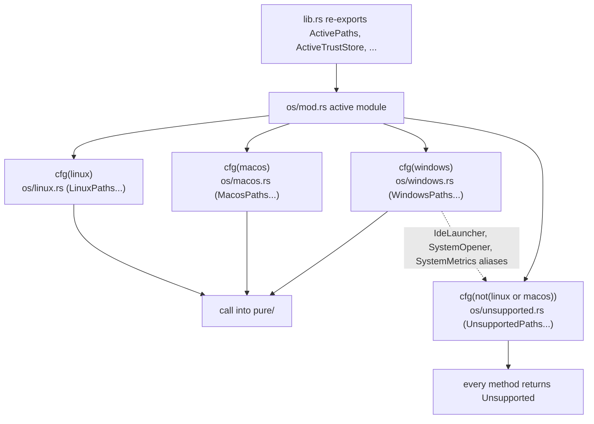

# Cross-Platform Model

Yerd supports macOS, Linux, and Windows from a single workspace. macOS and Linux are complete; Windows is an early-access target with real `Windows*` implementations for paths, TCP binding, the port-redirect probe, the trust store, the resolver, and terminal launching, and a small remainder still aliased to the `unsupported` stub. Almost all of the OS-specific surface area is concentrated in one crate, [`yerd-platform`](./crates/yerd-platform). This page walks the actual module map, the compile-time OS selection, the purity discipline that keeps decisions testable, the privilege boundary that keeps the library unprivileged, and the per-OS behaviour matrices.

::: info Where this lives in the architecture
`yerd-platform` is unprivileged library code. The daemon ([`yerdd`](./binaries/yerdd)) calls it; the privileged work is delegated to [`yerd-helper`](./binaries/yerd-helper). For the bigger picture see [Architecture](./architecture); for the runtime story see [Elevation & Privileges](../guide/elevation).
:::

## Design goals

The crate doc (`crates/yerd-platform/src/lib.rs`) states the contract directly: the core traits live in this crate, each with a single thin implementation per OS selected by `#[cfg(target_os = ...)]`. macOS and Linux implement every trait; Windows implements most of them with real `Windows*` types and aliases the rest to the `os::unsupported` stub, which returns `PlatformError::Unsupported` for every method.

Three rules follow from this and recur throughout the crate:

1. **Exactly one OS implementation is active per build**, chosen at compile time by `#[cfg(target_os = ...)]`. There is no runtime OS dispatch.
2. **Decisions live in `pure/`, side effects live in the OS impls.** Anything that can be expressed as "given this text/these outcomes, what should happen?" is a pure, runtime-free, I/O-free function with table-style unit tests. The OS impl only does the file reads, binds, and command spawns.
3. **The platform crate never elevates itself.** Operations needing root return `PlatformError::NeedsHelper` carrying a typed operation tag; the daemon owns the spawn of `yerd-helper`.

The crate is also `#![forbid(unsafe_code)]`, and a dep-graph test (`tests/no_runtime_deps.rs`) asserts that `tokio`, `anyhow`, `reqwest`, and any OpenSSL/native-tls variant never enter its runtime graph.

## The trait surface

Every OS difference is funnelled through nine small traits, each defined in its own module and re-exported from `lib.rs`:

| Trait | Module | Responsibility |
| --- | --- | --- |
| `Paths` | `paths.rs` | Resolve config / data / state / cache / runtime directories into `PlatformDirs`. |
| `TrustStore` | `trust_store.rs` | Install / uninstall / probe a root CA in the **system** store, plus a per-user Firefox/NSS install. |
| `ResolverInstaller` | `resolver.rs` | Install / uninstall / probe the per-TLD OS resolver redirect. |
| `PortBinder` | `port_binder.rs` | Bind a single TCP listener, plus an atomic 80+443 (or rootless 8080+8443) pair. |
| `PortRedirector` | `port_redirect.rs` | Probe whether the privileged-port redirect is live (macOS pf), and whether a non-Yerd process is squatting 80/443 (cross-platform). |
| `TerminalLauncher` | `terminal.rs` | Open the host terminal with a project directory as its working directory. |
| `IdeLauncher` | `ide.rs` | Detect installed editors and launch one against a project directory. |
| `SystemOpener` | `opener.rs` | Open a file or directory with the desktop's default application. |
| `SystemMetrics` | `metrics.rs` | Best-effort per-process RSS and system load average. |

`SystemMetrics` is the odd one out: it returns `Option` rather than `Result`, because metrics are best-effort and an unsupported OS is indistinguishable (to callers) from a transient read failure - both collapse to "show nothing".

## Compile-time OS selection

`src/os/mod.rs` is the switchboard. Exactly one submodule is compiled, and a single `active` module re-exports its concrete types under OS-neutral aliases:

```rust
#[cfg(target_os = "linux")]
mod linux;
#[cfg(target_os = "macos")]
mod macos;
#[cfg(any(target_os = "linux", target_os = "macos"))]
mod unix;
#[cfg(not(any(target_os = "linux", target_os = "macos")))]
mod unsupported;
#[cfg(target_os = "windows")]
mod windows;

pub(crate) mod active {
    #[cfg(target_os = "linux")]
    pub use super::linux::{
        LinuxIdeLauncher as ActiveIdeLauncher, LinuxPaths as ActivePaths,
        LinuxPortBinder as ActivePortBinder, LinuxPortRedirector as ActivePortRedirector,
        LinuxResolverInstaller as ActiveResolverInstaller,
        LinuxSystemMetrics as ActiveSystemMetrics, LinuxSystemOpener as ActiveSystemOpener,
        LinuxTerminalLauncher as ActiveTerminalLauncher, LinuxTrustStore as ActiveTrustStore,
    };
    // macos, windows and unsupported blocks mirror this, gated by their own cfg.
}
```

Note the `unsupported` gate: it is `not(any(linux, macos))`, so the stub module stays **compiled on Windows too**. That is deliberate. `os/windows.rs` aliases the traits it has not implemented yet straight to the stub types (`pub use super::unsupported::UnsupportedIdeLauncher as WindowsIdeLauncher;` and the same for `SystemOpener` and `SystemMetrics`), so a Windows build still gets a total set of impls and each alias can be replaced by a real `Windows*` type one at a time.

`lib.rs` then re-exports the active set as the crate's public entry point:

```rust
pub use os::active::{
    ActiveIdeLauncher, ActivePaths, ActivePortBinder, ActivePortRedirector,
    ActiveResolverInstaller, ActiveSystemMetrics, ActiveSystemOpener, ActiveTerminalLauncher,
    ActiveTrustStore,
};
```

Callers depend on `ActivePaths`, `ActiveTrustStore`, and so on - never on `LinuxPaths`, `MacosPaths`, or `WindowsPaths` directly. This is what makes the rest of the workspace OS-agnostic: the daemon writes `ActiveTrustStore::new()` once and the compiler resolves it to the right concrete type for the target.

A handful of Windows-only *free functions* are re-exported alongside the aliases, behind `#[cfg(target_os = "windows")]`: the SID and named-pipe name (`current_user_sid`, `daemon_pipe_name`), the elevated-token probe (`is_token_elevated`), the NRPT rule lookups (`nrpt_guids_for_tld`, `nrpt_servers_for_tld`), the UDP port owner (`udp_port_owner`), and the `HKCU\Environment\Path` helpers (`user_path`, `set_user_path`, `broadcast_user_env_marker`). They have no cross-OS counterpart to hang a trait on, and routing them through this crate is what keeps `winreg` out of `yerd-helper`'s own dependency graph.


```mermaid
flowchart TD
    Lib["lib.rs re-exports ActivePaths, ActiveTrustStore, ..."]
    Mod["os/mod.rs active module"]
    Linux["cfg(linux)<br/>os/linux.rs (LinuxPaths...)"]
    Macos["cfg(macos)<br/>os/macos.rs (MacosPaths...)"]
    Windows["cfg(windows)<br/>os/windows.rs (WindowsPaths...)"]
    Unsupported["cfg(not(linux or macos))<br/>os/unsupported.rs (UnsupportedPaths...)"]
    Pure["call into pure/"]
    Unsup["every method returns Unsupported"]

    Lib --> Mod
    Mod --> Linux
    Mod --> Macos
    Mod --> Windows
    Mod --> Unsupported
    Linux --> Pure
    Macos --> Pure
    Windows --> Pure
    Windows -.->|"IdeLauncher, SystemOpener, SystemMetrics aliases"| Unsupported
    Unsupported --> Unsup
```

### The `unsupported` stub

`os/unsupported.rs` provides a complete set of trait impls whose every fallible method returns `Err(PlatformError::Unsupported { operation })`. Its own doc comment says why: it keeps `cargo check --workspace` green on any host, so a target with no real impl still compiles rather than failing to build.

Windows draws on it selectively rather than wholesale. Only three aliases are left: `IdeLauncher`, `SystemOpener`, and `SystemMetrics`. Every other trait has a real `Windows*` type.

`SystemMetrics` is the one exception to the error contract - its stub returns `None` rather than an error, matching the best-effort contract, so a Windows build shows no CPU/RAM tiles rather than surfacing a failure. `tests/unsupported.rs` (gated to targets that are not Linux, macOS, **or Windows**) asserts every other method returns the `Unsupported` variant, so the stub cannot silently rot. Windows is excluded from that test because it has real impls to assert instead, covered by `tests/windows_smoke.rs`.

::: info Windows is early access, not a stub
Windows is a real target, not a compile-only placeholder. `Paths`, `TrustStore`, `ResolverInstaller` (NRPT), `PortBinder`, `PortRedirector`, and `TerminalLauncher` are all implemented as real `Windows*` types in `os/windows.rs`; `IdeLauncher`, `SystemOpener`, and `SystemMetrics` are the three that still alias the `unsupported` stub.

There is still no cross-platform `Autostart` or `Elevation` **trait** in `yerd-platform`, on any OS. Both capabilities nonetheless exist on Windows, outside this crate: daemon-at-login is an `HKCU\...\Run` value named `Yerd Daemon`, owned by `crates/yerd-service-ctl`, and elevation is a UAC-launched `yerd-helper` driven from `bin/yerd/src/elevate.rs` (`ShellExecuteExW` via the `runas` crate, then wait for exit).
:::

## Purity: decisions in `pure/`, effects in the OS impls

`src/pure/mod.rs` sets the discipline:

```rust
//! Pure, in-memory decision helpers used by the OS impls.
//!
//! Every function in this module is sync, runtime-free, and free of I/O,
//! clock reads, and environment lookups. Each submodule is unit-tested
//! table-style.
```

The OS impls read a file or attempt a bind, then hand the bytes/outcome to a pure helper that decides what it means. The decision is therefore testable without a filesystem, a network stack, or root:

| Pure module | Decision it owns | Consumed by |
| --- | --- | --- |
| `port_plan` | Should a failed port-pair bind fall back to rootless ports, hard-fail, or be kept? | all three `bind_pair` impls |
| `resolver_file` | Compose/parse/match macOS `/etc/resolver/<tld>`; pick latest backup; `restorable` guard for restoring one. | macOS `ResolverInstaller` |
| `resolved_drop_in` | Compose/parse/match a `systemd-resolved` drop-in. | Linux `ResolverInstaller` |
| `resolv_conf` | Select systemd-resolved, positively marked NetworkManager, or unsupported; validate the NetworkManager reload post-condition. | Linux `ResolverInstaller` |
| `networkmanager_dnsmasq` | Compose and match NetworkManager dnsmasq plugin and per-TLD rules. | Linux `ResolverInstaller` |
| `dns_probe` | Compose the loopback A probe and validate a `127.0.0.1` answer. | Linux resolver post-condition (helper) |
| `pem_match` | Match a SHA-256 fingerprint against a list of PEM blobs; DER/PEM conversion. | Linux and Windows `TrustStore` |
| `pf_anchor` | Compose the macOS pf `rdr` ruleset, anchor refs, and LaunchDaemon plist. | macOS pf redirect (helper) |
| `firefox` | Parse `profiles.ini` to discover NSS databases. | `nss_exec` NSS install (Linux, macOS) |
| `proc_metrics` | Parse `/proc/<pid>/status` `VmRSS` and `/proc/loadavg`. | Linux `SystemMetrics` |
| `ps_metrics` | Parse headerless `ps -o rss=` output. | macOS `SystemMetrics` |
| `nrpt` | Compose the Windows NRPT `.tld` rule cmdlets; match one decoded registry rule against a TLD and server. | Windows `ResolverInstaller`, Windows helper |
| `win_pipe` | Derive the daemon's named-pipe name and its SDDL security descriptor from `(SID, runtime dir)`; parse the SID out of `whoami` output. | Windows IPC (daemon listener and every client) |
| `win_port_owner` | Parse `netstat` and `tasklist` output for "which image holds this UDP port". | Windows doctor depth probe (`udp_port_owner`) |
| `win_terminal` | The `(program, argv, needs-new-console)` shape of each terminal in the Windows fallback chain. | Windows `TerminalLauncher` |
| `win_token` | Match the mandatory-integrity SID in `whoami /groups` CSV to decide "elevated token". | `is_token_elevated` (CLI and helper) |
| `win_path_env` | Idempotent add/remove of one directory entry in a `;`-separated `HKCU\Environment\Path` value. | Windows `PATH` install/uninstall |
| `win_shim` | Render and recognise the `.cmd` shim wrappers that stand in for Unix symlinks. | Windows tool shims, daemon reconcile |
| `helper_result` | Validate the result token, derive the file name, and render/parse the one-line advisory the elevated Windows helper leaves behind (an elevated run yields no stdio). | Windows `yerd-helper` and `yerd elevate` |

This table is illustrative rather than exhaustive - `src/pure/mod.rs` is the complete list. Note that the `win_*` and `nrpt` modules are **not** `cfg`-gated: they are pure string, path, and registry-value manipulation, so they compile and run their table tests on Linux and macOS CI too, which is the whole point of keeping the decision out of the OS impl.

A concrete example: `port_plan::classify_desired` takes two `Result<(), io::ErrorKind>` bind outcomes and returns an action - `KeepDesired`, `UseFallback`, or `HardFail(kind)`. The retry trigger is exactly three error kinds:

```rust
pub fn is_retry_kind(kind: ErrorKind) -> bool {
    matches!(
        kind,
        ErrorKind::PermissionDenied | ErrorKind::AddrInUse | ErrorKind::AddrNotAvailable
    )
}
```

`os/linux.rs`, `os/macos.rs`, and `os/windows.rs` each carry their own copy of `bind_pair_impl` (they cannot share one - each is `cfg`-gated to its own target, and the macOS copy never even attempts the privileged desired pair), but all three delegate the actual precedence decision to this single pure function, which is exhaustively table-tested for the http/https × retry/hard-fail matrix.

## The privilege boundary

This is the load-bearing safety property of the whole crate. From `lib.rs`:

```rust
//! `yerd-platform` is unprivileged library code. Operations that need root
//! return PlatformError::NeedsHelper. The typed HelperInvocation enum
//! carries the request to the `yerd-helper` binary (a separate crate) for
//! execution. The OS impls never spawn the helper themselves - a
//! privileged caller owns the Command::new(...) call.
```

So the flow for any root-requiring operation is:

1. The daemon calls e.g. `ActiveTrustStore::install_system(pem, &fp)`.
2. The impl immediately returns `Err(PlatformError::NeedsHelper { operation: ops::INSTALL_CA })`. It does **no** privileged work and spawns **nothing**.
3. The daemon recognises `NeedsHelper`, builds the matching typed `HelperInvocation`, and is the one that runs `yerd-helper` (directly for its own setup, or via `yerd elevate` under `sudo`/`osascript`, or via a UAC prompt on Windows).

**The Windows trust store is the one exception, and only it.** Adding a CA to the `CurrentUser\Root` store needs no administrator rights, only a one-time OS confirmation dialog, so `WindowsTrustStore`'s `install_system` and `uninstall_system` do the work **directly and unprivileged** instead of returning `NeedsHelper`. That dialog needs an **interactive desktop**, which is why those two calls must run in the CLI or GUI process and never in `yerdd`. Everything else on Windows follows the flow above: the resolver's `install`/`uninstall` return `NeedsHelper` and the elevated NRPT write goes through a UAC-launched `yerd-helper`.

`PlatformError::NeedsHelper` carries only a `&'static str` operation tag, sourced from the single-source-of-truth `error::ops` module (`INSTALL_CA`, `UNINSTALL_RESOLVER`, `SETCAP`, `INSTALL_PORT_REDIRECT`, …). The same constants are the leading argv element of the helper invocation, so the tag round-trips end to end.

### `HelperInvocation`: the typed wire contract

`src/helper.rs` defines the enum the daemon hands to its spawner. Values stay typed all the way to the spawn site - there is no `Vec<String>` round-trip in between:

```rust
#[non_exhaustive]
pub enum HelperInvocation {
    InstallCa { ca_pem_path: PathBuf, fp: CaFingerprint },
    UninstallCa { fp: CaFingerprint },
    InstallResolver { tld: String, addr: SocketAddr },
    UninstallResolver { tld: String },
    Setcap { daemon_binary: PathBuf },
    InstallPortRedirect { http_from: u16, http_to: u16, https_from: u16, https_to: u16 },
    UninstallPortRedirect,
}
```

`to_argv` serialises this to a `Vec<OsString>` (operation tag, then alternating `--flag value` pairs); `from_argv` is the strict inverse used inside the helper - unknown flags, missing values, and trailing argv are all rejected with a typed `ArgvParseError`. Fingerprints render as exactly 64 lowercase hex characters; socket addresses use their `Display` form; paths pass as native `OsString`. The argv shape is pinned by `tests/helper_argv_shape.rs` and round-tripped by the unit tests in `helper.rs`, so adding or reordering a flag trips a test.

::: tip Why typed all the way down
Keeping the invocation a typed enum (rather than assembling strings in the daemon) means the privileged boundary is crossed with a value the compiler has checked - the only stringly-typed moment is the single `to_argv`/`from_argv` hop, and that hop is guarded by round-trip tests. See [IPC Protocol](./ipc-protocol) and [yerd-helper](./binaries/yerd-helper) for the execution side.
:::

The probes (`is_present_system`, `is_installed`, `bind`, `is_active`, the metrics reads) are all read-only and run **unprivileged** in the daemon - they never return `NeedsHelper`.

## Per-OS behaviour matrices

The same five-field `PlatformDirs` is produced by all three OSes, but with different sources: Linux uses XDG via the `directories` crate (with `state` distinct from `data` and a `/tmp/yerd-$UID` runtime fallback when `XDG_RUNTIME_DIR` is unset); macOS collapses `state` onto `data` and uses a deterministic `/tmp/yerd-$UID` runtime dir so a `sudo`-elevated process can reconstruct the IPC socket path from `SUDO_UID` alone; Windows reads the known-folder environment variables directly rather than using `directories` (whose Windows mapping does not match Yerd's locked layout), giving `config` = `%APPDATA%\yerd`, `data`/`state`/`cache` as subdirectories of a single `%LOCALAPPDATA%\yerd` root so an uninstall can remove one tree, and `runtime` = `%TEMP%\yerd`, which is already per-user there. The subsystems differ as follows.

### Resolver install

| Aspect | Linux | macOS | Windows |
| --- | --- | --- | --- |
| Backend | `systemd-resolved` drop-in (preferred), else NetworkManager dnsmasq plugin | `/etc/resolver/<tld>` | NRPT wildcard rule (`Add-DnsClientNrptRule`) |
| File path | resolved drop-in, or `/etc/NetworkManager/{conf.d,dnsmasq.d}/yerd-*.conf` | `/etc/resolver/<tld>` | n/a (registry): `HKLM\SYSTEM\CurrentControlSet\Services\Dnscache\Parameters\DnsPolicyConfig`, one braced-GUID subkey per rule |
| File body | `[Resolve]` route, or `[main] dns=dnsmasq` plus `server=/<tld>/<ip>#<port>` | `nameserver <ip>` `port <n>` (`resolver_file::compose`) | n/a (registry): a `Name` multi-sz of namespaces plus a `GenericDNSServers` string |
| `install` / `uninstall` | `NeedsHelper` (`install-resolver` / `uninstall-resolver`) | `NeedsHelper` (same tags) | `NeedsHelper` (same tags), executed by the UAC-elevated helper |
| `is_installed` probe | resolved drop-in is shape/TLD-only; NetworkManager requires matching plugin, TLD, address, and port snippets | parse file; **requires** matching nameserver **and** port | read-only HKLM scan of every rule, matched by `pure::nrpt::rule_matches`; unprivileged |
| Empty TLD | `Err(Resolver { TldEmpty })` | `Err(Resolver { TldEmpty })` | rejected by the helper's `validate::require_valid_tld`, in both `install_resolver` and `uninstall_resolver`: the platform impl returns `NeedsHelper` without inspecting the TLD |
| Address validation | n/a (the port is written into the resolver file) | n/a (same) | helper-side `require_loopback_53`: a non-loopback or non-53 address is refused outright |

The macOS probe is deliberately strict about the port: a bare `nameserver 127.0.0.1` left by Valet/Herd defaults to port 53 (where nothing listens), so it must read as *not installed* and get rewritten with the daemon's real DNS port. The helper backs up any replaced `/etc/resolver/<tld>` under `/Library/Application Support/io.yerd.Yerd/resolver-backups` (path logic in `resolver_file`, I/O in the helper). `uninstall-resolver` (i.e. `unelevate resolver`) is the inverse: it restores the newest backup over `/etc/resolver/<tld>` then clears the rest - but only after confirming the backup is root-owned, not a symlink, and `resolver_file::restorable` (parses as a real resolver file); otherwise it falls back to a plain removal.

Windows has the mirror-image constraint. An NRPT rule carries no port at all and always resolves to `<ip>:53`, so `is_installed` returns `false` outright for any non-53 address (which is what keeps doctor's "resolver installed" honest once the daemon's DNS port moves), and the helper refuses to write such a rule in the first place. A LAN-mode unspecified IPv4 normalises to loopback, the address the rule actually holds; an IPv6 address never matches.

### Port binding

| Aspect | Linux | macOS | Windows |
| --- | --- | --- | --- |
| Privileged 80/443 | bind **directly** after `setcap cap_net_bind_service` | cannot bind 80/443 unprivileged → pf redirect | bind **directly**, with no privilege step at all: Windows has no reserved-port rule for ordinary users |
| `bind` / `bind_pair` | `127.0.0.1` loopback via `TcpListener` | `127.0.0.1` loopback via `TcpListener` | `127.0.0.1` loopback (or `0.0.0.0` in LAN mode) via `TcpListener` |
| Fallback decision | `pure::port_plan` (shared) | `pure::port_plan` (shared) | `pure::port_plan` (shared) |
| Retry triggers | `PermissionDenied`, `AddrInUse`, `AddrNotAvailable` | same | same |
| `PortRedirector::is_active` | `None` ("not applicable"): it binds the privileged ports directly | `Some(bool)` from an active unprivileged probe: `:80` must answer with the proxy's `Server: yerd` marker and `:443` must be reachable | `None` ("not applicable"), for the same reason as Linux: nothing is redirected, so there is no redirect to probe |

`bind_pair(desired, fallback)` attempts the desired pair (e.g. 80/443), and on a retry-kind failure drops any partial listener and retries the fallback pair (e.g. 8080/8443). A non-retry error on the desired pair surfaces immediately as `PlatformError::Bind` without trying the fallback. If both pairs fail, `PlatformError::BindPair::BothPairsFailed` carries all four `io::ErrorKind`s, so the daemon can tell "`setcap` missing" (`PermissionDenied` across the board) from "port already in use" (`AddrInUse`) and message accordingly.

### Trust store

| Aspect | Linux | macOS | Windows |
| --- | --- | --- | --- |
| System store | anchor dir + distro `update-ca-certificates`/`update-ca-trust` (via helper) | `/Library/Keychains/System.keychain` | the **`CurrentUser\Root`** store, via the `schannel` crate. Per-user by design: that is what makes the CA trustable with no administrator prompt |
| Anchor dirs scanned | `/usr/local/share/ca-certificates`, `/etc/pki/ca-trust/source/anchors`, `/etc/ca-certificates/trust-source/anchors` | n/a | n/a |
| `install` / `uninstall` | `NeedsHelper` (`install-ca` / `uninstall-ca`) | `NeedsHelper` (same tags) | performed **directly and unprivileged in the CLI or GUI**: never `NeedsHelper`, and never in the daemon, because the OS confirmation dialog needs an interactive desktop |
| `is_present_system` probe | hash each anchor `.crt` DER, match fingerprint (`pem_match`) | enumerate Keychain certs via `security-framework`, SHA-256 the DER | enumerate the `CurrentUser` Root store, SHA-256 each DER (`pem_match`) |
| Browser/NSS install | `nss_exec::real_install` - `~/.pki/nssdb` (Chromium-family) + every Firefox profile, incl. Snap/Flatpak | `nss_exec::real_install` - Firefox profiles only (Chromium-family reads the keychain) | no NSS path needed - Chromium-family reads `CurrentUser\Root` natively, and Firefox imports the same store via `security.enterprise_roots.enabled` (default `true`) |
| `certutil` lookup | `/usr/bin/certutil`, then `$PATH` | Homebrew (linked + keg-only `nss`) and MacPorts prefixes, then `$PATH` | n/a |

The fingerprint is a `CaFingerprint` newtype wrapping a 32-byte SHA-256 digest, with a strict lowercase-hex wire form (`to_hex` / `from_hex`). The presence probe is a *presence* check, not a trust-policy check.

On Windows presence *is* trust - there is no separate trust-settings layer as on macOS - so `is_trusted` delegates straight to `is_present_system`. That probe does double duty: `install_system` re-runs it after the add, through a store handle opened once the write handle has been closed, because the Win32 add reports success even when nothing was written (the user declined the dialog, or the process had no interactive desktop to show it on). Only a certificate actually found in the store counts as an install.

::: info Both OS impls drive `certutil` for real
`install_firefox_nss` / `uninstall_firefox_nss` / `browser_ca_trust` all delegate to `nss_exec`, which discovers the per-user NSS databases, runs `certutil` against each, and aggregates the results into an `NssOutcome`. Path derivation and the argv are pure (`pure::nss`, `pure::firefox`'s `profiles.ini` parser); only the discover→run→aggregate orchestration touches the host, and it does so behind injected seams so it is unit-tested in-memory.

`certutil` is resolved to an absolute path from a per-OS candidate list **before** `$PATH`, because a service manager hands the daemon a stripped environment. A missing tool stays a first-class degraded outcome (`certutil_missing` / `BrowserCaTrust::ToolMissing`), never an error.

Windows keeps all three methods at `PlatformError::Unsupported` **on purpose**, and that is not a gap to fill: Firefox there imports the `CurrentUser\Root` store `install_system` already writes, so there is nothing per-profile left to do. Two measured gotchas, because both invite a wrong diagnosis: the CA does **not** appear in Firefox's `about:certificate` even while Firefox trusts it (OS-imported roots never enter that NSS database - check the padlock's *Verified by* line, or the Windows store, instead), and Firefox snapshots the root store at startup, so adding or removing the CA only reaches it after a restart. Because `browser_ca_trust` stays `Unsupported`, the daemon's `.ok().map(...)` leaves `report.ca.browser_trust` as `None` on Windows, which keeps both `certutil_missing_detail` and `browser_untrusted_detail` unreachable there.
:::

### Autostart

`yerd-platform` exposes no general cross-platform autostart abstraction: there is no `Autostart` trait (nor an `Elevation` one) anywhere in the crate, on any OS. Windows nonetheless has real daemon-at-login, implemented **outside** this crate in `crates/yerd-service-ctl`. Inside `yerd-platform`'s own remit, the only boot persistence is the macOS pf redirect:

| Aspect | Linux | macOS | Windows |
| --- | --- | --- | --- |
| Generic daemon autostart trait in `yerd-platform` | not implemented (roadmap) | not implemented (roadmap) | not implemented (roadmap) |
| Daemon at login | not implemented | not implemented | real, but outside `yerd-platform`: an `HKCU\Software\Microsoft\Windows\CurrentVersion\Run` value named `Yerd Daemon` (`yerd-service-ctl`'s `enable_at_login`), unprivileged and idempotent. Not a Windows Service |
| pf-redirect boot persistence | n/a (binds 80/443 directly via `setcap`) | `LaunchDaemon` plist `dev.yerd.pf` at `/Library/LaunchDaemons/dev.yerd.pf.plist` | n/a (binds 80/443 directly, so there is no redirect to persist) |
| Re-applied at boot by | n/a | `/sbin/pfctl -E -f /etc/pf.conf`, one-shot `RunAtLoad`, no `KeepAlive` | n/a |
| Installed by | n/a | `yerd-helper` via `launchctl bootstrap system` | n/a |

The plist is composed by `pure::pf_anchor::compose_launchdaemon_plist` and installed by the helper's `install-port-redirect` operation. It is one-shot (`RunAtLoad` without `KeepAlive`) so launchd does not respawn a process that exits 0 in a tight loop. Because Linux and Windows both bind the privileged ports directly, neither needs an equivalent.

The Windows logon entry is deliberately named `Yerd Daemon`, distinct from the GUI's own `Yerd` value, so the two entries never collide; `enable_at_login` also repairs an existing Task Manager `StartupApproved` override back to "enabled", so re-enabling from inside Yerd beats a prior Task-Manager "Disable".

### Desktop integration

These four traits carry no privilege at all, but they still differ per OS, and they are where the Windows subset currently stops. Two of them are the only places Windows still returns `PlatformError::Unsupported` outside the deliberate Firefox/NSS decision above, and both are **not yet wired** rather than impossible:

| Aspect | Linux | macOS | Windows |
| --- | --- | --- | --- |
| `TerminalLauncher` | `xdg-terminal-exec`, then `x-terminal-emulator`, then the configured KDE terminal, then a spec list; first successful spawn wins | `/usr/bin/open -a Terminal <dir>` | real: Windows Terminal (`wt.exe -d <dir>`), then PowerShell, then `cmd.exe`; shapes in `pure::win_terminal` |
| `IdeLauncher` | resolve a CLI executable, else launch a `.desktop` entry | resolve a CLI executable, else open the app bundle via `/usr/bin/open -a` | `Unsupported` - not yet wired: `WindowsIdeLauncher` is still an alias for `UnsupportedIdeLauncher` |
| `SystemOpener` | try a probe list of default openers, KDE-aware | `/usr/bin/open` | `Unsupported` - not yet wired: `WindowsSystemOpener` is still an alias for `UnsupportedSystemOpener` |
| `SystemMetrics` | parse `/proc/<pid>/status` and `/proc/loadavg` | parse `ps -o rss=` | `None` (the stub's best-effort answer, not an error), so the GUI shows no CPU/RAM tiles |

These are exactly the "Open in editor" and "Open folder" buttons the [Windows guide](../guide/windows) lists under its early-access limitations. Wiring either one is a two-part change: a real `Windows*` type plus flipping its alias in `os/windows.rs`, never one without the other.

## Probing vs. doing: the `PortRedirector` nuance

On macOS the daemon still *binds* its high rootless ports even after the pf redirect makes 80/443 reachable, so the status field `http.fell_back` stays `true`. The doctor needs a separate signal that 80/443 are genuinely reachable, which is what `PortRedirector::is_active` provides. It is an **active, unprivileged** probe that confirms the redirect reaches *Yerd's own proxy* (not merely that something answers):

```rust
impl PortRedirector for MacosPortRedirector {
    fn is_active(&self) -> Option<bool> {
        // :80 must answer with the proxy's `Server: yerd` marker; :443 reachable.
        Some(loopback_redirect_reaches_proxy(80) && loopback_port_reachable(443))
    }
}
```

`loopback_redirect_reaches_proxy` speaks HTTP to loopback and checks for `yerd_core::PROXY_SERVER_ID` on the reply, rather than checking whether the pf anchor file exists (a file-existence check is a false-green - the file can exist while the rule isn't redirecting) or merely that a socket accepts (a foreign web server or stale `pf` rule would read as a live Yerd redirect). Linux and Windows both return `None` for `is_active` ("not applicable") because they bind the privileged ports directly. Windows still has a real `WindowsPortRedirector` rather than the stub, and the reason is the trait's other method: implementing the trait is what inherits the cross-platform `foreign_web_listener` probe below, so the doctor can still name a foreign process squatting 80/443.

The trait also has a **cross-platform** default method, `foreign_web_listener() -> Option<bool>`: `Some(true)` when a privileged web port answers but the proxy marker is absent - a non-Yerd process squatting 80/443. The daemon reports it as `StatusReport.foreign_web_listener` and `yerd-doctor` turns it into the `ForeignWebListener` warning (which supersedes `PortFallback`). The `unsupported` stub overrides it back to `None`.

## Invariants worth knowing

These are enforced by tests in `crates/yerd-platform/tests/`:

- **Exactly one OS impl is active.** `linux_smoke.rs`, `macos_smoke.rs`, `windows_smoke.rs`, and `unsupported.rs` are each `#![cfg(...)]`-gated to their target so only the active one runs.
- **The stub never silently gains behaviour.** `unsupported.rs` asserts every trait method returns `PlatformError::Unsupported`. It is gated to targets that are not Linux, macOS, or Windows, because those three have real impls their own smoke tests assert instead.
- **The helper argv shape is pinned.** `helper_argv_shape.rs` and the `helper.rs` round-trip tests fail if a flag is added or reordered.
- **No heavy runtime deps.** `no_runtime_deps.rs` walks the `--filter-platform`-scoped dep graph and fails if `tokio`, `anyhow`, `reqwest`, or OpenSSL/native-tls is reachable from `yerd-platform`.
- **Pure helpers are table-tested in memory** - every `pure/` submodule ships its own `#[cfg(test)] mod tests`.

## Where to go next

- [yerd-platform crate reference](./crates/yerd-platform) - the full module-by-module API.
- [yerd-helper (privileged)](./binaries/yerd-helper) - the execution side of `HelperInvocation`.
- [Elevation & Privileges](../guide/elevation) - the user-facing privilege story.
- [Architecture](./architecture) - how the crates fit together.

For source, see the public repository: <https://github.com/forjedio/yerd>.
