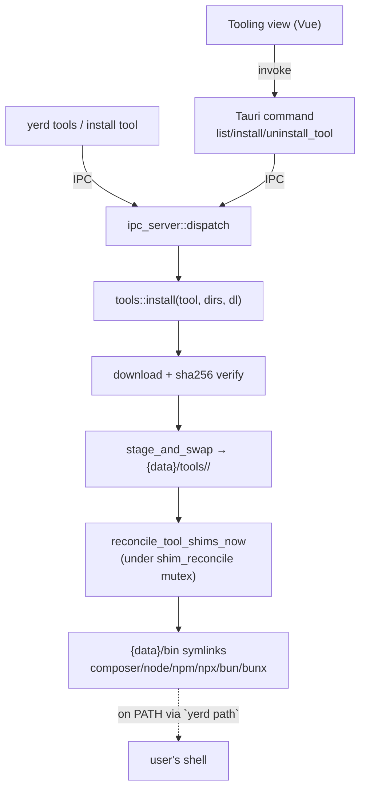

# Dev-tool installer subsystem

The **Tooling** feature lets a user install Composer, Node (`node`/`npm`/`npx`),
Bun (`bun`/`bunx`), the Laravel installer, and WP-CLI as self-contained
binaries on their `PATH`, from the [desktop app](./gui) or the
[`yerd` CLI](./binaries/yerd). This page documents its implementation
end-to-end: the daemon subsystem that downloads/verifies/lays down the
binaries (or, for the Laravel installer and WP-CLI, builds them via Composer),
the `{data}/bin` shim reconciliation, the IPC contract, and the thin GUI/CLI
wiring.

It follows the same I/O-edge pattern as PHP installs and the
[cover-shim/pcov work](./binaries/yerdd#cover-shim-reconciliation-and-pcov):
all logic lives in the daemon and its libraries; the GUI is a
[thin IPC client](./binaries/yerd). Everything is **Unix-first** - the shim
symlinks and the `composer` multi-call exec are `#[cfg(unix)]`.

::: info Source
The subsystem is [`bin/yerdd/src/tools/`](https://github.com/forjedio/yerd/tree/main/bin/yerdd/src/tools)
(`mod.rs` + `composer.rs` / `node.rs` / `bun.rs`). The `composer` exec shim is
[`bin/yerd/src/composer_shim.rs`](https://github.com/forjedio/yerd/tree/main/bin/yerd/src/composer_shim.rs).
:::

## At a glance



## The `Tool` registry (`tools/mod.rs`)

A small `Copy` enum drives everything; there is no per-tool trait - the variants
differ enough (phar vs multi-file tarball vs single-binary zip) that a `match`
into per-tool modules is clearer than an abstraction.

```rust
pub enum Tool { Composer, Node, Bun, Laravel, WpCli }

impl Tool {
    pub const ALL: [Tool; 5];
    pub const fn id(self) -> &'static str;            // "composer" | "node" | "bun" | "laravel" | "wp-cli"
    pub const fn display_name(self) -> &'static str;  // for the UI
    pub const fn primary_bin(self) -> &'static str;   // the command external detection looks for
    pub const fn exposed_bins(self) -> &'static [&'static str]; // commands on PATH
    pub const fn accepts_external(self) -> bool;      // may a PATH copy stand in?
    pub fn parse(id: &str) -> Option<Tool>;           // wire id → Tool
}
```

`exposed_bins` is the single source of truth for which `{data}/bin` names a tool
owns: `composer`; `node`/`npm`/`npx`; `bun`/`bunx`; `laravel`; `wp`. It drives
both shim creation and pruning.

`accepts_external` is the source of truth for whether a copy already on the
user's `PATH` can substitute for a managed install. It is `false` only for
`WpCli`, and that asymmetry is load-bearing: the Laravel flow resolves and execs
whatever `laravel`/`composer` it finds, whereas every WP-CLI caller (WordPress
scaffolding, the admin-user list, URL sync, the `wp` shim) execs the *managed*
`vendor/wp-cli/wp-cli/php/boot-fs.php` by path and can never use an external
`wp`. Reporting one as external is what caused
[#150](https://github.com/RichardAnderson/yerd/issues/150) - preflight passed,
then scaffolding failed spawning a `boot-fs.php` that was never installed. Keep
`ListTools` and any new preflight honest to this flag rather than re-deriving
the rule.

Failures are a binary-local `thiserror` enum (the tools subsystem has no library
crate of its own, so this mirrors `MutateError`/`DaemonError` rather than the
library `PhpError`/`ServiceError`):

```rust
pub enum ToolError {
    Download(String), Sha256Mismatch(String), Unpack(String),
    UnsupportedHost(&'static str), Io(String), Unknown(String),
}
```

`ipc_server::tool_error_code` maps it to a wire `ErrorCode` (mirrors
`php_error_code`): `Unknown → NotFound`, `UnsupportedHost → InvalidPath`, else
`Internal`.

## Status: pure filesystem reads

`status(dirs, tool)` and `list_status(dirs)` read a tool's `.version` marker
under `{data}/tools/<id>/` and return a `yerd_ipc::ToolStatus` (`id`,
`display_name`, `installed`, `version`, `binaries`). No marker → `installed:
false`. There is **no network or lock**, so `ListTools` is cheap and can never
block - unlike `ListServices`, which probes run-state.

## Install: download → verify → stage → swap

`install(tool, dirs, dl)` returns `Result<(), ToolError>` - a real Ok/Error so
the synchronous dispatch arm can report success or failure (it deliberately does
**not** reuse Composer's old error-swallowing `ensure_present` wrapper). The
shared helpers in `mod.rs`:

- **`sha_for_asset(sums_text, exact_filename)`** - Node and Bun publish a
  `SHASUMS256.txt` listing *many* assets (platforms, plus `-baseline`/`-musl`/
  `-profile` decoys). The parser tokenises each `"<hex>  <file>"` line
  (tolerating CRLF, a UTF-8 BOM on line 1, and a `*` binary-mode marker) and
  matches the filename **exactly** - never a `contains`/`ends_with`, which would
  pick a decoy.
- **`extract_root_dir(dir)`** - Node and Bun archives wrap their payload in one
  top-level, version-named directory (`node-v24.17.0-darwin-arm64/…`,
  `bun-darwin-aarch64/bun`). This resolves the *actual* single child dir (erroring
  unless exactly one), so the install never reconstructs the name from a version
  string that could drift upstream.
- **`stage_and_swap(dirs, tool, version, unpack)`** - mirrors
  `php_install::install`: unpack into a fresh `.staging-<id>-<pid>` dir, write the
  `.version` marker, remove any existing `{data}/tools/<id>`, then atomic
  `rename`. So a reinstall/update replaces in place and always leaves exactly one
  versioned child (keeping `extract_root_dir`'s invariant true across updates).
- **Trust boundary.** The tar/zip unpackers validate member *names* against
  traversal (`yerd_php::is_safe_member`) and preserve symlinks (Node needs its
  internal `bin/npm → ../lib/node_modules/npm/bin/npm-cli.js` links); the sha256
  verification before unpack is the integrity boundary.

The `reqwest`-backed `ReqwestDownloader` (from `php_install`) is reused; it sets
a `User-Agent` (the GitHub API used for Bun rejects requests without one).

### Per-tool specifics

| Module | Version source | Artifact | Integrity | Layout |
|---|---|---|---|---|
| `composer.rs` | `getcomposer.org/versions` → newest stable the installed PHP can run (honours each entry's `min-php` `PHP_VERSION_ID`) | `…/download/<ver>/composer.phar` | `composer.phar.sha256sum` (single line) | `{data}/tools/composer/composer.phar` |
| `node.rs` | `nodejs.org/dist/index.json` → first entry with a string `lts` (newest LTS) | `node-<ver>-<os>-<arch>.tar.gz` | per-release `SHASUMS256.txt` | unpacked tree under a versioned dir |
| `bun.rs` | GitHub `releases/latest` → `tag_name` (`bun-v…`) | `bun-<os>-<arch>.zip` (plain, non-baseline) | per-release `SHASUMS256.txt` | `bun-<os>-<arch>/bun` |

Each module has a pure host→asset mapper (`current_os_arch()` → `darwin-arm64` /
`linux-x64` / `bun-darwin-aarch64` / …) that returns a typed
`ToolError::UnsupportedHost` for a platform the publisher doesn't ship, rather
than building a URL that 404s. Bun's zip is unpacked with the `zip` crate
(`default-features = false, features = ["deflate"]`, pulling only the pure-Rust
flate2 backend - pinned to 2.x to stay within the workspace's MSRV-1.77
discipline; see the `Cargo.toml` MSRV-pin block).

### Composer-built tools: the Laravel installer and WP-CLI

`laravel.rs` and `wp_cli.rs` don't fit the download-a-release-asset shape above
- neither project publishes a standalone binary with a checksum sidecar worth
pinning to. Both instead run the managed **Composer** (`composer.rs`'s phar,
so Composer itself must already be installed) as a `create-project`:

| Module | Composer package | Entry point | Layout |
|---|---|---|---|
| `laravel.rs` | `laravel/installer` | `vendor/laravel/installer/bin/laravel` | `{data}/tools/laravel/` (the create-project root) |
| `wp_cli.rs` | `wp-cli/wp-cli-bundle` (a root project depending on `wp-cli/wp-cli`, not that package itself) | `vendor/wp-cli/wp-cli/php/boot-fs.php` | `{data}/tools/wp-cli/` |

`install(dirs, progress)` runs `php <composer.phar> create-project --prefer-dist --no-interaction --no-dev <package> <staging-dir>`, streaming output through the same `drain`/`stage_and_swap` helpers the download-based tools use - so a `create-project` failure never leaves a partial install in place. The installed version is read back out of the built `composer.lock` (`wp-cli/wp-cli`'s resolved version for WP-CLI, since `wp-cli-bundle`'s own `composer.lock` has no self-entry for the *root* package the way a dependency does for Laravel's installer). **Integrity is Composer's own** (its `composer.lock` hash pinning and Packagist's TLS), not a yerd-side checksum - consistent with the "Composer needs PHP" trust boundary already described in the [Tooling guide](../guide/tooling#composer-needs-php).

Both shims exec their entry point under `boot_name`'s bare file name with `cwd` set to that file's own directory (not the invocation's cwd) - see [`yerd`'s `wp` shim](./binaries/yerd#cover-shims-yerd-as-a-multi-call-binary-cover_shim-rs) for why (a macOS space-in-path bug in some subcommands' self-re-invocation).

::: tip WP-CLI deprecation suppression
WP-CLI's bundled dependencies emit PHP deprecation notices on newer PHP that would otherwise flood streamed job logs. See [`yerdd`'s WordPress support section](./binaries/yerdd#wordpress-support) for `QUIET_DEPRECATIONS` and the `PHP_INI_SCAN_DIR`-based fix for subprocesses WP-CLI spawns internally via `launch_self()`.
:::

## Shims: `reconcile_tool_shims`

The commands a tool provides are symlinks in `{data}/bin` - the same directory as
the PHP `php`/`php<ver>`/`phpcover` shims. The two reconcilers partition the
namespace cleanly: the PHP reconcile only prunes `php<X.Y>*` names, and
`reconcile_tool_shims` owns `composer`/`node`/`npm`/`npx`/`bun`/`bunx`.

For each installed tool it creates `(name → target)` links via the shared
`php_install::place_symlink` (atomic temp+rename); for each **uninstalled** tool
it prunes that tool's owned names. Pruning keys on **name-ownership** gated on
`symlink_metadata().is_symlink()` - never `target.exists()` - so a link left
dangling by an uninstall is still removed. Per-tool targets:

| Tool | Link → target |
|---|---|
| Composer | `composer` → the `yerd` binary (a multi-call shim, like `phpcover`) |
| Node | `node`/`npm`/`npx` → **absolute** `node_root/bin/{…}` |
| Bun | `bun` → `bun_root/bun`; `bunx` → `{data}/bin/bun` (sibling; Bun dispatches on argv0) |

::: tip Why npm points at an absolute path
Node's `bin/npm` and `bin/npx` are themselves *relative* symlinks into
`../lib/node_modules/npm`. Pointing `{data}/bin/npm` at the **absolute**
`node_root/bin/npm` lets the kernel resolve that inner relative link correctly
(each link resolves relative to its own directory). The npm-cli shebang
`#!/usr/bin/env node` then finds `{data}/bin/node` via `PATH`. Pointing
`{data}/bin/npm` straight at `npm-cli.js` would lose npm's own arg handling.
:::

### Concurrency

`{data}/bin` is written by both the PHP reconcile and the tool reconcile, and the
daemon serves IPC requests `tokio::spawn`-per-connection - so two clients could
mutate the directory at once. `reconcile_tool_shims_now` takes the **same**
`state.shim_reconcile` mutex as the PHP reconcile, serialising all `{data}/bin`
mutation. The slow download runs *before* the lock is taken; only the reconcile
holds it.

## The `composer` exec shim (`bin/yerd/src/composer_shim.rs`)

Composer is a phar, so its `composer` command can't be a direct symlink - it
needs a PHP interpreter. Like the [cover shims](./binaries/yerd#cover-shims-yerd-as-a-multi-call-binary-cover_shim-rs),
`{data}/bin/composer` symlinks to the `yerd` binary, which detects `argv[0] ==
"composer"` *before clap* (in `main.rs`, ahead of `cover_shim::dispatch`) and
`exec`s the default managed PHP against `{data}/tools/composer/composer.phar`. If
no PHP is installed it prints a clear "install a PHP version" message; if the
phar is absent it points the user at the Tooling page.

## IPC contract

Three additive variants (no `PROTOCOL_VERSION` bump - see
[IPC Protocol](./ipc-protocol)):

| Request | Response |
|---|---|
| `ListTools` | `Tools { tools: Vec<ToolStatus> }` |
| `InstallTool { tool: String }` | `Ok` / `Error` |
| `UninstallTool { tool: String }` | `Ok` / `Error` |

`ToolStatus` lives in `crates/yerd-ipc/src/status.rs` (alongside `ServiceStatus`/
`DatabaseSummary`); its field declaration order is the wire contract and is pinned
by `tests/wire_stability.rs`. The install/uninstall arms run the slow work with no
lock held, then call `reconcile_tool_shims_now`; the daemon also reconciles tool
shims once at startup (self-healing the `composer` link if the `yerd` binary
moved between runs).

## GUI & CLI wiring

- **Tauri** (`apps/yerd-gui/src-tauri/src/commands.rs`): `list_tools`,
  `install_tool(tool)`, `uninstall_tool(tool)` - each `finish(exchange(&Request::…))`,
  registered in `main.rs`'s `generate_handler!`. No capabilities edit (our
  `#[tauri::command]`s are permitted by registration).
- **Frontend**: `ipc/types.ts` (`ToolStatus` + the `tools` response), `ipc/client.ts`
  (`listTools`/`installTool`/`uninstallTool`), `views/ToolingView.vue` (a table
  copied from the PHP view's pattern - install/update/uninstall with a busy
  spinner and toasts), plus the `SideNav.vue` + `router.ts` entries that place
  **Tooling** between Sites and Services.
- **CLI**: `yerd tools`, `yerd install tool <id>`, `yerd uninstall tool <id>` -
  a `Tool` variant on the `InstallTarget`/`UninstallTarget` enums and a `Tools`
  command, mapped in `map::to_request` (exhaustive, compile-checked) with an
  explicit `Response::Tools` arm in `map::render` (which has a wildcard, so a
  missing arm would silently misrender).

## Composer is opt-in

Composer was briefly auto-installed on daemon start; that was reverted when the
Tooling page landed. The startup/12h auto-fetch and the unconditional `composer`
shim were removed; Composer now installs only via `InstallTool` (or `yerd install
tool composer`), and its phar moved from `{data}/composer/` to
`{data}/tools/composer/`. A fresh daemon start performs no Composer network I/O.

## Tests

- **Pure helpers** (inline): the `sha_for_asset` exact-match against a multi-asset
  fixture with `-baseline`/`-musl`/`-profile` decoys and a CRLF line;
  `extract_root_dir`'s single-child invariant; Node's LTS pick from an
  `index.json` fixture; the host→asset mappers; Composer's `min-php` selection;
  Bun's zip unpack preserving the executable bit.
- **Subsystem**: `status` reflects the marker; `stage_and_swap` places then
  replaces in place; `reconcile_tool_shims` creates an installed tool's links,
  prunes an uninstalled tool's, and leaves PHP shims untouched.
- **Wire stability**: byte-shape goldens for `ListTools`/`InstallTool`/
  `UninstallTool` and `Tools` in `crates/yerd-ipc/tests/wire_stability.rs`.

## See also

- [Tooling guide](../guide/tooling) - the user-facing view.
- [yerdd (daemon)](./binaries/yerdd) - the host process and its
  [cover-shim/pcov](./binaries/yerdd#cover-shim-reconciliation-and-pcov) sibling.
- [yerd (CLI)](./binaries/yerd) - the multi-call binary that backs `composer`.
- [IPC Protocol](./ipc-protocol) - the additive wire contract.
