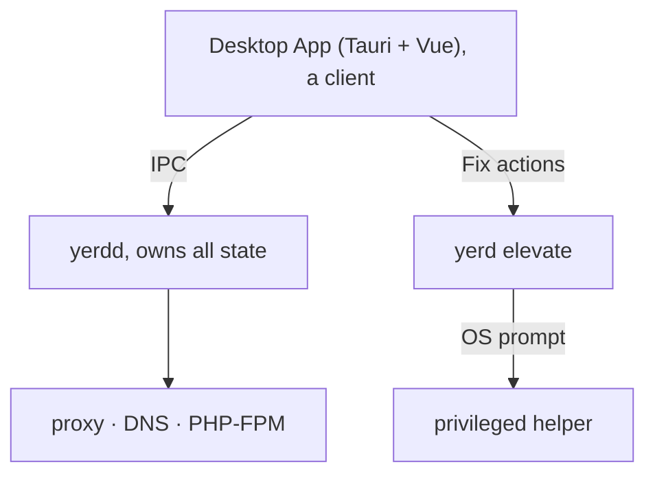

# Desktop App

Yerd ships an optional desktop GUI: a small tray-first window over everything the CLI does. Built with Tauri v2, Vue 3, TypeScript, and Tailwind, it's a thin client of the [daemon](./daemon), just like the `yerd` CLI. Every button maps to one IPC request to `yerdd`, so the GUI and CLI can't drift out of sync.

The GUI is optional. If you live in the terminal, skip it.

## Install the bundles

The app ships as separate bundles on the same release as the CLI:

| Platform | Artifact | Install |
|---|---|---|
| macOS (Apple Silicon) | `Yerd_<ver>_aarch64.dmg` | Open the DMG, drag Yerd to Applications |
| Linux | `Yerd_<ver>_amd64.AppImage` | `chmod +x Yerd_<ver>_amd64.AppImage` and run it |
| Linux | `Yerd_<ver>_amd64.deb` | `sudo dpkg -i Yerd_<ver>_amd64.deb` |

The macOS DMG targets Apple Silicon (`aarch64`) only; Intel (x86-64) Macs are not supported at this time. There's no Windows bundle yet: the daemon's named-pipe address isn't client-derivable.

::: warning Install the CLI and daemon too
The GUI is a client, not a self-contained install. You also need:

- `yerdd` running. The app talks to it over IPC and shows a "Daemon not running" screen if it can't connect.
- `yerd` on your `PATH`. The app's privileged "Fix" actions shell out to the audited `yerd elevate` helper.

On Linux, the CLI `.deb` and GUI `.deb` both install to `/usr/bin`, which is where the GUI looks for `yerd`. Install both. See [Getting Started](./getting-started) and [The Daemon](./daemon).
:::

::: tip First launch on macOS (unsigned)
Release bundles are currently unsigned, so Gatekeeper warns on first open. Either right-click the app in Applications and choose Open (once), or strip the quarantine attribute:

```sh
xattr -dr com.apple.quarantine /Applications/Yerd.app
```

Signing and notarisation are planned.
:::

## Tray-first by design

The window is something you summon, not keep open.

- Closing the window hides it to the tray instead of quitting. The daemon and your sites keep running.
- The tray menu has two items: Open Yerd (reopen the window) and Quit (exits the GUI, not the daemon).
- On macOS, left-click the tray icon to open the window. On Linux (AppIndicator), tray clicks aren't delivered, so use Open Yerd.
- Single-instance: launching again re-focuses the existing window.

The window is borderless with a custom title bar (macOS-style traffic lights for close / minimize / zoom) and looks identical on both platforms. A status pill in the bottom-left of the sidebar shows whether the daemon is connected, unreachable, or connecting.

If the daemon isn't running, the main area shows a "Daemon not running" panel with **Start** and **Retry** buttons — Start launches `yerdd` for you (through your per-user service) without leaving the app. The **General** tab stays reachable even when the daemon is down, so you can start or configure it from there. You can also start it from a terminal with `yerdd`.

::: tip First-run auto-install
If `yerdd` isn't installed at all when the app first opens (Linux/macOS), it downloads the matching release, installs the `yerd`/`yerdd`/`yerd-helper` binaries to `~/.local/bin`, starts the daemon, and lands you on the General tab — showing an "Installing Yerdd… Please wait" overlay while it works. It never runs as root to do this.
:::

## The window at a glance

The sidebar has five sections:

| Section | What it shows |
| --- | --- |
| General | Daemon start/stop, start-at-login toggles, appearance (theme) |
| PHP | Installed versions, updates, the default, global ini settings |
| Sites | Parked folders + linked sites, per-site PHP & HTTPS |
| Services | Subsystems, health checks + one-click fixes, environment |
| About | App/daemon versions, TLD, DNS, CA path + fingerprint |

### General

App- and daemon-level settings — the only tab that stays usable when the daemon is down (it can start or install it):

- **Daemon.** Whether `yerdd` is running (with pid), plus a Start or Stop button. Start/Stop go through your per-user service manager (systemd `--user` on Linux, a launchd LaunchAgent on macOS), with a detached-process fallback where none exists; the same actions are in the tray menu.
- **Start at login.** Three toggles — start the daemon at login, start the app at login, and start the app minimized (hidden to the tray). The daemon-at-login toggle is disabled where no per-user service manager is available.
- **Appearance.** A System / Light / Dark theme selector, applied live and remembered across launches.

### PHP

Manages your installed [PHP versions](./php-versions):

- A table of installed versions showing live FPM pool state, patch level, pool memory (RSS), and whether an update is available.
- Install opens a picker of installable versions (already-installed ones are hidden). Installs download a prebuilt static build, which can take a few minutes with no progress bar; the daemon reports only on completion.
- Refresh re-checks for updates. Update all updates every version with a pending update. Updates are notify-only.
- Each row's `⋯` menu offers Restart (only when the pool is running or failed), Update (only when available), Set default (marks it with a star), and Uninstall. Restart all restarts every running pool.
- A Default settings card edits the global ini defaults applied to every version: `memory_limit`, `max_execution_time`, `max_input_time`, `max_file_uploads`, `upload_max_filesize`, `post_max_size`, `error_reporting`, and `display_errors`. Leave a field blank to use PHP's built-in default. Saving restarts running pools to apply.

### Sites

The home base for [managing sites](./sites). Two cards:

Parked folders. Each parked directory shows a count of the `.test` sites it produces (one per child directory). Park folder opens a native directory picker; each row's menu offers Reveal folder or Un-park (with confirmation).

Sites. Every parked and linked site:

| Column | What it does |
|---|---|
| Site | The `name.test` URL. Click to open in your browser. A badge marks it `parked` or `linked`. |
| Document root | The project directory. Click to reveal it in your file manager. |
| Served from | The [web root](./sites#web-root-the-served-directory) actually served (e.g. `public`, or `/` for the project root), auto-detected per framework. Click to change it. |
| PHP | A per-site PHP picker (dropdown of installed versions), changed inline. |
| HTTPS | A toggle to flip [HTTPS](./https) on or off for that one site. |
| Actions | `⋯` menu: Open in browser, Reveal folder, **Set web root…**, **Auto-detect web root**, and (linked sites only) Unlink. |

Link site opens a modal to link one directory under a name you choose (a single DNS label, validated as `[a-z0-9-]+`). **Set web root…** opens a modal to pin the served subdirectory (or pick it with a folder browser); **Auto-detect web root** clears the override and lets Yerd detect it again. Parked sites have no destructive action here; remove them by un-parking their folder, or they'd reappear.

::: tip Untrusted CA banner
If your local CA isn't trusted in the system store, the Sites view shows a banner (browsers will warn on HTTPS sites until fixed). It links to Services → Environment, where one click runs the fix. See [HTTPS & Certificates](./https).
:::

### Services

Mirrors [`yerd doctor`](./diagnostics):

- Subsystems. A live table of the daemon (`yerdd`, with pid and uptime), the in-process DNS resolver, the HTTP and HTTPS proxy listeners (with bound ports, including when macOS's `pf` redirect carries `:80`/`:443`), and each PHP-FPM pool. The daemon and FPM rows have a `⋯` menu with Restart.
- Health. Lists problems by severity (`ok` / `warn` / `fail`) with a copyable remedy command. Run safe fixes applies the safe one-click fixes; Re-check re-runs diagnostics.
- Environment. OS-level state: Local CA trusted, `.test` resolver installed, and Privileged ports (80/443). A Fix (elevate) button runs the privileged action where a row isn't configured; once a row *is* configured, an **Unelevate** button reverts it — behind an in-app confirm dialog and the OS prompt. Unelevating the `.test` resolver restores your previous resolver on macOS; reverting privileged ports is macOS-only (Linux `setcap` has no clean reverse, so no button is shown there).

::: info "Fix" actions never run the GUI as root
The Fix buttons run the audited `yerd elevate` helper under an OS prompt; the GUI never runs elevated. On Linux this uses `pkexec`, on macOS an `osascript … with administrator privileges` prompt. You may be asked for your password. See [Elevation & Privileges](./elevation).
:::

### About

Shows the app, daemon, and negotiated IPC protocol versions, plus your local environment: the TLD (`.test`), the DNS responder address, and the local CA certificate path and fingerprint (both copyable, with reveal-in-finder). It also links to the project repository.

## Coming soon (stubs)

A few capabilities need a daemon IPC that doesn't exist yet. Rather than fake them, the app renders them as disabled, greyed-out controls with a "soon" label and a tooltip:

| Stub | Where | Why |
|---|---|---|
| Logs | Subsystem `⋯` menus (Services) | Needs a log-streaming IPC |
| Fix (when in-app elevation isn't available) | Environment (Services) | Falls back to a "soon" pill; run `yerd elevate` in a terminal for now |

A dashed border with the soon badge means the daemon-side IPC isn't wired up yet. Everything else is fully functional.

## How it fits together



The daemon owns all state; the window is a view onto it; privileged work goes through the audited helper behind an OS prompt. Both the GUI and CLI are clients of the same daemon, so anything you do in one shows up immediately in the other.

## Related

- [Getting Started](./getting-started) - install the CLI and daemon (do this first)
- [The Daemon](./daemon) - what `yerdd` is and how it runs
- [Sites](./sites) · [PHP Versions](./php-versions) · [HTTPS & Certificates](./https) - the features the GUI surfaces
- [Elevation & Privileges](./elevation) - how "Fix" actions stay root-free
- [Desktop App Internals](../developer/gui) - the Tauri/Vue architecture for contributors
- [Source on GitHub](https://github.com/forjedio/yerd) - `apps/yerd-gui`
