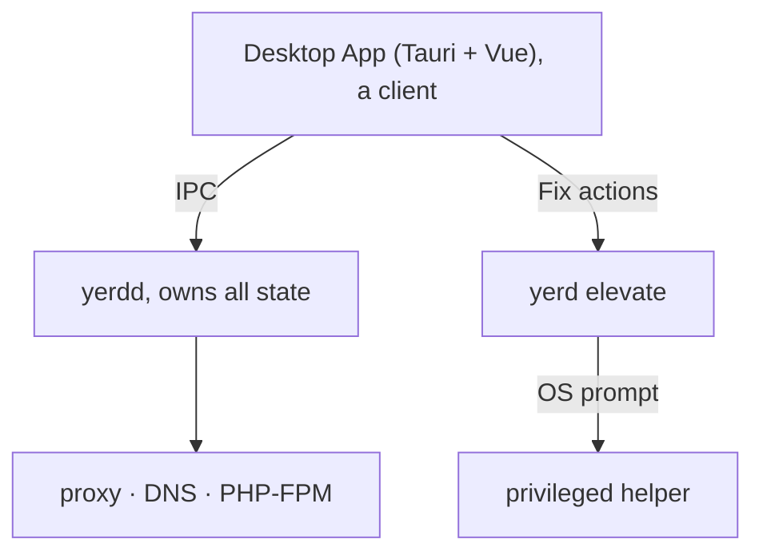

# Desktop App

Yerd ships a desktop GUI: a small tray-first window over everything the CLI does. Built with Tauri v2, Vue 3, TypeScript, and Tailwind, it's a thin client of the [daemon](./daemon), just like the `yerd` CLI. Every button maps to one IPC request to `yerdd`, so the GUI and CLI can't drift out of sync.

It's the recommended way to run Yerd: it installs and verifies the daemon and CLI for you, then walks you through the one-time setup. If you live in the terminal, the [CLI](./getting-started) is a first-class alternative.

## Install the bundles

The app is the **only** artifact, with the daemon + CLI + helper embedded:

| Platform | Artifact | Install |
|---|---|---|
| macOS (Apple Silicon) | `Yerd_MacOS_AppleSilicon_v<ver>.dmg` | Open the DMG, drag Yerd to Applications |
| Linux (x86-64) | `Yerd_Linux_x86_64_v<ver>.deb` | `sudo apt install ./Yerd_Linux_x86_64_v<ver>.deb` |

The macOS DMG targets Apple Silicon (`aarch64`) only; Intel (x86-64) Macs are not supported at this time. There's no Windows bundle yet: the daemon's named-pipe address isn't client-derivable.

::: tip The GUI sets up the backend for you
The GUI is a client of the [daemon](./daemon), and the daemon (`yerdd`), the `yerd` CLI, and `yerd-helper` are all **bundled inside the app** - nothing is downloaded at runtime. On first launch the app simply **starts its bundled daemon**, then lands you on the Overview dashboard. On macOS that makes setup essentially **drag-and-drop**: drag Yerd to Applications, launch it, done. On macOS the daemon registers as a background **SMAppService** login item (shown as "Yerd" in System Settings → Login Items); on Linux the `.deb` puts `yerd` on your `PATH` and grants the daemon its privileged-port capability.
:::

## Tray-first by design

The window is something you summon, not keep open.

- Closing the window hides it to the tray instead of quitting. The daemon and your sites keep running.
- The tray menu has two items: Open Yerd (reopen the window) and Quit (exits the GUI, not the daemon).
- On macOS, left-click the tray icon to open the window. On Linux (AppIndicator), tray clicks aren't delivered, so use Open Yerd.
- Single-instance: launching again re-focuses the existing window.

The window is borderless with a custom title bar (macOS-style traffic lights for close / minimize / zoom) and looks identical on both platforms. A status pill in the bottom-left of the sidebar shows whether the daemon is connected, unreachable, or connecting.

If the daemon isn't running, the main area shows a "Daemon not running" panel with **Start** and **Retry** buttons - Start launches the bundled `yerdd` for you (through your per-user service) without leaving the app. The **Overview**, **Settings**, and **About** pages stay reachable even when the daemon is down: Overview shows its own **Start Yerd** hero, and Settings can start it. You can also start it from a terminal with `yerdd serve &`.

::: tip First-run start
When the app first opens and the daemon isn't already running, it **starts the bundled `yerdd`** and lands you on the Overview dashboard. On macOS, registering the background service may prompt you to enable Yerd in System Settings → Login Items - the app shows a banner with a button to take you there. It never runs as root to do this.
:::

## The window at a glance

The sidebar opens on **Overview** and groups the rest:

| Group | Pages |
| --- | --- |
| (top) | **Overview** - a live dashboard of what's running |
| Environment | **PHP** · **Sites** |
| Developer | **Tooling** · **Services** · **Mail** · **Dumps** |
| System | **Settings** · **Doctor** · **About** |

### Overview

<ThemedImage light="/images/overview-light.png" dark="/images/overview-dark.png" alt="Overview dashboard" />

The landing dashboard. With the daemon running it shows a **serving** summary - the number of live `.test` sites (each a clickable chip that opens in your browser), stat tiles for PHP versions, sites, services, and captured mail (each links to its page), and a **system-health** strip (Local CA, `.test` resolver, privileged ports). When the daemon is down, the same surface becomes a **Start Yerd** hero.

### Settings

<ThemedImage light="/images/settings-light.png" dark="/images/settings-dark.png" alt="Settings page" />

App- and daemon-level settings (one of the pages that stays usable when the daemon is down, since it can start or install it):

- **Daemon.** Whether `yerdd` is running (with pid), a Start or Stop button, and a list of the daemon's in-process subsystems - the DNS resolver, the HTTP and HTTPS proxy listeners (with bound ports, including when macOS's `pf` redirect carries `:80`/`:443`), **Mail capture** (by port), and **Dump capture** (by port). The daemon row has a Restart button. Start/Stop/Restart go through your per-user service manager (systemd `--user` on Linux, a launchd LaunchAgent on macOS), with a detached-process fallback where none exists; the same actions are in the tray menu.
- **Start at login.** Three toggles - start the daemon at login, start the app at login, and start the app minimized (hidden to the tray). The daemon-at-login toggle is disabled where no per-user service manager is available.
- **Appearance.** A System / Light / Dark theme selector, applied live and remembered across launches.

### PHP

<ThemedImage light="/images/php-light.png" dark="/images/php-dark.png" alt="PHP versions page" />

Manages your installed [PHP versions](./php-versions):

- A table of installed versions showing live FPM pool state, patch level, pool memory (RSS), and whether an update is available.
- Install opens a picker of installable versions (already-installed ones are hidden). Installs download a prebuilt static build, which can take a few minutes with no progress bar; the daemon reports only on completion.
- Refresh re-checks for updates. Update all updates every version with a pending update. Updates are notify-only.
- Each row's `⋯` menu offers Restart (only when the pool is running or failed), Update (only when available), Set default (marks it with a star), and Uninstall. Restart all restarts every running pool.
- A Default settings card edits the global ini defaults applied to every version: `memory_limit`, `max_execution_time`, `max_input_time`, `max_file_uploads`, `upload_max_filesize`, `post_max_size`, `error_reporting`, and `display_errors`. Leave a field blank to use PHP's built-in default. Saving restarts running pools to apply.

### Sites

<ThemedImage light="/images/sites-light.png" dark="/images/sites-dark.png" alt="Sites page" />

The home base for [managing sites](./sites). Two cards:

Parked folders. Each parked directory shows a count of the `.test` sites it produces (one per child directory). Park folder opens a native directory picker; each row's menu offers Reveal folder or Un-park (with confirmation).

Sites. Every parked and linked site:

| Column | What it does |
|---|---|
| Site | The `name.test` URL. Click to open in your browser. A badge marks it `parked` or `linked`. |
| Document root | The project directory. Click to reveal it in your file manager. |
| Served from | The [web root](./sites#web-root-the-served-directory) actually served (e.g. `public`, or `/` for the project root), auto-detected per framework. Click to change it. |
| PHP | A per-site PHP picker (dropdown of installed versions), changed inline. |
| HTTPS | A toggle to flip [HTTPS](./https) on or off for that one site. |
| Actions | `⋯` menu: Open in browser, Reveal folder, **Set web root…**, **Auto-detect web root**, and (linked sites only) Unlink. |

Link site opens a modal to link one directory under a name you choose (a single DNS label, validated as `[a-z0-9-]+`). **Set web root…** opens a modal to pin the served subdirectory (or pick it with a folder browser); **Auto-detect web root** clears the override and lets Yerd detect it again. Parked sites have no destructive action here; remove them by un-parking their folder, or they'd reappear.

::: tip Untrusted CA banner
If your local CA isn't trusted in the system store, the Sites view shows a banner (browsers will warn on HTTPS sites until fixed). It links to the **Doctor** page's Environment panel, where one click runs the fix. See [HTTPS & Certificates](./https).
:::

### Tooling

<ThemedImage light="/images/tooling-light.png" dark="/images/tooling-dark.png" alt="Tooling page" />

Installs self-contained developer tools - Composer, Node, and Bun - onto your PATH alongside PHP, each managed by Yerd (install / update / uninstall) so they don't collide with system installs. See [Tooling](./tooling).

### Services

<ThemedImage light="/images/services-light.png" dark="/images/services-dark.png" alt="Services page" />

The database and cache engines Yerd supervises - Redis (Valkey), MySQL, MariaDB, and PostgreSQL. Install a version, then Start / Stop / Restart it. Each installed engine's `⋯` menu also offers **Configuration** (copy the Laravel `.env` for that engine - with a database picker that pre-fills `DB_DATABASE` for SQL engines), Edit port, View logs, **Manage databases** (create / drop / back up / restore, SQL engines only), Change version, and Uninstall. The daemon **auto-starts every installed engine** on boot. See [Services & Databases](./services).

### Mail

<ThemedImage light="/images/mail-light.png" dark="/images/mail-dark.png" alt="Mail capture page" />

The built-in SMTP **mail capture** server - point your app's mailer at `127.0.0.1` on the shown port and every outgoing email is captured for preview instead of being sent. Toggle capture, set the port, and open the separate **Mails** viewer with Show Mails. A **Laravel configuration** card emits the `.env` mail keys (`MAIL_HOST`, `MAIL_PORT`, …) to paste into your app, with editable From name/address. See [Mail Capture](./mail).

### Dumps

<ThemedImage light="/images/dumps-light.png" dark="/images/dumps-dark.png" alt="Dumps page" />

Laravel telemetry interception - `dump()`/`dd()` plus queries, jobs, views, requests, logs, cache, and outgoing HTTP - streamed to a separate viewer window with no code changes, captured by a per-version PHP extension. Enable interception, pick which signals to record, set the port, and open the viewer with Show Dumps. See [Laravel ▸ Dumps](./laravel-dumps).

### Doctor

<ThemedImage light="/images/doctor-light.png" dark="/images/doctor-dark.png" alt="Doctor page" />

Mirrors [`yerd doctor`](./diagnostics):

- **Health.** Lists problems by severity (Healthy / Warning / Problem) with a copyable remedy command. Run safe fixes applies the safe one-click fixes; Re-check re-runs diagnostics. A clean machine shows an "all clear" panel.
- **Environment.** OS-level state: Local CA trusted, `.test` resolver installed, and Privileged ports (80/443). A Fix (elevate) button runs the privileged action where a row isn't configured; once a row *is* configured, an **Unelevate** button reverts it - behind an in-app confirm dialog and the OS prompt. Unelevating the `.test` resolver restores your previous resolver on macOS; reverting privileged ports is macOS-only (Linux `setcap` has no clean reverse, so no button is shown there).

::: info "Fix" actions never run the GUI as root
The Fix buttons run the audited `yerd elevate` helper under an OS prompt; the GUI never runs elevated. On Linux this uses `pkexec`, on macOS an `osascript … with administrator privileges` prompt. You may be asked for your password. See [Elevation & Privileges](./elevation).
:::

### About

<ThemedImage light="/images/about-light.png" dark="/images/about-dark.png" alt="About page" />

Shows the app, daemon, and negotiated IPC protocol versions, plus your local environment: the TLD (`.test`), the DNS responder address, and the local CA certificate path and fingerprint (both copyable, with reveal-in-finder). It also links to the project repository.

## How it fits together

The daemon owns all state; the window is a view onto it; privileged work goes through the audited helper behind an OS prompt. Both the GUI and CLI are clients of the same daemon, so anything you do in one shows up immediately in the other.

## Related

- [Getting Started](./getting-started) - install Yerd (the app sets up the daemon and CLI for you) or take the terminal-first path
- [The Daemon](./daemon) - what `yerdd` is and how it runs
- [Sites](./sites) · [PHP Versions](./php-versions) · [HTTPS & Certificates](./https) - the features the GUI surfaces
- [Elevation & Privileges](./elevation) - how "Fix" actions stay root-free
- [Desktop App Internals](../developer/gui) - the Tauri/Vue architecture for contributors
- [Source on GitHub](https://github.com/forjedio/yerd) - `apps/yerd-gui`
