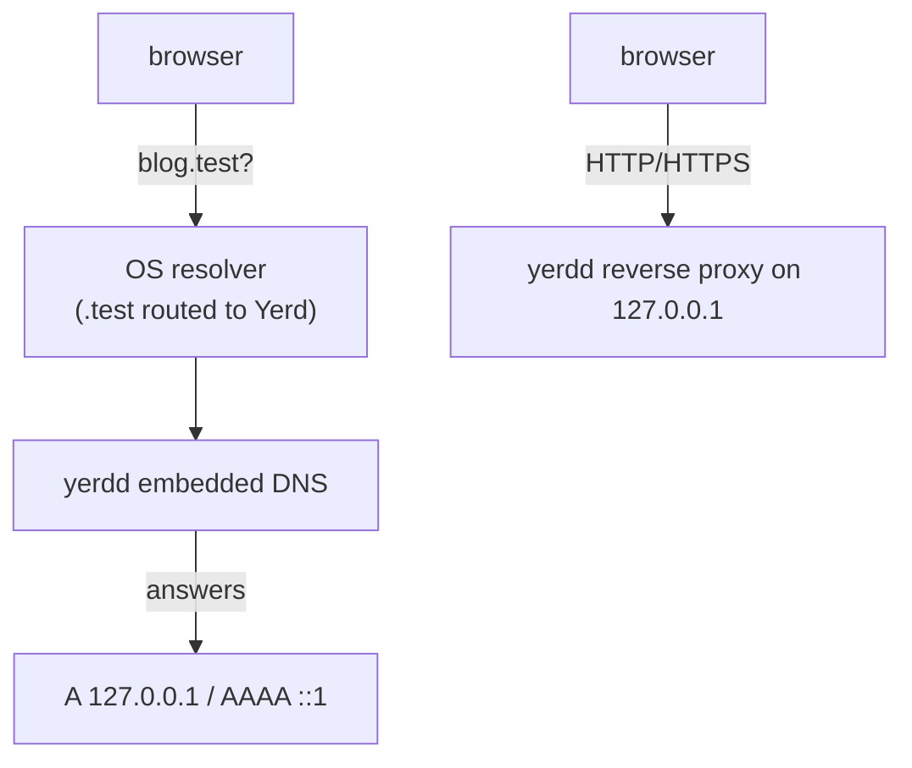

# DNS & .test Domains

Open `http://blog.test` and something has to turn that name into an address your machine listens on. Yerd handles this with a small embedded DNS resolver that answers for one TLD (`.test` by default), plus a one-time change that points your OS at it.

## The short version

- The `yerdd` daemon runs an embedded DNS server. It answers `*.test` with `127.0.0.1` (`A`) and `::1` (`AAAA`).
- You tell your OS to send `.test` lookups there, once: `sudo yerd elevate resolver`.
- After that it's automatic. Park or link a project and `<name>.test` resolves to loopback, where Yerd's reverse proxy is waiting.



::: tip Why `.test`?
`.test` is reserved (RFC 6761) and can never exist on the public internet, so routing it to your machine can't shadow a real site. The TLD is configurable; see [Configuration Reference](../reference/configuration).
:::

## The embedded resolver

The resolver lives in the `yerd-dns` crate, built on `hickory-dns`. It is authoritative for exactly one zone (your TLD) and nothing else: it never forwards, caches, or touches the network.

| Query | Wire response |
|---|---|
| `app.test`, `A` | `NOERROR`, `A 127.0.0.1` |
| `app.test`, `AAAA` | `NOERROR`, `AAAA ::1` |
| `app.test`, any other qtype (MX, TXT, …) | `NOERROR`, empty answer |
| `test` (bare TLD apex) | `NOERROR`, empty answer |
| malformed in-zone label (`.test`, `app..test`) | authoritative `NXDOMAIN` |
| outside the zone (`app.com`, `testify`) | `REFUSED`, `AA` bit cleared |

Worth knowing:

- Any subdomain depth resolves. `a.b.c.app.test` maps to loopback just like `app.test`, and matching is case-insensitive. Resolving a name to loopback is not the same as a site answering it: routing is the reverse proxy's job, and since v2 a site answers only the domains registered for it, so a name that resolves in DNS may still 404 at the proxy until you attach it with `yerd domain add`.
- Records carry a 60-second TTL (`ANSWER_TTL_SECS`), so resolvers don't cling to stale answers when your setup changes.
- Out-of-zone queries return `REFUSED` with the `AA` bit cleared. If your OS ever misroutes a non-`.test` query here, the cleared bit tells it to ask elsewhere instead of trusting a bogus answer.
- No `SOA` is emitted in the authority section of `NXDOMAIN`/`NODATA` replies.

::: info Read-only by design
The DNS server holds no logic about your sites. It says "that's loopback" for the whole zone; routing to the right project and PHP version happens later in the reverse proxy. See [Sites](./sites) and [The Daemon](./daemon).
:::

### How the daemon binds it

The daemon binds the resolver on `127.0.0.1` at [`dns_port`](../reference/configuration) from `yerd.toml`. The default is **1053** (`DEFAULT_DNS_PORT`): not the mDNS-contended `5353`, and not privileged `53`, so the unprivileged daemon can bind it.

UDP and TCP both bind on the same address. Set `dns_port = 0` and the kernel picks an ephemeral port, retrying until UDP and TCP match. A fixed port is better, though, since the resolver config your OS stores hard-codes `127.0.0.1:<port>` and a stable port keeps that file valid across restarts.

::: warning Keep the port stable
If `dns_port` changes (or you used `0`), the config written by `yerd elevate resolver` may point at a port nothing listens on. `yerd doctor` catches this by checking the config against the daemon's current DNS address. Restart Yerd so it binds the configured port, then re-run `sudo yerd elevate resolver`.
:::

::: warning A bind failure is non-fatal
If another process already holds `dns_port`, the daemon does **not** abort - it comes up degraded, with no `*.test` resolution, while the reverse proxy, PHP pools, and IPC server all still work normally. `yerd status` shows `dns       not resolving - couldn't bind port <port> (run yerd doctor)` in place of the bound address, and `yerd doctor` raises a `DnsPortUnbound` warning. Free the port, or change `dns_port` in Settings (Yerd ▸ General), then restart the daemon. See [Diagnostics](./diagnostics).
:::

## Pointing the OS at Yerd

Configuring the OS resolver needs root, so the auditable `yerd-helper` binary does it, once:

```sh
sudo yerd elevate resolver
```

This is one slice of the one-time setup. The full command also does CA trust and port capability:

```sh
sudo yerd elevate            # trust + resolver + ports, in one go
```

Daily use never touches root again. To undo it:

```sh
sudo yerd unelevate resolver
```

On macOS, undo is a **restore**: if a previous resolver was backed up when Yerd took over (see below), `unelevate resolver` puts it back and clears the saved backups; with no backup it removes Yerd's file. On Linux it removes every Yerd-owned resolver snippet, including artifacts from a previously active backend.

Install and uninstall are idempotent: re-installing an already-correct config changes nothing (and writes no backup), and uninstalling something absent succeeds quietly.

See [Elevation & Privileges](./elevation) for the privilege model and the [CLI Reference](../reference/cli/) for every flag.

### Per-platform mechanism

| Platform | Mechanism | File written | Reload |
|---|---|---|---|
| **macOS** | `resolver(5)` per-TLD file | `/etc/resolver/<tld>` | None (read at next query) |
| **Linux** (systemd-resolved) | drop-in config | `/etc/systemd/resolved.conf.d/yerd-<tld>.conf` | `systemctl reload-or-restart systemd-resolved` |
| **Linux** (NetworkManager) | dnsmasq plugin and per-domain route | `/etc/NetworkManager/conf.d/yerd-dnsmasq.conf`, `/etc/NetworkManager/dnsmasq.d/yerd-<tld>.conf` | `nmcli general reload conf dns-full` |
| **Linux** (other resolver) | refused | - | - |
| **Windows** | NRPT rule | - | *planned* |

#### macOS

Yerd writes a file named after the TLD (e.g. `/etc/resolver/test`) with two directives:

```text
nameserver 127.0.0.1
port 1053
```

macOS reads it at the next query, so there's nothing to reload.

If a file already exists there (a leftover from Valet, Herd, or older Yerd) and doesn't point at Yerd, the helper backs it up before overwriting. Backups land in `/Library/Application Support/io.yerd.Yerd/resolver-backups/` as `<tld>-<unix-seconds>.conf`, and `yerd doctor` reports the most recent. An already-correct file is left alone.

`sudo yerd unelevate resolver` reverses this: it restores the most recent backup over `/etc/resolver/<tld>`, then deletes the saved backups. The restore is guarded - the helper only writes back a backup that is root-owned, not a symlink, and parses as a valid resolver file - so a tampered or junk backup is skipped in favour of a plain removal.

::: tip The `port` line is load-bearing
A bare `nameserver 127.0.0.1` (what Valet/Herd leave) defaults to port `53`, where nothing of Yerd's listens. The `is_installed` probe requires both nameserver and port to match the live daemon, so a stale file reads as "not installed" and gets rewritten on the next elevate.
:::

#### Linux - systemd-resolved drop-in

On systemd-resolved systems Yerd writes `/etc/systemd/resolved.conf.d/yerd-<tld>.conf`:

```ini
[Resolve]
DNS=127.0.0.1:1053
Domains=~test
```

The `~` prefix is systemd's routing-only marker: use this server only for names under `test`, without making Yerd the global resolver. The helper then runs:

```sh
systemctl reload-or-restart systemd-resolved
```

Detection is conservative. Yerd treats systemd-resolved as in charge only if `/run/systemd/resolve` exists, or `/etc/resolv.conf` carries the `systemd-resolved` marker in its first few lines.

The resolved probe preserves its established shape-based contract: a well-formed route for the configured TLD counts as installed. The NetworkManager probe strictly verifies its TLD, address, and port snippets.

#### Linux - NetworkManager with dnsmasq

When resolved is absent and NetworkManager is detected, Yerd writes a `[main] dns=dnsmasq` override and a narrow rule such as `server=/test/127.0.0.1#1053`. The `dnsmasq` and `nmcli` executables must already be installed; Yerd does not install system packages. After the DNS-only reload, Yerd polls for up to five seconds until NetworkManager's local resolver answers a `.test` probe, while ordinary and VPN upstream DNS continue through NetworkManager.

If reload fails, the helper restores both previous snippets and attempts to reload the prior configuration. Unelevation removes both Yerd-owned files, restoring NetworkManager's prior DNS mode. Other resolver managers remain unsupported; Yerd never edits `/etc/resolv.conf` directly because it is commonly regenerated.

#### Windows - NRPT (planned)

Windows is on the [roadmap](./services). The plan routes `.test` via the Name Resolution Policy Table (NRPT), Windows' native per-suffix mechanism, alongside named-pipe IPC and the system certificate store. Not implemented today; on unsupported platforms the resolver operations return an `Unsupported` error.

## Verifying it works

`yerd status` shows the DNS address the daemon bound and whether the OS points at it:

```sh
yerd status
# …
# dns       127.0.0.1:1053
```

When resolution breaks, `yerd doctor` flags it and names the fix (usually `sudo yerd elevate resolver`):

```sh
yerd doctor
yerd doctor fix     # auto-repairs the safe ones
```

You can query the resolver directly. It's authoritative for the whole zone, so any `.test` name returns loopback:

```sh
# Ask Yerd's resolver on its port:
dig @127.0.0.1 -p 1053 anything.test A
#   anything.test.   60   IN   A   127.0.0.1

dig @127.0.0.1 -p 1053 anything.test AAAA
#   anything.test.   60   IN   AAAA   ::1
```

To confirm the OS routes `.test` (not just Yerd's port): on macOS, `dscacheutil -q host -a name app.test` returns `127.0.0.1`; on Linux with systemd-resolved, `resolvectl query app.test` shows the answer from `127.0.0.1:1053`.

## Related

- [HTTPS & Certificates](./https) - trusting the local CA so `.test` sites go green
- [Sites](./sites) - parking and linking projects onto `.test` names
- [Localhost Access](./localhost-access) - reaching sites when `.test` can't be routed
- [Elevation & Privileges](./elevation) - the one-time `sudo` and what it touches
- [The Daemon](./daemon) - how `yerdd` binds and supervises the resolver
- [Configuration Reference](../reference/configuration) - `dns_port` and the TLD
- Developer deep-dive: [yerd-dns](../developer/crates/yerd-dns) and [yerd-platform](../developer/crates/yerd-platform)

Source: [github.com/forjedio/yerd](https://github.com/forjedio/yerd).
