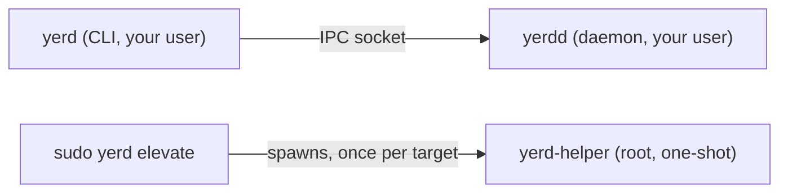

# Elevation & Privileges

Yerd is rootless by design. The daemon (`yerdd`), the CLI (`yerd`), and the desktop app all run as your normal user. Only one step needs administrator rights: a one-time setup that wires Yerd into three OS subsystems your account can't touch on its own. Everything after that (parking sites, switching PHP, securing a site, restarting a pool) runs unprivileged.

## Why elevation is needed

Three things can't be done as an unprivileged user, on any OS:

1. **Trusting the local CA.** Yerd issues per-site certificates from a local CA. For the browser to show a padlock, that CA must go into the root-owned system trust store.
2. **Configuring the system resolver.** Routing `*.test` to Yerd's DNS responder means editing the OS resolver config under `/etc` (`/etc/resolver/<tld>` on macOS, a `systemd-resolved` drop-in on Linux).
3. **Binding ports 80 and 443.** These are privileged ports; an unprivileged process can't bind them without help.

Herd and Valet require the same admin steps for the same reasons.

::: tip You don't have to elevate
Skip setup and Yerd still works: it falls back to [rootless ports `8080`/`8443`](#the-rootless-fallback), serving over `http://...:8080` (or you trust the CA yourself). Elevation buys the "just type the URL" experience, not basic functionality.
:::

## The one command

Run this once for the full experience. It's the only Yerd command that uses root:

```sh
sudo yerd elevate
```

With no subcommand, `elevate` does all three steps in order (trust, resolver, ports). Each runs independently, so a failure or skip in one doesn't abort the rest.

You can run one piece at a time:

```sh
sudo yerd elevate trust       # add the local CA to the system trust store
sudo yerd elevate resolver    # route *.test to yerd's DNS responder
sudo yerd elevate ports       # allow the daemon to serve on 80/443
```

| Target | What it configures |
|---|---|
| `trust` | Adds Yerd's local CA to the OS system trust store. |
| `resolver` | Routes `*.<tld>` (e.g. `*.test`) queries to Yerd's DNS responder. |
| `ports` | Lets the daemon serve on the privileged ports 80/443. |

::: tip Or use the GUI
The desktop app's **Doctor** page mirrors this exactly - a **Fix** button per row
(CA trust, `.test` resolver, privileged ports) runs the same `yerd elevate`
helper under an OS prompt, and once a row is configured an **Unelevate** button
reverts it.
:::

<ThemedImage light="/images/doctor-light.png" dark="/images/doctor-dark.png" alt="The Doctor page in the desktop app, with Fix and Unelevate buttons per row" />

Reverse any of it with `unelevate`, using the same targets:

```sh
sudo yerd unelevate           # revert everything elevate configured
sudo yerd unelevate trust     # remove the CA from the system trust store
sudo yerd unelevate resolver  # restore the prior resolver (macOS) / remove the route
```

::: tip Unelevate restores your previous resolver
On macOS, if `elevate resolver` replaced a pre-existing `/etc/resolver/<tld>` (a Valet/Herd leftover), it saved a backup. `unelevate resolver` **restores that backup** - returning DNS to its pre-Yerd state - and then clears the saved backups; with no backup it just removes Yerd's file. On Linux it removes the `systemd-resolved` drop-in (no backup mechanism). `unelevate ports` is reversible on macOS only (see [Ports](#ports)).
:::

::: tip Removing yerd entirely
`sudo yerd uninstall` runs this same `unelevate` (all three targets) as part of a full removal, then deletes the daemon, config, data, and binaries. Run it **with `sudo`** so the trust/resolver/port changes are reversed - they can't be undone once the `yerd-helper` binary is gone. See the [Uninstall reference](../reference/cli/uninstall).
:::

::: info The helper only removes its own CA
`unelevate trust` (and the full uninstall) ask `yerd-helper` to remove a CA from the system trust store **by fingerprint**. Before deleting, the helper confirms the matched certificate is actually Yerd's (its Subject CN is `Yerd Local CA`) - so a stray or mistaken fingerprint can never make the privileged helper delete an unrelated trusted root. If it can't confirm ownership, it refuses and leaves the cert in place.
:::

::: warning Start the daemon first
`elevate` reads facts from your running daemon over the per-user socket (CA path and fingerprint, TLD, DNS address, rootless ports). If it isn't running you'll see `start the yerd daemon first, then re-run`. Start `yerdd` as your user, then re-run `sudo yerd elevate`.
:::

## What each target does, per OS

The mechanics differ by platform; the intent is identical.

### Trust

The CA cert is added to the system store, then the store is refreshed:

- **macOS:** added to `/Library/Keychains/System.keychain` as a trusted root (`security add-trusted-cert ... -r trustRoot`).
- **Linux:** copied into the distro's anchor directory and the store is rebuilt:
  - `/usr/local/share/ca-certificates` then `update-ca-certificates` (Debian/Ubuntu)
  - `/etc/pki/ca-trust/source/anchors` then `update-ca-trust extract` (RHEL/Fedora)
  - `/etc/ca-certificates/trust-source/anchors` then `trust extract-compat` (Arch)

See [HTTPS & Certificates](./https) for how the CA and leaf certs are generated.

### Resolver

- **macOS:** writes `/etc/resolver/<tld>` pointing at Yerd's DNS address, picked up at the next query (no restart). An existing file is backed up first, and `unelevate resolver` restores that backup.
- **Linux:** writes a `systemd-resolved` drop-in at `/etc/systemd/resolved.conf.d/yerd-<tld>.conf` and runs `systemctl reload-or-restart systemd-resolved`. Without `systemd-resolved`, this target is **skipped** (not failed): you'll be told to point `/etc/resolv.conf` at the DNS address yourself, since Yerd won't rewrite a file that `NetworkManager`, `resolvconf`, or cloud-init may own.

See [DNS & .test Domains](./dns) for the resolution model.

### Ports

The platforms diverge most here.

- **Linux:** grants `cap_net_bind_service=+ep` on the `yerdd` binary (`setcap`). The unprivileged daemon can then bind 80/443 directly. Restart the daemon (as your user) for it to take effect.

  ::: warning setcap is reset by upgrades
  The capability lives on the binary file, so replacing that file (a package upgrade) clears it. The Linux packages re-apply it on every upgrade (the `.deb`'s post-install and the Arch package's `.install` scriptlet); other install methods need `sudo yerd elevate ports` again after upgrading. There's no clean reverse, so `sudo yerd unelevate ports` only prints the manual command (`sudo setcap -r <path-to-yerdd>`).
  :::

- **macOS:** no `setcap`. The helper installs a `pf` redirect (`rdr`) mapping `80 -> http_port` and `443 -> https_port`, the rootless ports the daemon already bound. The daemon keeps its high ports; pf forwards the privileged ones. A `LaunchDaemon` re-applies the redirect at boot. It's live immediately (no restart) and fully reversible via `sudo yerd unelevate ports`. The daemon also polls for the redirect every few seconds, so a secure site's `http://` → `https://` redirect drops the `:8443`-style port from the URL shortly after you elevate (and brings it back if you `unelevate`) - no restart needed for that either.

## The rootless fallback

If you never run `elevate ports` (or it can't apply), the daemon falls back to high ports. When binding the desired pair fails with a recoverable error (`PermissionDenied`, `AddrInUse`, or `AddrNotAvailable`), it drops any partial listener and retries on the fallback:

| Service | Privileged | Rootless fallback |
|---|---|---|
| HTTP | 80 | 8080 |
| HTTPS | 443 | 8443 |

So without elevation you can reach sites at `http://my-app.test:8080` - **if** the resolver is installed.

::: tip Can't install the resolver at all?
If you have no admin rights to route `.test`, those names won't resolve anywhere. Yerd still serves every site through plain `localhost` - open `http://localhost:8080/~my-app.test`, or just `http://localhost:8080/` and pick from the list. See [Localhost Access](./localhost-access) for the full story (the `/~` switch, the picker, the `X-Yerd-Site` API header, and the caveats).
:::

Run [`yerd doctor`](./diagnostics) to see which ports are live and what to do.

::: warning If even the fallback can't bind
Rare, but possible if something else already holds the rootless ports too: the daemon comes up with no web listener at all. `yerd status` reports "not serving" for both ports, and `yerd doctor` raises a hard `WebPortsUnbound` failure. In this state `sudo yerd elevate ports` **refuses** on macOS - a `pf` redirect needs a live bound port to point at, and there isn't one. Free a port, or change the fallback pair in Settings (Yerd ▸ General), then restart the daemon before elevating. See [Diagnostics](./diagnostics).
:::

::: info macOS port status
The macOS daemon always binds its high ports (pf does the 80/443 forwarding), so Yerd probes reachability rather than trusting that a config file exists. The probe also **confirms it reaches Yerd's own proxy** - it speaks HTTP to `127.0.0.1:80` and checks for the proxy's `Server: yerd` marker - so a redirect you've torn down (or a foreign web server squatting the port) is correctly reported as *not* redirected. If something that isn't Yerd holds 80/443, `doctor` raises a [`ForeignWebListener`](./diagnostics) warning.
:::

## The security model

Elevation is tiny and tightly bounded. Yerd splits into three binaries with different privilege:



- **`yerdd`** owns all runtime state, the proxy, DNS, and PHP-FPM pools. Never runs as root.
- **`yerd`** is a thin client. Under `sudo yerd elevate` it runs as root only to orchestrate; it never does the privileged operation itself.
- **`yerd-helper`** is a strict one-shot binary. Each invocation does exactly one validated operation and exits with a `sysexits.h`-style code.

The desktop app is also just a daemon client and never runs as root; its "Fix" actions shell out to `sudo yerd elevate ...` like you would, and the matching **Unelevate** buttons shell out to `sudo yerd unelevate ...` (behind an in-app confirm and the OS prompt). See [Features](./desktop-app).

### What makes `yerd-helper` safe

The helper trusts no caller, not even the daemon:

- **Effective-UID gate.** Refuses to run unless its effective UID is 0 (Linux reads `/proc/self/status`; macOS shells out to `/usr/bin/id` by absolute path). If `/proc` is missing it reports "not root" rather than assuming privilege.
- **Frozen, typed argv contract.** The CLI hands it one typed operation (`install-ca`, `uninstall-ca`, `install-resolver`, `uninstall-resolver`, `setcap`, `install-port-redirect`, `uninstall-port-redirect`), nothing else.
- **Re-validation.** Every argument is re-parsed before any side effect: paths must be absolute and existing, the TLD goes through `yerd-core`'s `Tld` type, and `setcap` is refused on any binary whose basename isn't `yerdd`.
- **Fingerprint-pinned CA install.** The helper reads the PEM, requires exactly one `CERTIFICATE` block, and verifies its SHA-256 matches the fingerprint passed on argv. This blocks swapping in a different PEM.
- **Hardened subprocesses.** Any tool it runs (`security`, `pfctl`, `update-ca-certificates`, `systemctl`, ...) is spawned with `env_clear()` and a pinned `PATH` (`/usr/sbin:/usr/bin:/sbin:/bin`), with the working directory set to `/`. It never touches the network.
- **Atomic writes.** Files are written to a temp sibling, `fsync`'d, and `rename(2)`'d into place with the mode set at creation, so there's no create-then-chmod race.

On the orchestration side, `sudo yerd elevate` adds two guards:

- It derives the `yerd-helper` and `yerdd` paths from its own trusted `current_exe` siblings, never from anything the daemon says, so a forged daemon can't aim root's `setcap` at an arbitrary binary.
- Before trusting the daemon's CA path, it checks the path is owned by the invoking user (via `SUDO_UID`) and not group/world-writable.

::: tip Reading the source
See [`bin/yerd/src/elevate.rs`](https://github.com/forjedio/yerd/blob/main/bin/yerd/src/elevate.rs) and the helper under [`bin/yerd-helper/src`](https://github.com/forjedio/yerd/tree/main/bin/yerd-helper/src). For the developer breakdown see [yerd-helper (privileged)](../developer/binaries/yerd-helper) and the [Cross-Platform Model](../developer/cross-platform).
:::

## Reading the output

`elevate` narrates each step. A full run looks like:

```
==> trust: trusting the local CA in the system store
    ok
==> resolver: routing *.test → 127.0.0.1:1053
    ok
==> ports: granting cap_net_bind_service to yerdd
    ok
    restart the yerd daemon (as your user) for 80/443 to take effect.
```

Outcomes:

- **`ok`** - succeeded (operations are idempotent, so re-running is safe).
- **`skipped (unsupported on this host)`** - the target doesn't apply here (e.g. `resolver` on Linux without `systemd-resolved`). The run continues.
- **`failed: ...`** - a real error; that target's exit status is reported and the command exits non-zero, but the other targets still run.

## See also

- [HTTPS & Certificates](./https) - the local CA and per-site certificates
- [DNS & .test Domains](./dns) - how `*.test` resolution works
- [Diagnostics](./diagnostics) - `yerd doctor` and what it checks
- [CLI Reference](../reference/cli/) - full `elevate` / `unelevate` grammar
- [yerd-helper (privileged)](../developer/binaries/yerd-helper) - the helper internals
