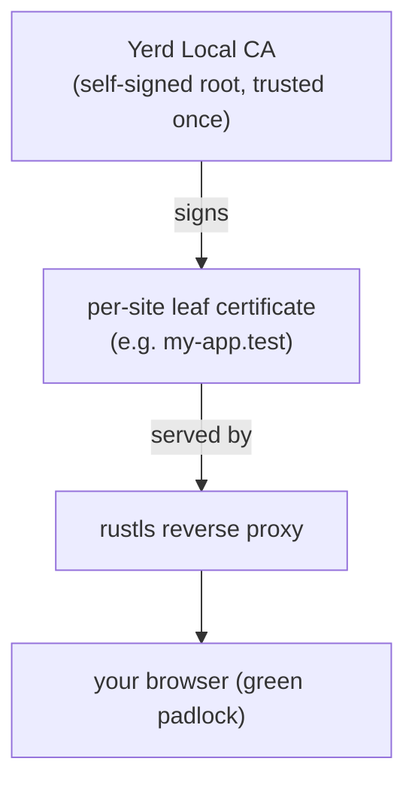

# HTTPS & Certificates

Yerd gives every `.test` site a real, trusted HTTPS certificate with no manual
work - no OpenSSL, no `mkcert`, no copying `.pem` files around. You trust a
single local certificate authority **once** during setup, and from then on every
site you secure gets a fresh, browser-valid certificate the moment it's needed.

This page explains how that works, how to turn HTTPS on and off per site, and
the small amount of trust you grant during the one-time elevation step.

## The short version

```sh
# One-time: trust Yerd's local CA in your OS trust store (run via sudo).
sudo yerd elevate trust

# Per site: turn HTTPS on, then off.
yerd secure my-app      # -> https://my-app.test  (green padlock)
yerd unsecure my-app    # -> back to http://my-app.test only
```

After `elevate trust`, `https://my-app.test` loads with a valid certificate in
your browser - no warnings, no exceptions to click through.

## How automatic HTTPS works

Yerd's TLS lives in the `yerd-tls` crate, built entirely on pure-Rust libraries:

- **[rcgen](https://github.com/rustls/rcgen)** generates and signs certificates.
- **[rustls](https://github.com/rustls/rustls)** terminates TLS in the reverse
  proxy.

There is **no OpenSSL anywhere** in the stack, and no shelling out to `mkcert`.
Certificate issuance is a library call, not an external process.

There are two layers of certificates:



### 1. The local certificate authority

When the daemon (`yerdd`) starts for the first time, it generates a single local
CA - a self-signed root certificate named **"Yerd Local CA"** - and stores its
certificate and private key in the daemon's data directory. The key is locked
down to your user account (`0600`), and the public certificate is written
world-readable but not group/world-*writable* so the trust helper can refuse a
tampered file.

A few deliberate properties of this CA:

- It is an **ECDSA P-256** key (pinned explicitly, not left to a library
  default).
- It is marked as a CA with a **path-length constraint of 0**, so it can only
  sign leaf certificates - never intermediate CAs.
- Its validity window is roughly **10 years** from generation.

The CA exposes a stable **SHA-256 fingerprint** over its certificate DER. That
fingerprint is the security boundary used everywhere trust is installed or
checked - the filename on disk and any display value are just human-readable
tags.

::: info One CA, many sites
You never generate a CA per site. There is exactly one CA per machine, and every
site certificate is signed by it. That is why you only trust once.
:::

### 2. Per-site leaf certificates

Yerd does **not** pre-issue certificates for sites you haven't visited. Instead,
the proxy issues a leaf certificate **lazily, on the first HTTPS request** for a
host. The flow inside the daemon's cert store is:

1. A TLS handshake arrives with an SNI hostname (say `my-app.test`).
2. The store checks its in-memory cache. On a hit, it reuses the cached key.
3. On a **miss**, it asks the CA to issue a fresh leaf for that hostname,
   persists the leaf certificate and key as PEM files alongside the CA, parses
   them into a rustls signing key, caches it, and completes the handshake.

SNI hostnames are normalised first (trailing dot stripped, lower-cased), so
`my-app.test`, `MY-APP.TEST` and `my-app.test.` all resolve to the same cached
certificate.

Each leaf is a modern, SAN-only certificate:

- **No Common Name** - identity lives entirely in Subject Alternative Names, the
  way current browsers expect.
- **Extended Key Usage: `serverAuth`**, plus `digitalSignature` and
  `keyEncipherment` key usages.
- An **Authority Key Identifier** linking it back to the CA.
- A short validity window (a little over a year) with a small backdated start to
  tolerate clock skew.
- Its own **freshly generated private key** - leaf keys are never shared with
  the CA or with each other.

### Wildcard SANs

The issuance layer accepts **wildcard DNS names** such as `*.my-app.test` as
Subject Alternative Names, alongside the bare hostname. SAN entries are validated
as `IA5String` (ASCII) DNS names; non-ASCII names are rejected with a clear
error pointing at the offending entry. This is what lets a single certificate
cover a site and its sub-hosts where that's needed.

::: tip Why a leaf per host instead of one big cert
Issuing on demand keeps certificates scoped to exactly the hostnames you
actually use, and means adding a new site never requires re-trusting anything -
the new leaf is already signed by the CA you trusted on day one.
:::

## Trusting the CA (once)

A self-signed CA is not trusted by your OS or browsers until you add it to a
trust store. That single act is the one-time step:

```sh
sudo yerd elevate trust
```

This is the **only** part of HTTPS that needs root, and it's part of the broader
one-time setup. See [Elevation & Privileges](./elevation) for the full picture
of what runs privileged and why.

Under the hood, `yerd elevate trust` doesn't do the privileged work itself.
It asks the daemon for the CA certificate path, verifies that file is owned by
your user and not world-writable, then invokes the small, auditable
**`yerd-helper`** binary to install the CA into the system trust store. The
helper takes typed arguments, never shells out to a shell, never touches the
network, does exactly one thing, and exits.

How the CA lands in the system store depends on the platform:

| Platform | What `yerd-helper` does |
|---|---|
| macOS | `security add-trusted-cert -d -r trustRoot -k /Library/Keychains/System.keychain` (the same approach `mkcert` uses) |
| Debian / Ubuntu / Alpine | writes to `/usr/local/share/ca-certificates`, then runs `update-ca-certificates` |
| RHEL / Fedora / CentOS | writes to `/etc/pki/ca-trust/source/anchors`, then runs `update-ca-trust extract` |
| Arch | writes to `/etc/ca-certificates/trust-source/anchors`, then runs `trust extract-compat` |

Installation is **idempotent**. On macOS, `security` returns a benign non-zero
code when the certificate is already present; Yerd recognises that case (by
confirming the fingerprint really is in the System keychain) and treats it as
success. A genuine failure - a cancelled auth prompt, a locked keychain - still
surfaces as an error.

### Firefox and other NSS apps

Firefox (and some other tools) **do not use the OS trust store**. They keep
their own NSS certificate database per profile. Yerd handles this separately: it
can install the CA into every discovered NSS database - Firefox profiles plus
`~/.pki/nssdb` - using `certutil`.

This step is **best-effort**:

- If `certutil` is not on your `PATH`, Yerd logs it and carries on rather than
  failing the whole operation. (Install your distro's NSS tools - often
  `libnss3-tools` - to enable Firefox trust.)
- Per-profile results are tracked individually, so one missing database doesn't
  block the others.

::: warning Firefox still warns? Install certutil
If Chrome/Safari are green but Firefox shows a certificate warning, the NSS
install was almost certainly skipped because `certutil` wasn't available. Install
it and re-run the trust step.
:::

## PHP and the local CA

Your browser and shell `curl` trust `.test` HTTPS as soon as you run
`sudo yerd elevate trust`, because they read the OS trust store. The **bundled
PHP is different**: it verifies TLS against its own OpenSSL certificate bundle,
not the system keychain. Without help, a PHP HTTPS call to a secured `.test`
site fails even though the browser is happy:

```php
Http::get('https://site-b.test/api/example');
// cURL error 60: SSL certificate problem: unable to get local issuer certificate
```

Yerd fixes this automatically. On daemon start it writes a managed bundle,
`cacert.pem`, into its data directory - your host's public root certificates
**plus** the Yerd CA - and points the bundled PHP at it via `openssl.cafile` and
`curl.cainfo`, for both FPM (served apps) and the CLI (`artisan`, `tinker`,
`composer`). Laravel's `Http`/Guzzle, `file_get_contents('https://…')`, and curl
all then verify `.test` certificates like the browser does.

::: info Public HTTPS is never sacrificed
The managed bundle always includes your host's public roots, so PHP keeps
verifying real-internet HTTPS (Composer, external APIs). If Yerd can't find any
host roots, it deliberately leaves PHP's default trust store untouched rather
than risk breaking public HTTPS - and `yerd doctor` will flag it.
:::

If a PHP HTTPS call to a `.test` site still fails with `cURL error 60` after a
Yerd upgrade, the daemon most likely hasn't restarted yet (the bundle is written
at start-up). Run `yerd doctor` - it detects a missing or stale bundle and can
rebuild it:

```sh
yerd doctor        # reports "PHP doesn't trust the local CA" if wrong
yerd doctor fix    # rebuilds cacert.pem
```

For direct `php` calls in your shell, make sure Yerd's environment is wired up
with `yerd path install` (this exports `PHPRC` so the CLI reads Yerd's `php.ini`).

## Turning HTTPS on and off per site

HTTPS is a per-site toggle. Both commands take a site **name** (not a URL):

```sh
yerd secure my-app      # serve my-app over HTTPS
yerd unsecure my-app    # stop serving my-app over HTTPS
```

| Command | Effect |
|---|---|
| `yerd secure <site>` | Marks the site as HTTPS-enabled. (For a parked site this promotes it to an explicit linked entry so the flag has somewhere to live.) |
| `yerd unsecure <site>` | Clears the HTTPS flag; the site is served over plain HTTP only. |

Both are ordinary, **unprivileged** commands - they're thin CLI calls that the
daemon applies to its site configuration. You do not need `sudo` to secure or
unsecure a site; the only privileged step is trusting the CA, which you've
already done once.

You can see which sites are secured at a glance:

```sh
yerd sites
```

The site list reports each site's kind, PHP version, doc-root, and whether HTTPS
is on. For a full daemon snapshot - including whether the CA is trusted in your
system store - use:

```sh
yerd status
```

If `yerd status` reports the CA as not trusted, that's your cue to run
`sudo yerd elevate trust`. Yerd's diagnostics will point you there too:

```sh
yerd doctor
```

::: tip Add --json anywhere
Every command accepts `--json` for machine-readable output, handy if you're
scripting site setup or wiring Yerd into CI.
:::

## Removing trust

If you ever want to pull the CA back out of your trust stores, reverse the
elevation:

```sh
sudo yerd unelevate trust
```

This is idempotent too: if the CA's fingerprint isn't found in the system store,
there's simply nothing to remove and the command succeeds quietly.

## See also

- [Elevation & Privileges](./elevation) - the full one-time setup model and the
  `yerd-helper` privilege boundary.
- [Sites](./sites) - parking, linking, and managing the sites you secure.
- [DNS & .test Domains](./dns) - how `*.test` reaches the proxy in the first
  place.
- [CLI Reference](../reference/cli/) - every command and flag.
- Source: [`yerd-tls`](https://github.com/forjedio/yerd/tree/main/crates/yerd-tls)
  and [`yerd-helper`](https://github.com/forjedio/yerd/tree/main/bin/yerd-helper)
  on GitHub.
