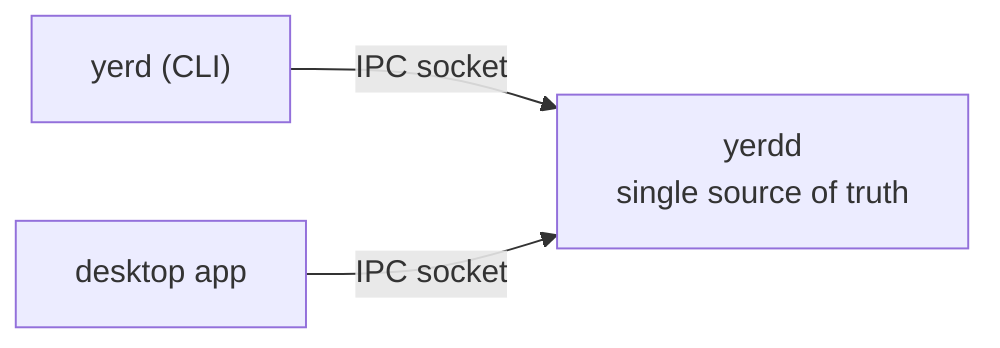
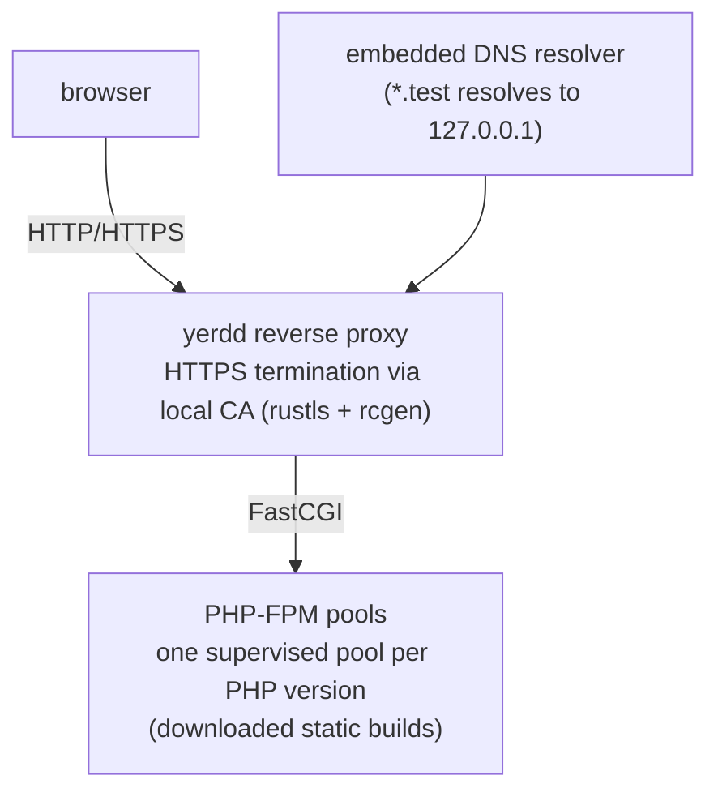

# Introduction

Yerd is a fast, rootless, open-source local PHP development environment. It serves projects on `.test` domains over HTTP and HTTPS, runs a different PHP version per site, and manages everything from one small daemon. No Docker, no `sudo` for daily work, no subscription.

If you've used [Laravel Herd](https://herd.laravel.com), you know the appeal: open `https://my-app.test` and it works, with the right PHP version and a trusted certificate. Yerd does the same, cross-platform and rootless.

## The problem Yerd solves

The traditional setup means wiring together a web server, a DNS tool (dnsmasq), a cert workflow (mkcert), and a way to run several PHP versions at once. Containerised tools simplify the wiring but add image pulls and a VM you didn't want. Yerd gives you the same result as native processes:

- **Zero-config sites.** Drop a project into a parked directory and it's live at `<name>.test`.
- **HTTPS that works.** A local CA issues per-site certificates automatically. No browser warnings once the CA is trusted.
- **Any PHP, per site.** Install multiple versions and pin each site to the one it needs.
- **Self-diagnosing.** `yerd status` and `yerd doctor` show what's running and how to fix what isn't.

## Core principles

### Rootless by design

Yerd runs as your user, never as root in normal operation. `sudo` appears in two non-ongoing places: installing the system `.deb` and a single one-time setup step. Want no `sudo` at all? Use the tarball or build from source and serve sites on `127.0.0.1:8080`.

The privilege boundary comes from splitting Yerd into three pieces:

| Piece | Runs as | Role |
|---|---|---|
| `yerdd` | your user | Unprivileged per-user daemon. Owns runtime state; serves the proxy, DNS, and PHP-FPM pools. |
| `yerd` | your user | The CLI, a thin client that talks to the daemon over a per-user socket. |
| `yerd-helper` | root (one-shot) | Strict, auditable binary for the few operations that need root. |

`yerd-helper` is the security boundary: typed arguments, never shells out, never touches the network, does one thing, exits. See [Elevation & Privileges](./elevation).

### One daemon, two clients

The daemon owns state. The CLI and desktop app are both clients; they never reimplement its logic, so they can't disagree about what's running. A change in one shows up in the other immediately.



The IPC layer is a versioned, byte-pinned contract. See [IPC Protocol](../developer/ipc-protocol).

### Lightweight and native

The daemon is a single binary of roughly 8 MB. No containers, no VM, no Electron (the desktop app uses Tauri, a native webview, and is just another client). PHP isn't bundled; Yerd downloads prebuilt static builds on demand when you run `yerd install php`, so the install stays small.

### Local and quiet

Yerd makes no network calls except the ones you ask for (downloading PHP builds). Updates are notify-only: it tells you when a newer patch exists but never installs it for you.

### Cross-platform

Linux is supported on x86-64 and arm64, and macOS on Apple Silicon (arm64). Apple Intel (x86-64) Macs are not supported at this time. Windows is planned (NRPT resolver, named-pipe IPC, system cert store, TCP-loopback PHP-FPM) but its OS adapters aren't done yet.

::: info How portability is achieved
Pure logic lives in library crates; I/O and OS calls sit at the edges behind traits (`ProcessSpawner`, `TrustStore`, `ResolverInstaller`, `PortBinder`, `Clock`, and so on) with one implementation per OS. Behaviour stays identical across platforms and tests stay fast. See [Cross-Platform Model](../developer/cross-platform).
:::

### Fully open-source

Licensed under the MIT License, and developed in the open at [github.com/forjedio/yerd](https://github.com/forjedio/yerd). No paid tier, no closed core.

## How it works

When you open `https://my-app.test`, several pieces cooperate inside the one daemon:



1. **Local DNS.** An embedded resolver answers `*.test` lookups with `127.0.0.1`. See [DNS & .test Domains](./dns).
2. **Reverse proxy.** The daemon maps the hostname to a site and forwards it to the right PHP-FPM pool over FastCGI.
3. **HTTPS via a local CA.** For secured sites, the proxy terminates TLS with a per-site certificate from Yerd's local CA. Trust the CA once and every `.test` site is green-padlock valid. See [HTTPS & Certificates](./https).
4. **PHP-FPM per version.** Each installed PHP version runs as its own supervised pool, and each site routes to the version it's pinned to. See [PHP Versions](./php-versions).

The workflow:

```sh
# Install a PHP version and make it the default
yerd install php 8.5
yerd use 8.5

# Park a directory - every sub-folder becomes <folder>.test
yerd park ~/Sites
#   ~/Sites/blog  ->  http://blog.test

# …or link a single project under a name you choose
yerd link my-app ~/code/my-app
#   ->  http://my-app.test

# Turn on HTTPS for a site
yerd secure my-app
#   ->  https://my-app.test  (trusted, thanks to the local CA)

# Pin one site to a different PHP version
yerd use my-app 8.3

# Check status / fix problems
yerd status
yerd doctor
```

::: tip Ports without root
On a `.deb` install, the daemon gets `cap_net_bind_service` so it can bind 80/443 unprivileged. Without that capability, Yerd falls back to `8080`/`8443` automatically, and `yerd doctor` tells you.
:::

Add `--json` to any command for machine-readable output.

## Who Yerd is for

- **PHP and Laravel developers** who want Herd-style `.test` sites and trusted HTTPS on macOS or Linux.
- **Anyone juggling multiple PHP versions** who needs to pin a specific one per project.
- **People who avoid Docker for local dev** and prefer native processes with a tiny footprint.
- **Open-source-minded developers** who want a tool they can read, audit, and contribute to.
- **CLI and GUI users alike**, since the same daemon backs both the command line and an optional tray app.

## Next steps

- [Getting Started](./getting-started) - install Yerd and serve your first site.
- [Features](./features) - a tour of everything Yerd can do.

Going deeper? See [Sites](./sites), [PHP Versions](./php-versions), [HTTPS & Certificates](./https), [DNS & .test Domains](./dns), the [CLI reference](../reference/cli/), or the [Architecture](../developer/architecture).
