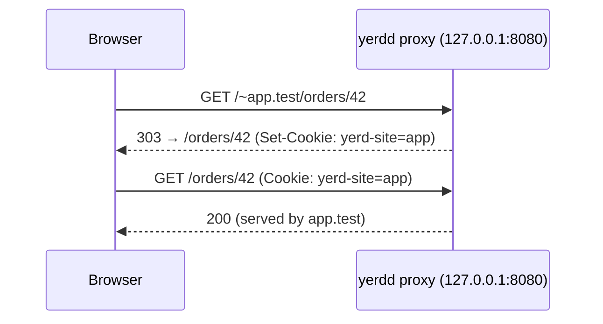

# Localhost Access

Yerd's "just type `app.test`" experience needs the OS resolver routed to its DNS (`sudo yerd elevate resolver`). On a locked-down machine where you **can't** do that, `*.test` names don't resolve at all - so normally you'd be stuck.

This page is the way out. Yerd serves **every** site through plain `http://localhost`, and lets you pick which one, so you can keep working without any admin rights.

## The short version

- `*.test` not resolving? Open **`http://localhost:8080/~app.test`** - Yerd pins that origin to `app.test` and you're in.
- No URL in mind? Open **`http://localhost:8080/`** and pick a site from the list.
- Pinned to the wrong site? Open **`http://localhost:8080/~`** to clear the pin and see the picker again.
- Scripting against it? Send **`X-Yerd-Site: app.test`** and skip the cookie dance.
- It's **HTTP-only** and **one site per browser at a time** (see [the caveats](#the-caveats)).

::: tip This is the fallback, not the default
If you can install the resolver, do - the `.test` experience is nicer. This page is for when you genuinely can't. (`8080` is the *rootless HTTP port*; it's the default but [configurable](../reference/configuration), so substitute your real port throughout.)
:::

## Why you'd need it

Reaching `app.test` takes two OS-level changes, both needing `sudo` once: routing `.test` to Yerd's DNS, and (optionally) binding ports 80/443. See [Elevation & Privileges](./elevation). If you can't run `sudo yerd elevate resolver` - a managed laptop, a CI box, a container - then:

- The browser can't resolve `app.test`, so the URL bar is a dead end.
- But the daemon's proxy **is** listening on `127.0.0.1:8080` (the [rootless port](./elevation#the-rootless-fallback)).
- A request to `http://localhost:8080` arrives with `Host: localhost`, which matches no site - so Yerd needs another way to know *which* site you mean.

That "another way" is the three mechanisms below.

## Three ways to reach a site

### 1. The `/~` switch URL (recommended)

Open:

```
http://localhost:8080/~app.test
```

Yerd recognises the `/~<domain>` prefix, **pins** the `localhost:8080` origin to `app.test` (with a cookie), and redirects you to `/`. From then on every `http://localhost:8080/...` request is served by `app.test` - including the app's own absolute links and assets (`/css/app.css`, `redirect('/dashboard')`), because the browser origin genuinely *is* `localhost:8080`.

To **switch** to another site, just open its `/~` URL (`http://localhost:8080/~blog.test`); the pin moves. A path after the domain is preserved through the redirect, so `…/~app.test/orders/42` lands you on `/orders/42` of `app.test`.



A **bare label** works too: `http://localhost:8080/~app` pins `app` just like `/~app.test`.

**Back to the picker:** open `http://localhost:8080/~` (no domain) to clear the pin and get redirected to `/`, which shows the picker again.

### 2. The site picker

Don't remember the name? Open the bare origin (or any path) in a browser:

```
http://localhost:8080/
```

With no site pinned yet, Yerd returns a small **picker page** listing your sites. Click one and Yerd pins it and forwards you to the path you originally requested. The picker is a normal browser page - it only appears for navigations (HTML requests), so it never interferes with assets or API calls.

### 3. The `X-Yerd-Site` header (for API clients)

Scripts and API clients shouldn't have to follow redirects and carry cookies. Send a header instead:

```sh
curl -H 'X-Yerd-Site: app.test' http://localhost:8080/api/orders
```

That request - and only that request - is served by `app.test`. No redirect, no cookie, no state. A bare label (`X-Yerd-Site: app`) and the dash-free alias `X-Yerdsite` both work.

## In the desktop app & CLI

You rarely type these URLs by hand. When the resolver isn't installed, Yerd surfaces the right links automatically:

- The **desktop app** "Open" buttons (Sites, Overview, and the create-site wizard) point at `http://localhost:8080/~<name>.test` instead of `https://<name>.test`, and their tooltips note the http-only caveat.
- **`yerd status`** prints a hint line: `reach sites at http://localhost:8080/~<name>.test`.

So the buttons just work; the mechanics above are for when you're driving it by hand or from a script.

## The caveats

::: warning HTTP-only
There's no TLS certificate for `localhost` (Yerd's certs are per-`.test`-site), so this path is plain `http://` only. The proxy won't redirect a secured site to HTTPS here.

Apps that **pin their own scheme or host** can still misbehave:

- `URL::forceScheme('https')` or forced-HTTPS middleware will bounce you to an `https://localhost` that isn't listening.
- A fixed `APP_URL=http://app.test` (used for URL generation, emails, etc.) or absolute URLs stored in a database (WordPress) will point away from `localhost`.

The fix is to point those at the localhost origin (e.g. `APP_URL=http://localhost:8080`) for the duration, or install the resolver.
:::

::: warning One site per browser at a time
The pin is a cookie on the `localhost` origin, so a browser serves **one** pinned site at a time. Switching is one click (another `/~` link or the picker); `http://localhost:8080/~` clears the pin outright and sends you back to the picker. Different sites simultaneously means different browsers/profiles - or installing the resolver. API clients using `X-Yerd-Site` aren't affected; each request stands alone.
:::

::: info Nothing serving?
If `yerd doctor` reports the daemon couldn't bind its web ports at all (another process is squatting them), there's no origin to reach and these links won't help - free the port or change Yerd's [configured port](../reference/configuration) first. See [Diagnostics](./diagnostics).
:::

## See also

- [DNS & .test Domains](./dns) - how `.test` resolution works when you *can* elevate
- [Elevation & Privileges](./elevation) - the one-time `sudo` setup and the rootless port fallback
- [HTTPS & Certificates](./https) - why there's no `localhost` cert
- [Diagnostics](./diagnostics) - `yerd doctor` and port status
